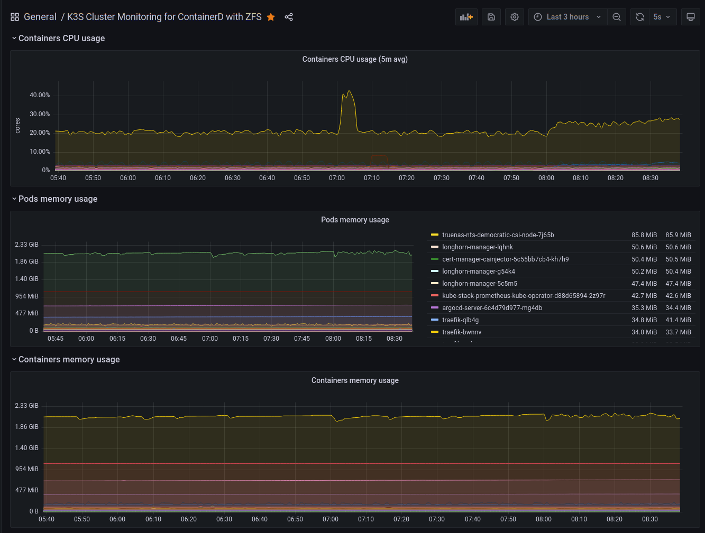

# K3s Kubernetes for ZFS with ArgoCD & Renovate for GitOps via Ansible


An Ansible role to provide an automated _K3s Lightweight Distribution of Kubernetes_ initial deployment. The goal is to have Anisble build just enough Kubernetes on a cluster node to get ArgoCD running.  Anisble will then be used to render various application manifest files that ArgoCD will deploy.

Once the initial deployment is successful you do not need Ansible to maintain the cluster applications - ArgoCD will use an "App of Apps" pattern to handle this, along with Renovate to maintain and update application versions.

The following enhancements are part of this Ansible role:

* **ZFS Integration** via ZFS ZVOL for K3s.  Unfortunately K3s uses an integrated `containerd` with reduced functionality -- lacks ZFS snapshot support.
  * Instead a ZFS ZVOL will be created with XFS filesystem to allow K3s to use its native overlay snapshot filesystem.
  * The ZFS native encryption can be enabled on the ZVOL.
* **non-root** user account for Kubernetes, passwordless access to `kubectl` by default.
* **Centralized cluster system logging** via [rsyslog](https://www.rsyslog.com/) with real-time viewing with [lnav](https://lnav.org/) utility.
* [Helm Client](https://helm.sh/docs/intro/using_helm/) for installing applications in Kubernetes.
* [ArgoCD](https://argoproj.github.io/cd/) will deploy all applications used here. They are added to Git repository for ArgoCD and every few minutes it confirms that applications are deployed as configured.
  * Non-compliant changes are automatically detected and optionally rolled back automatically.
* [Renovate](https://docs.renovatebot.com/) runs as nightly (or on demand) job scanning the Git repository to detect if application upgrades are available.
  * If an upgrade is detected, Renovate will generate a Pull Request (PR) in the Git repository where you can review and approve the upgrade.
  * This process updates the deployment manifest files which ArgoCD detects and will deploy the upgraded application for you.
  * ArgoCD and Renovate work together to help keep your application versions current and prevent configuration drift.
* [Cert-manager](https://cert-manager.io/) with [Let's Encrypt](https://letsencrypt.org/) **wildcard certificates** for your domains generated against Let's Encrypt staging or prod (Cloudflare DNS validator).
* [K3s System Upgrade Controller](https://github.com/rancher/system-upgrade-controller) to perform rolling upgrades to newer Kubernetes releases.  
  * Renovate will create the Pull Request for your review and approval.
  * Once approved, within minutes the controller will start to upgrade the master nodes one by one and then the worker nodes.

Optionally Installed:

* [kube-vip](https://kube-vip.io/) for Kubernetes API Load Balancer
* [kube-vip-cloud-provider](https://kube-vip.io/docs/usage/cloud-provider/) Load Balancer to replace [K3s Klipper](https://github.com/k3s-io/klipper-lb) Load Balancer for ingress traffic.
* [Sealed Secrets](https://github.com/bitnami-labs/sealed-secrets) for true encrypted secrets safe for public git repositories (still recommend using private repository)
* [Longhorn](https://longhorn.io/) distributed [Persistent Volumes](https://kubernetes.io/docs/concepts/storage/persistent-volumes/) as default storage class
* [democratic-csi](https://github.com/democratic-csi/democratic-csi) to provide [Persistent Volumes](https://kubernetes.io/docs/concepts/storage/persistent-volumes/) storage via **iSCSI** and **NFS** from [TrueNAS](https://www.truenas.com/)
* [Kube-Prometheus Stack](https://github.com/prometheus-operator/kube-prometheus) collection of Kubernetes manifests, [Grafana](http://grafana.com/) dashboards, and [Prometheus rules](https://prometheus.io/docs/prometheus/latest/configuration/recording_rules/) to provide easy to operate end-to-end Kubernetes cluster monitoring
* [Traefik](https://traefik.io/) HA Load Balanced ingress deployed as a DaemonSet.
  * IngressRoutes for the following will be generated and deployed:
    * Traefik Dashboard
    * ArgoCD Dashboard
    * Longhorn Dashboard
    * Prometheus Dashboard
    * AlertManager Dashboard
    * Grafana Dashboards

---

## Home Cluster Hardware

<div align="center">

[](https://bit.ly/423PISu)

</div>

<div align="center">

[](https://github.com/kashalls/kromgo/)&nbsp;&nbsp;[](https://github.com/kashalls/kromgo/)&nbsp;&nbsp;[](https://github.com/kashalls/kromgo/)&nbsp;&nbsp;[](https://github.com/kashalls/kromgo/)&nbsp;&nbsp;[](https://github.com/kashalls/kromgo/)&nbsp;&nbsp;[](https://github.com/kashalls/kromgo/)&nbsp;&nbsp;[](https://github.com/kashalls/kromgo/)&nbsp;&nbsp;[](https://github.com/kashalls/kromgo/)&nbsp;&nbsp;[](https://github.com/kashalls/kromgo/)&nbsp;&nbsp;

</div>

**Home Cluster Compute Hardware Summary:**

| Device          | Count | Cores / Threads     | OS Disk Size      | Data Disk Size         | RAM  | Purpose               |
| --------------- | ----- | ---------------     | ------------      | ---------------------- | ---- | -------------------   |
| HP T740 Thin PC | 3 | (Ryzen V1756B) 4 / 8 | 118GiB ZFS Mirror | 800Gib Rook-Ceph | 64GB | Kubernetes Master / Ceph Storage |
| Minisform UM560 | 2 | (Ryzen 5 5625U) 6 / 12 | 120GiB ZFS Mirror | 2TiB Rook-Ceph | 64GB | Kubernetes Worker / Ceph Storage |
| Custom Build (Fractal Design Node 804 with ASRock B660 Steel Legend)   | 1 | (Intel i5-13500) 6 / 20 | 14TB ZFS zRaid  | 2 TiB Rook-Ceph  | 64GB | Kubernetes Worker / Ceph / Intel iGPU |
| Custom Build (Fractal Design Node 804 with ASUS Prime X570-Pro) | 1 | (Ryzen 7 3700X) 8 / 16 | 1 TiB ZFS Mirror | 2 TiB Rook-Ceph | 128GB | Kubernetes Worker / Ceph / NVidia GPU / Desktop |

* All devices have at least 2.5GbE networking (some are 10GbE) to UniFi USW Enterprise 8 Port Switch with dual 10GbE uplinks to main network.

**Ceph Storage Cluster Summary:**

[](https://github.com/kashalls/kromgo/)
[](https://github.com/kashalls/kromgo/)&nbsp;&nbsp;[](https://github.com/kashalls/kromgo/)&nbsp;&nbsp;[](https://github.com/kashalls/kromgo/)&nbsp;&nbsp;[](https://github.com/kashalls/kromgo/)&nbsp;&nbsp;[](https://github.com/kashalls/kromgo/)&nbsp;&nbsp;[](https://github.com/kashalls/kromgo/)&nbsp;&nbsp;[](https://github.com/kashalls/kromgo/)&nbsp;&nbsp;[](https://github.com/kashalls/kromgo/)&nbsp;&nbsp;[](https://github.com/kashalls/kromgo/)&nbsp;&nbsp;

**30 Day Service Availability:**

| Service | 30 Day Stats | | Service | 30 Day Stats | | Service | 30 Day Stats |
| --: | --- |--- | --: |--- |--- | --: |--- |
| | | | | | | | |
| | | | | | | | |
| | | | | | ||  |
| | | | | | | | |

**Home Cluster Network Summary:**

| Device | Count | Purpose | Specifications | Description |
|---     | :--:  |---      |---             |---          |
| Firewall | 1 | Router | Intel i5-5200U CPU, 8GB RAM, ZFS mirror storage, 4x 1GbE RJ45 ports | Primary network pfSense firewall, router, DNS, Proxy |
| Switch | 1 | Backbone | MikroTik CloudSwitch CRS309-1G-8S+IN. 8x SPF+ 10GbE ports | Primary Homelab Switch. All other switches and access points are downstream |
| Switch | 1 | Cluster Switch | UniFi USW Enterprise 8 Port Poe Switch. 8x 2.5GbE RJ45 ports and 2x SPF+ 10GbE ports | Dedicated Kubernetes cluster switch with dual 10GbE uplinks to Backbone switch |
| UPS | 3| Backup Power Supply | Trip-Lite Smart 1500 LCDt UPS unit | Provide short term backup power and clean stable electricity to all devices |
| KVM | 2 | Keyboard and Video Switch | 4 HDMI in, 4 USB In, 4 USB Out | Provides console access with keyboard to cluster devices |

---

## TL;DR

* You should read it. :)
* A tweaked multi-node Kubernetes cluster based on K3s (no docker used)
* You will need to setup an Ansible inventory file in a defined way
* You will need to create a dedicated repository for ArgoCD, ideally a private GitHub repository (free)
* **ArgoCD** will require Ansible secrets set for repository URL, Access Token, etc.
* Ansible will render all initial application manifest files and commit them to Git repository
* **ArgoCD** will see remaining missing applications and deploy them as defined
* **Renovate** will monitor deployed application manifests and provide update notifications via Pull Request process
* **Let's Encrypt** configuration requires you to define your challenge credentials and list domains for certificate generation
* **Kube-vip** Load Balancer section will require you to specify a range of IP addresses available for use and a VIP address for the API Load Balancer
* **Longhorn** Distributed storage (if enabled) is intended to be the default storage class, the `local-path` StorageClass is not installed
* **Sealed Secrets** can be used to provide truly encrypted secrets considered safe to be committed to public git repositories

---

## Suggested Environment

* Ubuntu 22.04.x LTS
  * Based [ZFS on Root](https://github.com/reefland/ansible-zfs_on_root) installation
* K3s v1.25.x - v1.27.x

---

## Packages Installed

* [apparmor](https://packages.ubuntu.com/jammy-updates/apparmor), [apparmor-utils](https://packages.ubuntu.com/jammy/apparmor-utils) required for K3s Containerd to load profiles
* [lnav](https://lnav.org/) for view centralized cluster system logging
* [python3-pip](https://pypi.org/project/pip/) (required for Ansible managed nodes)
* pip packages - [OpenShift](https://pypi.org/project/openshift/), [pyyaml](https://pypi.org/project/PyYAML/), [kubernetes](https://pypi.org/project/kubernetes/) (required for Ansible to execute K8s module)
* k3s (Runs official script [https://get.k3s.io](https://get.k3s.io))
* [helm](https://helm.sh/), [helm diff](https://github.com/databus23/helm-diff), [apt-transport-https](http://manpages.ubuntu.com/manpages/jammy/man1/apt-transport-https.1.html) (required for helm client install)
* [open-iscsi](https://github.com/open-iscsi/open-iscsi), [lsscsi](http://sg.danny.cz/scsi/lsscsi.html), [sg3-utils](https://sg.danny.cz/sg/sg3_utils.html), [multipath-tools](https://github.com/opensvc/multipath-tools), [scsitools](https://packages.ubuntu.com/jammy/scsitools-gui) (required by democratic-csi  and by Longhorn)
* [xfsprogs](https://packages.ubuntu.com/jammy/xfsprogs) (required for ZFS ZVOL used for K3s installation)

---

### Comments

* I provide a lot of documentation notes below for my own use.  If you find it overwhelming, keep in mind most of it you do not need.
* Towards the bottom is a section which shows how to use Ansible to run this in stages (step by step) to built it up in layers using `tags`.
* I no longer use Longhorn for in-cluster storage.  I currently use Rook-Ceph instead, however that's outside the scope of this project.

---

## Review `defaults/main.yml` for initial settings

Each of these links provide useful documentation details:

* Review [Linux OS Settings](docs/os-settings.md)
* Review [Centralized Cluster System Logs Settings](docs/rsyslog-settings.md)
* Review [K3S Configuration Settings](docs/k3s-settings.md)
* Review [ArgoCD Configuration Settings](docs/argocd-settings.md)
* Review [Renovate Configuration Settings](docs/renovate-settings.md)
* Review [Sealed Secrets Configuration Settings](docs/sealed-secrets-settings.md)
* Review [System Upgrade Controller Configuration Settings](docs/upgrade-controller-settings.md)
* Review [CertManager Configuration](docs/cert-manager.md)
* Review [Let's Encrypt Configuration](docs/lets-encrypt-settings.md)
* Review [Kube-vip API Load Balancer Settings](docs/kube-vip-settings.md)
* Review [Traefik and Dashboard Settings](docs/traefik-settings.md)
* Review [Longhorn Distributed Storage Settings](docs/longhorn-settings.md)
* Review [democratic-csi for TrueNAS Settings](docs/democratic-csi-settings.md)
* Review [Kube Prometheus Stack Settings](docs/prometheus-op-settings.md)

---

## How do I Run it

### Edit your inventory document

Define a group for this playbook to use in your inventory, I like to use YAML format:

```yaml
k3s_control:
  hosts:
    k3s01.example.com:                        # Control Node / Master #1
      k3s_pool: "rpool"
      k3s_vol_size: "50G"
    k3s02.example.com:                        # Control Node / Master #2
      k3s_pool: "rpool"
      k3s_vol_size: "50G"
    k3s03.example.com:                        # Control Node / Master #3
      k3s_pool: "rpool"
      k3s_vol_size: "50G"
  vars:                                       # Applies to all control nodes
    longhorn_zfs_pool: "tank"
    longhorn_vol_size: "10G"
    vip_endpoint_ip: "192.168.10.220"
    vip_lb_ip_range: "cidr-global: 192.168.10.221/30"   # 4 Addresses pool
    traefik_lb_ip: "192.168.10.221"           # must be within cidr ip_range

    k3s_labels:
      - "k3s-upgrade=true"

k3s_workers:
  hosts:
    k3s04.example.com:                        # Worker #1
    k3s05.example.com:                        # Worker #2 (add more if needed)

  vars:                                       # Applies to all worker nodes
    k3s_pool: "rpool"
    k3s_vol_size: "30G"
    k3s_labels:
      - "kubernetes.io/role=worker"
      - "node-type=worker"
      - "k3s-upgrade=true"

k3s:                                          # Group name for all nodes
  children:
    k3s_control:
    k3s_workers:

  vars:
    # Install versions are optional, lets you pin newer versions than defaults
    k3s_install_version: "v1.23.5+k3s1"
    argocd_install_version: "4.10.5"
    renovate_install_version: "32.152.0"
    cert_manager_install_version: "v1.8.2"
    sealed_secret_install_version: "v2.6.0"
    system_upgrade_controller_install_version: "v0.9.1"
    kube_vip_install_version: "v0.5.0"
    kube_vip_cloud_provider_install_version: "v0.0.3"
    traefik_install_version: "v10.22.0"
    longhorn_install_version: "v1.3.0"
    democratic_csi_install_version: "0.13.4"
    prometheus_op_install_version: "39.5.0"
    prometheus_op_crd_version: "v0.58.0"
    zfs_exporter_install_version: "v2.2.5"

    #[ Unique Per Cluster Settings ]############################################
    democratic_csi_parent_dataset: "main/k8s"
    k3s_cluster_ingress_name: "k3s-test.{{ansible_domain}}"
    argocd_repo_url: "https://github.com/<USERNAME>/<REPO-NAME>"

    # Longhorn does support S3 or NFS backup targets.  Only NFS supported here.
    longhorn_backup_target: "nfs://192.168.10.102:/mnt/main/backups/longhorn-test"

    K3S_TOKEN: 'secret_here'                # Set to any value you like
```

* This inventory file divides hosts into Control nodes and Worker nodes:
  * Easily defines High Availability (HA) distributed etcd configuration.
  * The cluster will work fine with just a single node but for HA you should have 3 (or even 5) control nodes:

    | master nodes | must maintain | can lose | comment |
    |:------------:|:-------------:|:--------:|---------|
    |       1      |      1        |    0     | Loss of 1 is headless cluster |
    |       2      |      2        |    0     | Loss of 1 is headless cluster |
    |       3      |      2        |    1     | Allows loss of 1 master only  |
    |       4      |      3        |    1     | No advantage over using 3     |
    |       5      |      3        |    2     | Allows loss of 2 masters      |
    |       6      |      4        |    2     | No advantage over using 5     |
    |       7      |      4        |    3     | Allows loss of 3 masters      |

  * Kubernetes uses the [RAFT consensus algorithm](https://kubernetes.io/blog/2019/08/30/announcing-etcd-3-4/) for quorum for HA.
  * More then 7 master nodes will result in a overhead for determining cluster membership and quorum, it is not recommended. Depending on your needs, you typically end up with 3 or 5 master nodes for HA.

---

#### Inventory Variables for IP & Load Balancers

For simplicity I show the variables within the inventory file.  You can place these in respective group vars and host vars files.  

* `vip_endpoint_ip` specifies the IP address to be used for the Kubernetes API Load Balancer provided by Kube-vip
* `vip_lb_ip_range` a CIDR expression which defines the IP address range kube-vip can use to provide IP addresses for LoadBalancer services.
* `traefik_lb_ip` defines the IP address to be used for the Traefik ingress controller Load Balancer.  It must be within the range defined by `vip_lb_ip_range` CIDR.

---

#### Inventory Variables for Longhorn Distributed Storage

_NOTE: After using Longhorn for a while, I have decided not to use it.  It has issues reclaiming disk space and does not seem appropriate for any applications with heavy disk write activity. The amount of space is not a concern, just the amount of disk writes.  Works great for low write volume applications._

* `longhorn_zfs_pool` lets you define the ZFS pool to create Longhorn cluster storage with. It will use the ZFS pool `rpool` if not defined. This can be host specific or group scoped.
* `longhorn_vol_size` specifies how much storage space you wish to dedicate to Longhorn distributed storage. This can be host specific or group scoped.
* `longhorn_backup_target` full NFS share URL path for Longhorn to make backups of the cluster storage volumes.

---

#### Inventory Variables for K3s Installation

* `k3s_pool` lets you define the ZFS pool to be used for K3s installation and mounted on `/var/lib/rancher`  You don't have to create a new pool, just specify a valid existing pool to use.  A ZVOL will be created within the pool specified here.
* `k3s_vol_size` specifies the size of the ZVOL to create for the K3s Installation.  30G to 50G is a reasonable starting size.
* `k3s_cluster_ingress_name` is the Fully Qualified Domain Name (FQDN) you plan to use for the cluster.  This will point to the Traefik Ingress controller's Load Balancer IP Address.  
  * If not provided it will default to `k3s` and the domain name of the Kubernetes Primary Master server... something like `k3s.localdomain` or `k3s.example.com`
  * All of the respective dashboards (Traefik, Longhorn, Prometheus, Grafana, etc) will be available from this FQDN.
* `k3s_cli_var` passes host specific variables to the K3s installation script.
* `k3s_labels` can be used to set labels on the cluster nodes.  This can be host specific or group scoped.  For example, instead of worker nodes having a default role of `<NONE>`, the followings gives them a more kubernetes like role name:

  ```yaml
  vars:
    k3s_labels:
      - "kubernetes.io/role=worker"
      - "node-type=worker"
      - "k3s-upgrade=true"
  ```

* `K3S_TOKEN` is a secret required for nodes to be able to join the cluster.  The value of the secret can be anything you like.  The variable needs to be scoped to the installation group.  
  * While it can be defined directly within the inventory file or group_var it better to create a variable named `K3S_TOKEN`in using Ansible's vault.
  * If you do not define this variable then the default `top_secret` which is lame will be used.
  * If you need inspiration for an easy to create a secret value:

  ```shell
  $ date | md5sum

  0097661c0c55ccc8921617e0997d2e73
  ```

---

#### Other Inventory Variables Used

* `argocd_repo_url` is a URL which points the the Git repository (private recommended) that ArgoCD will monitor.  Do NOT put `.git` at the end.
* `democratic_csi_parent_dataset` (if Democratic-CSI is to be used) specifies the TrueNAS parent dataset for iSCSI and NFS Persistent Volume storage. If multiple clusters are setup against the same TrueNAS server then this value needs to be unique.
* `k3s_cluster_ingress_name` is the Fully Qualified Domain Name the cluster will be known as.  This is a DNS name that Cert-Manager will create Let's Encrypt Wildcard certificates for.  Most dashboards will be based on this name.

---

#### Inventory Variables for Installed Versions

The idea behind pinning specific versions of software is so that an installation done on Monday can be identical when installed on Tuesday or Friday, or sometime next month.  Without pinning specific versions you have no way of knowing what random combination of versions you will get.

* `k3s_install_version` pins the K3s [Release](https://github.com/k3s-io/k3s/releases) version.
* `argocd_install_version` pings the ArgoCD Helm [Release](https://artifacthub.io/packages/helm/argo/argo-cd) (not application version)
* `renovate_install_version` pins the Renovate Helm [Release](https://github.com/renovatebot/helm-charts/releases) (not application version)
* `cert_manager_install_version` pins the Cert-manager Helm [Release](https://github.com/cert-manager/cert-manager/releases)
* `sealed_secret_install_version` pins the Sealed Secrets Helm [Release](https://github.com/bitnami-labs/sealed-secrets/releases)
* `system_upgrade_controller_install_version` pins the application [Release](https://github.com/rancher/system-upgrade-controller/releases) version
* `kube_vip_install_version` pins the Application Container Tag [Release](https://github.com/kube-vip/kube-vip/releases)
* `kube_vip_cloud_provider_install_version` pins the Application Container Tag [Release](https://github.com/kube-vip/kube-vip-cloud-provider/releases)
* `traefik_install_version` pings the Traefik Helm [Release](https://github.com/traefik/traefik-helm-chart/tags) version.
* `longhorn_install_version` pins the Longhorn Helm [Release](https://github.com/longhorn/longhorn/releases) version.
* `democratic_csi_install_version` pins the Democratic CSI iSCSI and/or NFS Provisioner Helm [Release](https://github.com/democratic-csi/charts/releases) version.
* `prometheus_op_install_version` pins the Kube Prometheus Stack Helm [Release](https://github.com/prometheus-community/helm-charts/releases) version
* `prometheus_op_crd_version` pins the Prometheus Operator CRD [Release](https://github.com/prometheus-community/helm-charts/tree/main/charts/kube-prometheus-stack#upgrading-chart) that Kube Prometheus Stack requires
* `zfs_exporter_install_version:` pins the ZFS Exporter used for ZFS File System Monitoring [Release](https://github.com/pdf/zfs_exporter/releases)

---

### Create a Playbook

Simple playbook I'm using for testing, named `k3s-argocd.yml`:

```yml
- name: k3s Kubernetes Installation with ZFS & ArgoCD GitOPS
  hosts: k3s
  become: true
  gather_facts: true

  roles:
    - role: k3s-argocd
```

### Fire-up the Ansible Playbook

The most basic way to deploy K3s Kubernetes with ContainerD:

```bash
ansible-playbook -i inventory.yml k3s-argocd.yml
```

To limit execution to a single machine:

```bash
ansible-playbook -i inventory.yml k3s-argocd.yml -l k3s01.example.com
```

## Build in Stages

Instead of running the entire playbook, you can run smaller logical steps using tags. Or use a tag to re-run a specific step you are troubleshooting.

```bash
ansible-playbook -i inventory.yml k3s-argocd.yml -l k3s01.example.com --tags="<tag_goes_here>"
```

The following tags are supported and should be used in this order:

* `config_rsyslog`
* `prep_os`
* `install_k3s`
* `apply_labels`
* `validate_k3s`
* `install_helm_client`
* `install_sealed_secrets`
* `install_argocd`
* `deploy_apps`
* `config_le_certificates`

The following tags are not run by default but can be used to install this additional software:

* `install_democratic_csi_iscsi`
* `install_democratic_csi_nfs`
* `install_prometheus_operator`

Other handy tags for specific routines:

* `update_kubeseal_cli` - will just update the `kubeseal` CLI to be version matched to the Sealed Secrets controller deployed.
* `update_argocd_cli` - will just update the `argocd` CLI to be version matched to ArgoCD controller deployed.
* `update_argocd_files` - will process ArgoCD repository files like `install_argocd` does, but will not attempt to try and run Helm install on ArgoCD which would likely error out as it should not be managed by Helm anymore.
* `update_zfs_exporter` - will just update the `zfs_exporter` utility deployed to nodes for ZFS filesystem monitoring to the version specified in inventory variable.

---

## Grafana Dashboards

A K3s cluster monitoring dashboard specific to this installation is available:

[https://grafana.com/grafana/dashboards/16450](https://grafana.com/grafana/dashboards/16450)

* This will be automatically installed as a configMap Dashboard for Grafana as part of the Kube-Prometheus-Stack procedure.




Additional Dashboards will also be deployed as ConfigMaps (modified from defaults to work with containerd and not docker):

* [ArgoCD](./images/dashboard_argocd-1.png) - [Screenshot #2](./images/dashboard_argocd-2.png) - [#3](./images/dashboard_argocd-3.png) - [#4](./images/dashboard_argocd-4.png) - [#5](./images/dashboard_argocd-5.png)
* [Cert-Manager](./images/dashboard_cert-manager.png)
* [Longhorn](./images/dashboard_longhorn-1.png) - [Screenshot #2](./images/dashboard_longhorn-2.png) - [#3](./images/dashboard_longhorn-3.png)
* [Traefik](./images/dashboard_traefik-1.png) - [Screenshot #2](./images/dashboard_traefik-2.png) - [#3](./images/dashboard_traefik-3.png)
* Several from [dotdc](https://github.com/dotdc/grafana-dashboards-kubernetes) modern dashboards
  * [Global View](./images/dashboard_dotdc-cluster-1.png) - [Screenshot #2](./images/dashboard_dotdc-cluster-2.png) - [#3](./images/dashboard_dotdc-cluster-3.png)
  * [Namespaces](./images/dashboard_dotdc-namespace-1.png)
  * [Nodes](./images/dashboard_dotdc-nodes-1.png) - [Screenshot#2](./images/dashboard_dotdc-nodes-2.png) - [#3](./images/dashboard_dotdc-nodes-3.png) - [#4](./images/dashboard_dotdc-nodes-4.png) - [#5](./images/dashboard_dotdc-nodes-5.png) - - [#6](./images/dashboard_dotdc-nodes-6.png)
  * [Pods](./images/dashboard_dotdc-pods-1.png)
  * [API Server](./images/dashboard_dotdc-apiserver-1.png) - [Screenshot #2](./images/dashboard_dotdc-apiserver-2.png)
  * [CoreDNS](./images/dashboard_dotdc-coredns-1.png) - [Screenshot #2](./images/dashboard_dotdc-coredns-2.png)
* Several from Kubernetes-Mixin (Deployed by Kube-Prometheus-Stack)

---

## Upgrading K3s Kubernetes

The [K3s System Upgrade Controller](https://github.com/rancher/system-upgrade-controller) is deployed to the `system-upgrade` namespace and `system-upgrade` ArgoCD project.  It is used to perform rolling upgrades to newer Kubernetes releases when available.  See [Configuration Settings](docs/upgrade-controller-settings.md) for more details.
