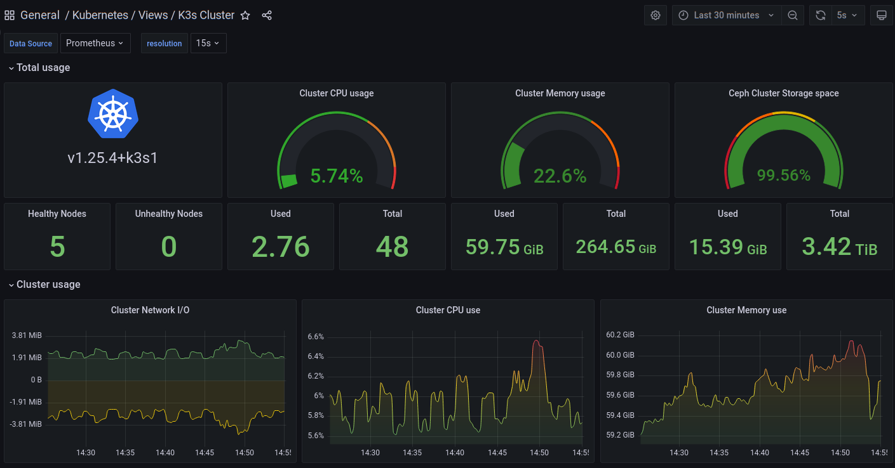

# K3s Kubernetes with ContainerD for ZFS & ArgoCD with Renovate for GitOps via Ansible

An Ansible role to provide an automated _K3s Lightweight Distribution of Kubernetes_ initial deployment. The goal is to have Anisble build just enough Kubernetes on each cluster node to get ArgoCD running.  Anisble will then be used to render various application manifest files that ArgoCD will deploy.  Once the initial deployment is successful you do not need Ansible to maintain the cluster applications - ArgoCD will be using an "App of Apps" pattern along with Renovate will handle this.  (Ansible can be reused in the future to upgrade K3s to a newer version).

The following enhancements are part of this Ansible role:

* **non-root** user account for Kubernetes, passwordless access to `kubectl` by default.
* [containerd](https://containerd.io/) to provide [ZFS snapshotter](https://github.com/containerd/zfs) support.
* **Centralized cluster system logging** via [rsyslog](https://www.rsyslog.com/) with real-time viewing with [lnav](https://lnav.org/) utility.
* [Helm Client](https://helm.sh/docs/intro/using_helm/) for installing applications in Kubernetes.
* [ArgoCD](https://argoproj.github.io/cd/) will deploy all applications used here. They are added to Git repository for ArgoCD and every few minutes it confirms that applications are deployed as configured.
  * Non-compliant changes are automatically detected and optionally rolled back automatically.
* [Renovate](https://docs.renovatebot.com/) runs as nightly (or on demand) job scanning the Git repository to detect if application upgrades are available.
  * If an upgrade is detected, Renovate will generate a Pull Request (PR) in the Git repository where you can review and approve the upgrade.
  * This process updates the deployment manifest files which ArgoCD detects and will deploy the upgraded application for you.
  * ArgoCD and Renovate work together to help keep your application versions current and prevent configuration drift.
* [Cert-manager](https://cert-manager.io/) with [Let's Encrypt](https://letsencrypt.org/) **wildcard certificates** for your domains generated against Let's Encrypt staging or prod (Cloudflare DNS validator).

Optionally Installed:

* [kube-vip](https://kube-vip.chipzoller.dev/) for Kubernetes API Load Balancer
* [kube-vip-cloud-provider](https://kube-vip.chipzoller.dev/) Load Balancer to replace [K3s Klipper](https://github.com/k3s-io/klipper-lb) Load Balancer for ingress traffic.
* [Longhorn](https://longhorn.io/) distributed [Persistent Volumes](https://kubernetes.io/docs/concepts/storage/persistent-volumes/) as default storage class
* [democratic-csi](https://github.com/democratic-csi/democratic-csi) to provide [Persistent Volumes](https://kubernetes.io/docs/concepts/storage/persistent-volumes/) storage via **iSCSI** and **NFS** from [TrueNAS](https://www.truenas.com/)
* [Traefik](https://traefik.io/) Load Balanced ingress deployed as a DaemonSet.
  * IngressRoutes for the following will be generated and deployed:
    * Traefik Dashboard
    * ArgoCD Dashboard
    * Longhorn Dashboard

---

## TL;DR

* You should read it. :)
* A tweaked multi-node Kubernetes cluster based on K3s (no docker used) is created
* You will need to setup an Ansible inventory file in a defined way
* You will need to create a dedicated repository for ArgoCD, ideally a private Github repository (free)
* **ArgoCD** will require Ansible secrets set for repository URL, Access Token, etc.
* Ansible will render all initial application manifest files and commit them to Git repository
* **ArgoCD** will see remaining missing applications and deploy them as defined
* **Renovate** will monitor deployed application manifests and provide update notifications via Pull Request process
* **Let's Encrypt** configuration requires you to define your challenge credentials and list domains for certificate generation
* **Kube-vip** Load Balancer section will require you to specify a range of IP addresses available for use and a VIP address for the API Load Balancer
* **Longhorn** Distributed storage is intended to be the default storage class, the `local-path` StorageClass is not installed

---

## Environments Tested

* Ubuntu 20.04.4 based [ZFS on Root](https://github.com/reefland/ansible-zfs_on_root) installation
* TrueNAS Core 12.x
* K3s v1.23.3 / v1.23.4+k3s1 / v1.23.5+k3s1

---

## Packages Installed

* [lnav](https://lnav.org/) for view centralized cluster system logging
* [python3-pip](https://pypi.org/project/pip/) (required for Ansible managed nodes)
* pip packages - [OpenShift](https://pypi.org/project/openshift/), [pyyaml](https://pypi.org/project/PyYAML/), [kubernetes](https://pypi.org/project/kubernetes/) (required for Ansible to execute K8s module)
* k3s (Runs official script [https://get.k3s.io](https://get.k3s.io))
* [containerd](https://containerd.io/), container networking-plugins, iptables
* [helm](https://helm.sh/), [helm diff](https://github.com/databus23/helm-diff), [apt-transport-https](http://manpages.ubuntu.com/manpages/focal/man1/apt-transport-https.1.html) (required for helm client install)
* [open-iscsi](https://github.com/open-iscsi/open-iscsi), [lsscsi](http://sg.danny.cz/scsi/lsscsi.html), [sg3-utils](https://sg.danny.cz/sg/sg3_utils.html), [multipath-tools](https://github.com/opensvc/multipath-tools), [scsitools](https://packages.ubuntu.com/focal/scsitools-gui) (required by democratic-csi  and by Longhorn)
* [lm-sensors](https://github.com/lm-sensors/lm-sensors) for hardware temperature monitoring

## Packages Uninstalled

* snapd (we have no use for it on Kubernetes nodes, saves resources)
  * This can be disabled if you really want to keep it.

  ```yml
  install:
    os:
      remove_snapd:                             # Remove Snapd Demon, we don't need it.
        remove_it: true
  ```

---
I provide a lot of documentation notes below for my own use.  If you find it overwhelming, keep in mind most of it you do not need.  Also note that towards the bottom is a section which shows how to use Ansible to run this in stages (step by step) to built it up in layers using `tags`.

---

## Review `defaults/main.yml` for initial settings

Each of these links provide useful documentation details:

* Review [Linux OS Settings](docs/os-settings.md)
* Review [Centralized Cluster System Logs Settings](docs/rsyslog-settings.md)
* Review [K3S Configuration Settings](docs/k3s-settings.md)
* Review [Containerd Configuration Settings](docs/containerd-settings.md)
* Review [ArgoCD Configuration Settings](docs/argocd-settings.md)
* Review [Renovate Configuration Settings](docs/renovate-settings.md)
* Review [CertManager Configuration](docs/cert-manager.md)
* Review [Let's Encrypt Configuration](docs/lets-encrypt-settings.md)
* Review [Kube-vip API Load Balancer Settings](docs/kube-vip-settings.md)
* Review [Traefik and Dashboard Settings](docs/traefik-settings.md)
* Review [Longhorn Distributed Storage Settings](docs/longhorn-settings.md)
* Review [democratic-csi for TrueNAS Settings](docs/democratic-csi-settings.md)

---

## How do I Run it

### Edit your inventory document

Define a group for this playbook to use in your inventory, I like to use YAML format:

```yaml
  k3s_control:
    hosts:
      k3s01.example.com:                        # Master #1
        longhorn_zfs_pool: "tank"
        longhorn_vol_size: "10G"
      k3s02.example.com:                        # Master #2
        longhorn_zfs_pool: "tank"
        longhorn_vol_size: "10G"
      k3s03.example.com:                        # Master #3 (add more if needed)
        longhorn_zfs_pool: "tank"
        longhorn_vol_size: "10G"

    vars:
      vip_endpoint_ip: "192.168.10.220"
      vip_lb_ip_range: "cidr-global: 192.168.10.221/30"   # 4 Addresses pool
      traefik_lb_ip: "192.168.10.221"           # must be within cidr ip_range

  k3s_workers:
    hosts:
      k3s-worker01.example.com:                # Worker #1

    vars:
      k3s_labels:
        - "kubernetes.io/role=worker"
        - "node-type=worker"

  k3s:
    children:
      k3s_control:
      k3s_workers:

    vars:
      # Install versions are optional, lets you pin newer versions than defaults
      k3s_install_version: "v1.23.5+k3s1"
      argocd_install_version: "4.5.10"
      renovate_install_version: "32.45.5"
      cert_manager_install_version: "v1.7.1"
      kube_vip_install_version: "v0.4.2"
      kube_vip_cloud_provider_install_version: "v0.0.2"
      traefik_install_version: "v10.19.4"
      longhorn_install_version: "v1.2.4"
      democratic_csi_install_version: "0.13.1"

      k3s_cluster_ingress_name: "k3s-test.{{ansible_domain}}"
      argocd_repo_url: "https://github.com/<USERNAME>/<REPO-NAME>"

      # Longhorn does support S3 or NFS backup targets.  Only NFS supported here.
      longhorn_backup_target: "nfs://192.168.10.102:/mnt/main/backups/longhorn-test"

      K3S_TOKEN: 'secret_here'                # Set to any value you like
```

* This inventory file divides hosts into Control nodes and Worker nodes:
  * Easily defines High Availability (HA) distributed etcd configuration.
  * The cluster will work fine with just a single node but for HA you should have 3 (or even 5) control nodes:

    | master nodes | must maintain | can lose | comment |
    |:------------:|:-------------:|:--------:|---------|
    |       1      |      1        |    0     | Loss of 1 is headless cluster |
    |       2      |      2        |    0     | Loss of 1 is headless cluster |
    |       3      |      2        |    1     | Allows loss of 1 master only  |
    |       4      |      3        |    1     | No advantage over using 3     |
    |       5      |      3        |    2     | Allows loss of 2 masters      |
    |       6      |      4        |    2     | No advantage over using 5     |
    |       7      |      4        |    3     | Allows loss of 3 masters      |

  * Kubernetes uses the [RAFT consensus algorithm](https://kubernetes.io/blog/2019/08/30/announcing-etcd-3-4/) for quorum for HA.
  * More then 7 master nodes will result in a overhead for determining cluster membership and quorum, it is not recommended. Depending on your needs, you typically end up with 3 or 5 master nodes for HA.

---

#### Inventory Variables for IP & Load Balancers

For simplicity I show the variables within the inventory file.  You can place these in respective group vars and host vars files.  

* `vip_endpoint_ip` specifies the IP address to be used for the Kubernetes API Load Balancer provided by Kube-vip
* `vip_lb_ip_range` a CIDR expression which defines the IP address range kube-vip can use to provide IP addresses for LoadBalancer services.
* `traefik_lb_ip` defines the IP address to be used for the Traefik ingress controller Load Balancer.  It must be within the range defined by `vip_lb_ip_range` CIDR.

---

#### Inventory Variables for Longhorn Distributed Storage

* `longhorn_zfs_pool` lets you define the ZFS pool to create Longhorn cluster storage with. It will use the ZFS pool `rpool` if not defined. This can be host specific or group scoped.

* `longhorn_vol_size` specifies how much storage space you wish to dedicate to Longhorn distributed storage. This can be host specific or group scoped.

* `longhorn_backup_target` full NFS share URL path for Longhorn to make backups of the cluster storage volumes.

---

#### Inventory Variables for K3s Installation

* `k3s_cluster_ingress_name` is the Fully Qualified Domain Name (FQDN) you plan to use for the cluster.  This will point to the Traefik Ingress controller's Load Balancer IP Address.  
  * If not provided it will default to `k3s` and the domain name of the Kubernetes Primary Master server... something like `k3s.localdomain` or `k3s.example.com`
  * All of the respective dashboards (Traefik, Longhorn, Prometheus, Grafana, etc) will be available from this FQDN.
* `k3s_cli_var` passes host specific variables to the K3s installation script.
* `k3s_labels` can be used to set labels on the cluster nodes.  This can be host specific or group scoped.  For example, instead of worker nodes having a default role of `<NONE>`, the followings gives them a more kubernetes like role name:

  ```yaml
  vars:
    k3s_labels:
      - "kubernetes.io/role=worker"
      - "node-type=worker"
  ```

* `K3S_TOKEN` is a secret required for nodes to be able to join the cluster.  The value of the secret can be anything you like.  The variable needs to be scoped to the installation group.  
  * While it can be defined directly within the inventory file or group_var it better to create a variable named `K3S_TOKEN`in using Ansible's vault.
  * If you do not define this variable then the default `top_secret` which is lame will be used.
  * If you need inspiration for an easy to create a secret value:

  ```shell
  $ date | md5sum

  0097661c0c55ccc8921617e0997d2e73
  ```

---

#### Other Inventory Variables Used

* `argocd_repo_url` is a URL which points the the Git repository (private recommended) that ArgoCD will monitor.  Do NOT put `.git` at the end.

---

#### Inventory Variables for Installed Versions

The idea behind pinning specific versions of software is so that an installation done on Monday can be identical when installed on Tuesday or Friday, or sometime next month.  Without pinning specific versions you have no way of knowing what random combination of versions you will get.

* `k3s_install_version` pins the K3s [Release](https://github.com/k3s-io/k3s/releases) version.
* `argocd_install_version` pings the ArgoCD Helm [Release](https://artifacthub.io/packages/helm/argo/argo-cd) (not application version)
* `renovate_install_version` pins the Renovate Helm [Release](https://github.com/renovatebot/helm-charts/releases) (not application version)
* `cert_manager_install_version` pins the Cert-manager Helm [Release](https://github.com/cert-manager/cert-manager/releases)
* `kube_vip_install_version` pins the Application Container Tag [Release](https://github.com/kube-vip/kube-vip/releases)
* `kube_vip_cloud_provider_install_version` pins the Application Container Tag [Release](https://github.com/kube-vip/kube-vip-cloud-provider/releases)
* `traefik_install_version` pings the Traefik Helm [Release](https://github.com/traefik/traefik-helm-chart/tags) version.
* `longhorn_install_version` pins the Longhorn Helm [Release](https://github.com/longhorn/longhorn/releases) version.
* `democratic_csi_install_version` pins the Democratic CSI iSCSI and/or NFS Provisioner Helm [Release](https://github.com/democratic-csi/charts/releases) version.

---

### Create a Playbook

Simple playbook I'm using for testing, named `k3s-argocd.yml`:

```yml
- name: k3s Kubernetes Installation with ZFS & ArgoCD GitOPS
  hosts: k3s
  become: true
  gather_facts: true

  roles:
    - role: k3s-argocd
```

### Fire-up the Ansible Playbook

The most basic way to deploy K3s Kubernetes with ContainerD:

```bash
ansible-playbook -i inventory.yml k3s-argocd.yml
```

To limit execution to a single machine:

```bash
ansible-playbook -i inventory.yml k3s-argocd.yml -l k3s01.example.com
```

## Build in Stages

Instead of running the entire playbook, you can run smaller logical steps using tags. Or use a tag to re-run a specific step you are troubleshooting.

```bash
ansible-playbook -i inventory.yml k3s-argocd.yml -l k3s01.example.com --tags="<tag_goes_here>"
```

The following tags are supported and should be used in this order:

* `config_rsyslog`
* `prep_os`
* `install_k3s`
* `install_containerd`
* `apply_labels`
* `validate_k3s`
* `install_helm_client`
* `install_argocd`
* `deploy_apps`
* `config_le_certificates`

The following tags are not run by default but can be used to install this additional software:

* `install_democratic_csi_iscsi`
* `install_democratic_csi_nfs`

---

## Grafana Dashboard

A K3s cluster monitoring dashboard specific to this installation (Containerd, ZFS backed longhorn, etc.) is available:

https://grafana.com/grafana/dashboards/16380



[Screeen Shot #2](./files/grafana/cluster_dashboard_02.png)
[Screeen Shot #3](./files/grafana/cluster_dashboard_03.png)
