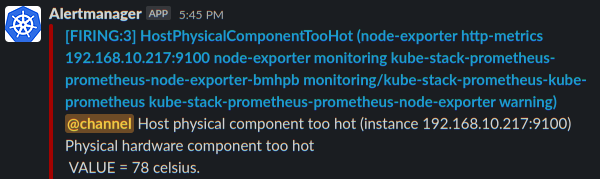
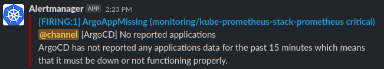
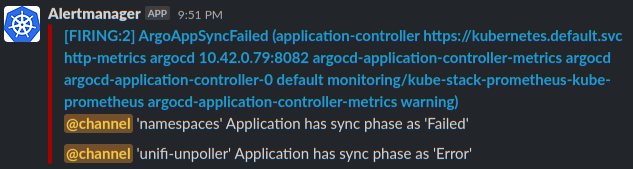
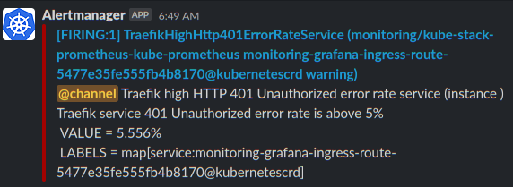
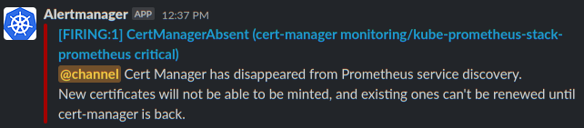
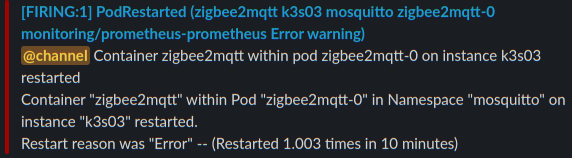

# Custom Alerts for Prometheus Alertmanager

This is a collection of alerts to be added to Prometheus Alertmanger. Many of them I cherry picked from [Awesome Prometheus Alerts](https://awesome-prometheus-alerts.grep.to/), some of them needed to be tweaked.

[Return to Application List](../)

Custom Alerts can be added to the following applications, details below.

* [Prometheus Self Alerts](#prometheus-self-alerts)
* [Node Exporter Alerts](#node-alerts)
* [Node ZFS Alerts](#node-zfs-alerts)
* [ArgoCS Sync Alerts](#argocd-sync-alerts)
* [Traefik Ingres Controller Alerts](#traefik-ingress-alerts)
* [Longhorn Cluster Storage Alerts](#longhorn-cluster-storage-alerts)
* [Cert-Manager Certificate Alerts](#cert-manager-certificate-alerts)
* [Sealed Secrets Controller Alerts](#sealed-secrets-controller-alerts)
* [Mosquitto MQTT Broker Alerts](#mosquitto-mqtt-alerts)

---

## Prometheus Self Alerts

These alerts override existing default alerts that have non-operator names and thus would not fire correctrly.

| Alert Description           | Condition           | Duration to Trigger |
|---                          | ---                 |---                  |
| Prometheus Missing / Down   | Job Absent          | Instantly           |
| Alertmanager Missing / Down | Job Absent          | Instantly           |

---

## Node Alerts

These alerts cover each node in the cluster.

| Alert Description       | Condition           | Duration to Trigger |
|---                      | ---                 |---                  |
| Host Out of Memory      | Less than 10%       | 5 minutes           |
| Host Under Memory Pressure | High Page Fault Count | 5 minutes      |
| Host Out of Disk Space  | Less than 10% left  | 5 minutes           |
| Host Disk almost Full   | Less than 20% left  | 5 minutes           |
| Host High CPU Load      | More than 80% Avg   | 5 minutes           |
| Host OOM Kill Detected  | More than zero      | Within Past 5 minutes |
| Host Components too Hot | More than 75 Celsius | 5 minutes          |
| Host Network Interface Saturated | More than 80% | 5 minutes        |
| Host Clock Skew         | +/- 0.05 seconds    | 2 minutes           |

Example Alert sent to Slack Channel:



---

## Node ZFS Alerts

These alerts cover each node in the cluster.

| Alert Description              | Condition    | Duration to Trigger |
|---                             | ---          |---                  |
| Host ZFS Pool Unexpected State | Not "online" | 1 minute            |

* NOTE: ZFS Pool Status metrics require `zfs_exporter` (See [Prometheus Exporters](../../docs/prometheus-exporters-settings.md))
  * Recent ZFS version removed the metrics that `node-exporter` used to scrape metrics - [See GitHub Issue](https://github.com/prometheus/node_exporter/issues/2068).

---

## ArgoCD Sync Alerts

**IMPORTANT**: You need to _enable_ the ArgoCD serviceMonitors.  They are **not** enabled by default. If the serviceMonitors are not enabled you will see an alert `No reported applications` such as:



### Enable ArgoCD ServiceMonitors

To enable the serviceMonitors, edit the ArgoCD `values.yaml` file in the ArgoCD git repository located at `/workloads/argocd/values.yaml` and uncomment the serviceMonitor entries such as:

```yaml
  ## Application controller metrics configuration
  metrics:
    enabled: true
    serviceMonitor:
      enabled: true
      namespace: monitoring
```

* Uncomment for `Application Controller`, `redis-exporter`, `Server metrics`, `Repo server`, `ApplicationSet controller` and `Notifications Controller`.  Save and commit change to the git repository.

These alerts cover each application deployed.

| Alert Description             | Condition             | Duration to Trigger |
|---                            | ---                   |---                  |
| Application OutofSync         | More than zero        | 1 minute            |
| Application Sycn Failed       | More than zero        | 1 minute            |
| ArgoCD Application Missing    | ArgoCD App not found  | 15 minutes          |

Example Alert sent to Slack Channel:



---

## Traefik Ingress Alerts

| Alert Description         | Condition           | Duration to Trigger |
|---                        | ---                 |---                  |
| High HTTP 401 Error Count | 5% of past 3 minute traffic | 1 minute    |
| High HTTP 403 Error Count | 5% of past 3 minute traffic | 1 minute    |
| High HTTP 404 Error Count | 5% of past 3 minute traffic | 1 minute    |
| High HTTP 5xx Error Count | 5% of past 3 minute traffic | 1 minute    |

Example Alert sent to Slack Channel:



---

## Longhorn Cluster Storage Alerts

| Alert Description           | Condition             | Duration to Trigger |
|---                          | ---                   |---                  |
| Cluster Storage at Capacity | Over 90% capacity     | 5 minutes           |
| Node Volume Fault           | Volume Fault          | 2 minutes           |
| Node Volume Degraded        | Volume Degraded       | 5 minutes           |
| Node Storage at Capacity    | Over 70% capacity     | 5 minutes           |
| Node Disk at Capacity       | Over 70% capacity     | 5 minutes           |
| Longhorn Node Down          | Node offline          | 5 minutes           |
| Instance Manager High CPU   | 3x CPU Request Limit  | 5 minutes           |
| Longhorn Node High CPU      | Over 90% CPU          | 5 minutes           |

---

## Cert-Manager Certificate Alerts

| Alert Description           | Condition              | Duration to Trigger |
|---                          | ---                    |---                  |
| Cert-Manager Absent         | Application Missing    | 10 minutes          |
| Certificate Expires Soon    | Expires within 21 days | 1 hour              |
| Certificate Not Ready       | Not Ready Status       | 10 minutes          |
| Lets Encrypt Rate Limit Hit | Unable to Renew Cert   | 5 minutes           |

Example Alert sent to Slack Channel:



---

## Sealed Secrets Controller Alerts

| Alert Description             | Condition              | Duration to Trigger  |
|---                            | ---                    |---                   |
| Higher Number of Unseal Errors| Non Zero Value         | 5 minutes            |
| Sealed Secret Not Synced      | Synced Not True        | 5 minutes            |

## Pod Alerts

| Alert Description             | Condition              | Duration to Trigger  |
|---                            | ---                    |---                   |
| Pod Restarted                 | More than Once         | Within 10 minutes    |

Example Alert sent to Slack Channel:



## Mosquitto MQTT Alerts

| Alert Description             | Condition              | Duration to Trigger  |
|---                            | ---                    |---                   |
| Published Message Rate        | Equal Zero             | 1 minute             |

[Return to Application List](../)
