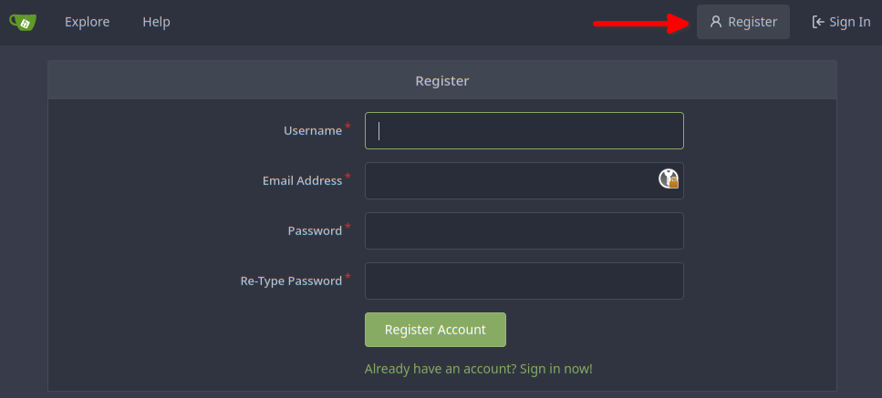
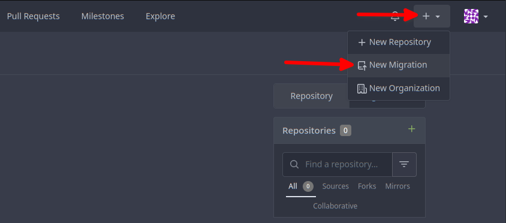
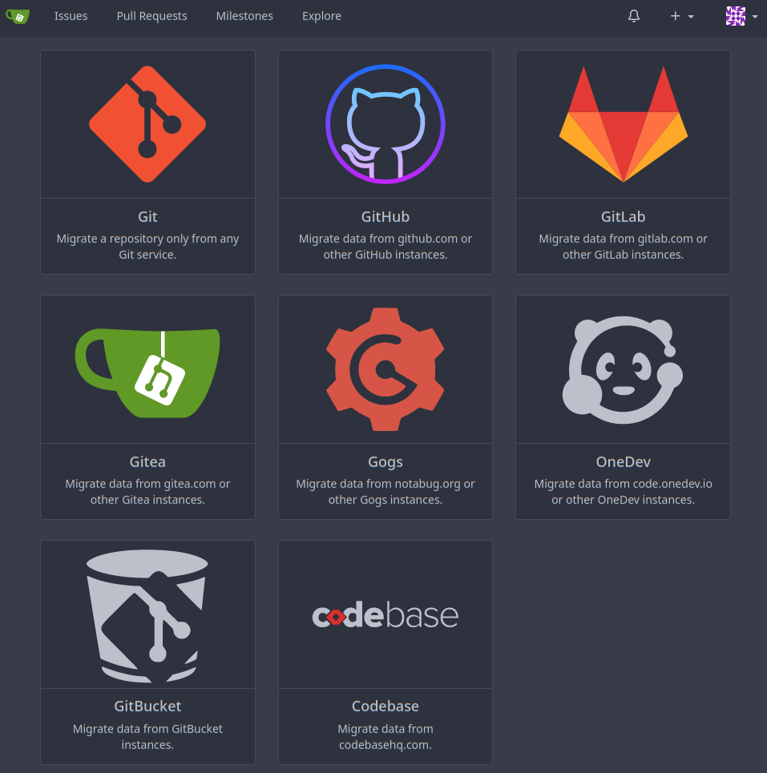
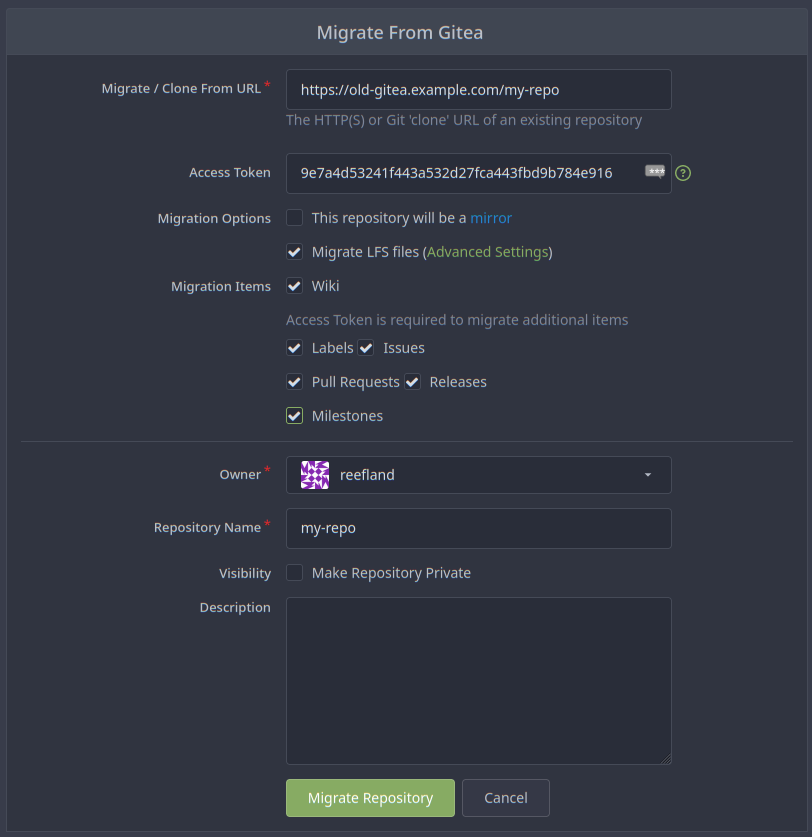

# Gitea is a painless self-hosted Git service

It is similar to GitHub, Bitbucket, and GitLab.

[Return to Application List](../)

* Kustomize based ArgoCD application deployment
* Deployed as a Statefulset
* Uses only Sqlite3 database for light-weight, small installation.
  * Use the project's Helm Chart instead if you want more advanced databse options.
* Gitea rootless (non-root) container is used
* Inbound SSH (port 22) handled via LoadBalancer

NOTE: First account registered after installation is the Administrative account.  No kubernetes secret required to configure an admin secret.

---

## Installation Configuration

Update file in `gitea-argocd-kustomize/workloads/gitea/kustomization.yaml` to define specifics about your Kubernetes environment:

* Define LoadBalancer IP Address for inbound SSH connections:

  ```yaml
  patches:
  # Set Service to LoadBalancer and Specify IP Address to use
  - patch: |-
      - op: remove
        path: /spec/clusterIP
      - op: add
        path: /spec/type
        value: LoadBalancer
      - op: add
        path: /spec/loadBalancerIP
        value: 192.168.10.222
  ```

  * The inbound HTTP traffic will be handled by the Ingress controller (see below).

* Define Inbound Ingress HTTP domain name:

  ```yaml
  - patch: |-
      - op: replace
        path: /spec/rules/0/host
        value: "gitea.example.com"
  ```

* Define the Storage Size and Storage Class Name:

  ```yaml
  - patch: |-
      - op: replace
        path: /spec/resources/requests/storage
        value: "5Gi"
      - op: replace
        path: /spec/storageClassName
        value: "local-path"
  ```

If you wish to enable `cpu` and `memory` resource limits then update file `resources-patch.yaml`.

---

## Gitea app.ini Configuration File

Update file in `gitea-argocd-kustomize/workloads/gitea/base/conf/app.ini` to setup initial configuration.  See [Project Documentation](https://docs.gitea.io/en-us/config-cheat-sheet) for details.

* Upon the initial install this file will be copied in one-time as part of the initContainer. Any modifications needed after that you can do manually within the container. The `app.ini` file is stored within the persistent storage volume (PVC).

  ```ini
  APP_NAME = Gitea: Git with a cup of tea
  RUN_USER = git
  RUN_MODE = prod
  ```

  * You can change the `APP_NAME` to whatever you like.
  * Do not change the `RUN_USER`, leave as `git`.
  * You can change the `RUN_MODE` if needed, `prod` is typical.

### Gitea Server Configuration

* Adjust the domain names below:

  ```ini
  [server]
  DOMAIN                  = gitea.example.com
  ```

  * The `DOMAIN` should be the only value you need to update. This is the Ingress name of the Traefik Ingress LoadBalancer (see `kustomization.yaml` and `ingress.yaml`).
  * No other values should need to be modified.

### Gitea Services Configuration

* See [Project Documentation](https://docs.gitea.io/en-us/config-cheat-sheet/#service-service) on which services you might want to enable or disable.
* This can be easily modified directly after installation.

  ```yaml
  [service]
  DISABLE_REGISTRATION              = false
  REQUIRE_SIGNIN_VIEW               = false
  REGISTER_EMAIL_CONFIRM            = false
  ENABLE_NOTIFY_MAIL                = false
  ALLOW_ONLY_EXTERNAL_REGISTRATION  = false
  ENABLE_CAPTCHA                    = false
  DEFAULT_KEEP_EMAIL_PRIVATE        = false
  DEFAULT_ALLOW_CREATE_ORGANIZATION = true
  ENABLE_USER_HEATMAP               = true
  DEFAULT_ENABLE_TIMETRACKING       = true
  NO_REPLY_ADDRESS                  = noreply.localhost
  ```

### Gitea Migrations

If you plan on migrating repositories from other instances (Gitea, GitLab, GitHub, etc) into Gitea, you might need to enable or add options here.

* To allow migrations from other instances on your local network, you would need to enable `ALLOW_LOCALNETWORKS`.

  ```ini
  [migrations]
  ALLOW_LOCALNETWORKS = true
  ```

  * Testing showed this was needed to migrate repositories from my local Docker Gitea to my local Kubernetes Gitea.

---

## Enable Prometheus Metrics

If you wish to enable Prometheus Metics scraping of Gitea:

* Enable the Prometheus Endpoint in Gitea within the `app.ini` file:

  ```yaml
  [metrics]
  ENABLED = true
  ENABLED_ISSUE_BY_REPOSITORY=true
  ENABLED_ISSUE_BY_LABEL=true
  ```

* Update file in `gitea-argocd-kustomize/workloads/gitea/base/application/kustomization.yaml`  and Uncomment the `servicemonitor.yaml` entry:

  ```yaml
  resources:
    - ingress.yaml
    - pvc.yaml
    - statefulset.yaml
    - service.yaml
    - servicemonitor.yaml
  ```

* Enable Grafana Dashboard to view Prometheus Metrics, uncomment this section:

  ```yaml
  configMapGenerator:
    - name: gitea-dashboard-17802
      files: [ gitea-dashboard-17802.json ]

  generatorOptions:
    disableNameSuffixHash: true
    labels:
      grafana_dashboard: "true"
  ```

---

## Application Deployment

* Test YAML syntax for any errors:

```shell
$ kubectl kustomize . | kubectl create --namespace gitea -f - --dry-run=client

configmap/gitea-config-file created (dry run)
service/gitea-http created (dry run)
service/gitea-ssh created (dry run)
persistentvolumeclaim/gitea-data created (dry run)
statefulset.apps/gitea created (dry run)
ingress.networking.k8s.io/gitea-http created (dry run)
```

* You can now deploy this directly by simply removing the `--dry-run=client` from above.

* Or for ArgoCD based deployment, include the:
  * `applications/gitea.yaml`
  * `namespaces/gitea.yaml`
  * `workloads/gitea/` (all files within directory structure)

---

### Troubleshooting

* To access the Init Container logs:

  ```yaml
  $ kubectl logs -n gitea gitea-0 -c init-gitea-storage

  Existing /data/gitea/conf/app.ini found, init skipped.
  ```

* To access the Gitea Container logs:

  ```yaml
  $ kubectl logs -n gitea gitea-0 -c gitea             
  2023/01/01 23:26:30 cmd/web.go:106:runWeb() [I] Starting Gitea on PID: 1
  2023/01/01 23:26:30 cmd/web.go:157:runWeb() [I] Global init

  ...

  2023/01/01 23:26:30 ...s/graceful/server.go:61:NewServer() [I] [63b216a6-42] Starting new SSH server: tcp::2222 on PID: 1
  2023/01/01 23:26:30 cmd/web.go:217:listen() [I] [63b216a6-50] Listen: http://0.0.0.0:3000
  2023/01/01 23:26:30 cmd/web.go:221:listen() [I] [63b216a6-50] AppURL(ROOT_URL): https://gitea-new.rich-durso.us/
  2023/01/01 23:26:30 cmd/web.go:224:listen() [I] [63b216a6-50] LFS server enabled
  2023/01/01 23:26:30 ...s/graceful/server.go:61:NewServer() [I] [63b216a6-50] Starting new Web server: tcp:0.0.0.0:3000 on PID: 1
  ```

* To Modify the `app.ini` file in Gitea Container (takes effect on next restart):

  ```yaml
  $ kubectl exec -it gitea-0 -n gitea -c gitea -- vi /data/gitea/conf/app.ini

  # File will loaded in vi editor
  ```

* Check size of Gitea SQLite3 database file:

  ```shell
  $ kubectl exec gitea-0 -n gitea -c gitea -- ls -lh /data/data/gitea.db

  -rw-rw-r--    1 git      git         1.5M Jan  1 23:53 /data/data/gitea.db
  ```

---

## Administrative Account Registration

Once deployed successfully, proceed to the Gitea URL from your web browser.  The first account registered will be the administrative account. Click the `[Register]` button:



* Fill out the form, click `[Register Account]` button and you're done!

---

### Migrate Repositories

To migrate repositories from another Gitea instance, you will need an access token from that repository.  

* Create Access Token:

  ```shell
  $ curl -H "Content-Type: application/json" -d '{"name":"migrate-token"}' -u gitea https://old-gitea.example.com/api/v1/users/my-repo/tokens                        
  
  Enter host password for user 'gitea':

  {"id":1,"name":"migrate-token","sha1":"9e7a4d53241f443a532d27fca443fbd9b784e916","token_last_eight":"b784e916"}
  ```

* The `sha1` value is the access token.

#### Start Migration Wizard

* Click `[+]` and select `New Migration`:



* Select the Repository Type you want to migrate, such as `Gitea`:



* Fill out the Gitea Migration Wizard Form:



* Click `[Migrate Repository]` to start.

NOTE: Don't forget to delete the access token created above from the original instance when your migrations are complete!

---

[Return to Application List](../)
