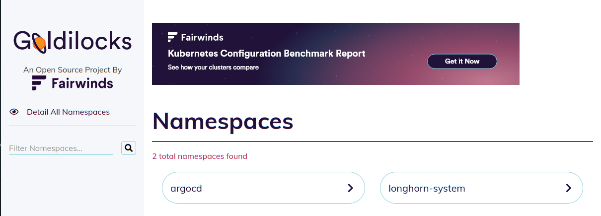
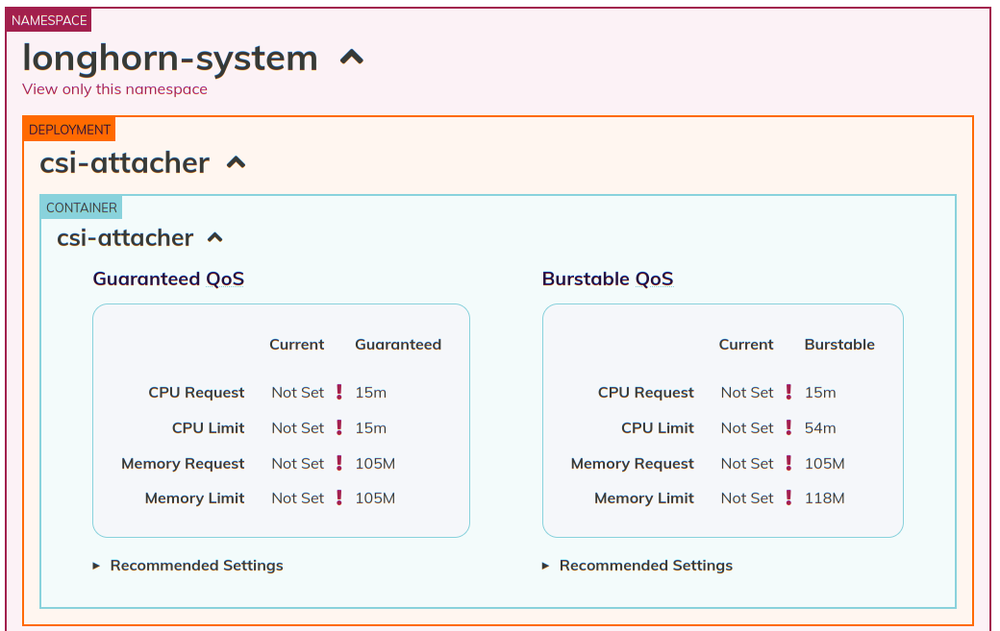
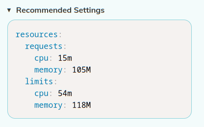
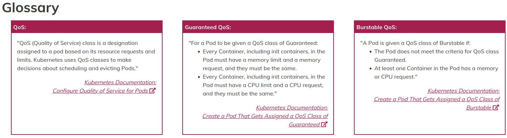

# Goldilocks

Goldilocks is a utility from Fairwinds to identify requests and limits, based on the Kubernetes [Vertical Pod Autoscaler (VPA)](../vpa/).

[Return to Application List](../)

* This tool creates a VPA for each workload in a namespace and then queries them for information
* Once the VPA are in place, Goldilocks Dashboard can be used to view the information

To enable Goldilocks on a namespace, simply apply a label to the namespace you want to monitor:

```shell
kubectl label namespace <nam-space-name> goldilocks.fairwinds.com/enabled=true
```

For example, this enabled ArgoCD to be monitored:

```shell
$ kubectl label namespace argocd goldilocks.fairwinds.com/enabled

namespace/argocd labeled
```

Within a few minutes, can you confirm a VPA has been created for each pod in the namespace such as:

```shell
$ kubectl get vpa -n argocd

NAME                                          MODE   CPU   MEM         PROVIDED   AGE
goldilocks-argocd-application-controller      Off    49m   297164212   True       34h
goldilocks-argocd-applicationset-controller   Off    15m   104857600   True       34h
goldilocks-argocd-notifications-controller    Off    15m   104857600   True       34h
goldilocks-argocd-redis                       Off    11m   52428800    True       34h
goldilocks-argocd-repo-server                 Off    15m   144645763   True       34h
goldilocks-argocd-server                      Off    15m   104857600   True       34h
```

A Traefik IngressRoute is provided under `goldilocks/workloads/traefik-config/goldilocks_ingress_route.yml` file.  You will need to update the `Host` rule `match` to be whatever domain name you use.  This should simply be a DNS alias to your Traefik ingress domain name (shares same IP address).

```yaml
spec:
  entryPoints:
    - websecure
  routes:
    - kind: Rule
      match: Host(`goldilocks.example.com`)
      priority: 10
      services:
      - name: goldilocks-dashboard
        port: 80
```

* NOTES:  I was unable to get the application working as a pathPrefix (`https://example.com/goldilocks/`)
  * Accessing the dashboard as a DNS alias is the next easiest option
  * You could just use a port-forward instead when you want to view the dashboard

* Since the dashboard is read-only, I did not enable authentication. You can easily add it if needed.

---

Once the IngressRoute and DNS alias are in place, the Goldilocks dashboard URL will resemble `https://goldilocks.example.com`:



Select a namespace you applied a label too, which enabled Goldilocks monitoring.  In this example I have enabled monitoring on `argocd` and `longhorn-system` namespaces.  Upon selecting a namespace you will see something like this:



The container `csi-attacher` has no current resource limits applied.  You can see the recommended values if you want to define `Guaranteed QoS` resources or `Burstable QoS` resources.

If you wanted to enable `Burstable QoS`, then expand the `Recommended Settings` to see the code to apply to the container's deployment:



You would then apply these values to the container's manifest spec, commit the changes to ArgoCD Repository and let ArgoCD deploy updated containers with new values.

* The recommendations are always changing based on application usage.  Even if you apply these settings, and check back again do not be surprised if the numbers have changed... they should be reasonably close but different.

---

* If you need need a refresher on what `QoS`, `Guaranteed QoS` and `Burstable QoS` mean then scroll down to the bottom of the dashboard for the Glossary.



---

* NOTE: You may see symbols like `!`, `<`, `>`, `=` between values.  It's not clear what exactly they are supposed to mean, I've not found it documented.

[Return to Application List](../)
