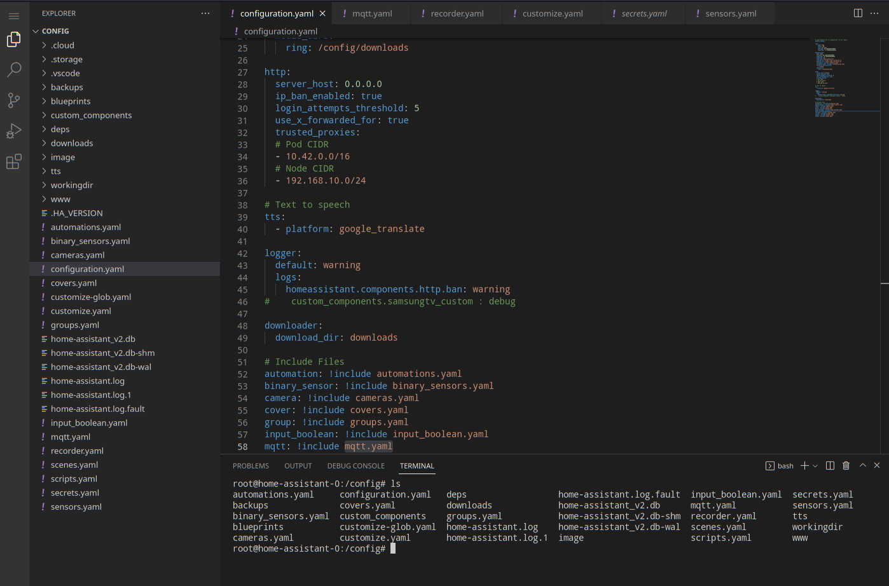

# Home Assistant - Open source home automation

[Return to Application List](../)

* Kustomize based ArgoCD application deployment
* Deployed as a Statefulset with a 10Gi Democratic-CSI iSCSI Persistent Storage Volume for data

Review file `home-assistant-argocd-helm/applications/home-assistant.yaml`

* Define the ArgoCD project to assign this application to
* ArgoCD uses `default` project by default

  ```yaml
  spec:
    project: default
  ```

* Affinity by default is set to be scheduled on the same node as Mosquitto MQTT Broker via `podAffinity`
  * Comment out or remove if not using MQTT Broker within Kubernetes
  * This `podAffinity` is best effort, not a requirement.
  * If insufficient resources exist on node where MQTT Broker then an alternate node is acceptable

  ```yaml
      # -- Affinity rules best effort to place the Pod with MQTT Broker when possible
      affinity:
        podAffinity:
          preferredDuringSchedulingIgnoredDuringExecution:
            - weight: 100
              podAffinityTerm:
                labelSelector:
                  matchExpressions:
                    - key: app.kubernetes.io/name
                      operator: In
                      values:
                        - mosquitto
                topologyKey: "kubernetes.io/hostname"
  ```

* The `ingress` middleware reference points to the Traefik CRD for without basic authentication as Home Assistant provides its own authentication:

  ```yaml
    ingress:
      main:
        enabled: true
        annotations:
          traefik.ingress.kubernetes.io/router.entrypoints: "websecure"
          traefik.ingress.kubernetes.io/router.middlewares: "traefik-x-forward-https-headers@kubernetescrd,traefik-compress@kubernetescrd"
        hosts:
          - host: ha.example.com
            paths:
              - path: /
                pathType: Prefix
  ```

* Enable `codeserver` to enable the graphical vscode editor:

  ```yaml
    addons:
      codeserver:
        enabled: true
  ```

The `codeserver` is an editor you can use to maintain configuration files using by Home Assistant.



* The `ingress` middleware reference points to the Traefik CRD for basic authentication and middleware needed to access the `codeserver` page:

  ```yaml
        ingress:
          enabled: true
          annotations:
            traefik.ingress.kubernetes.io/router.entrypoints: "websecure"
            traefik.ingress.kubernetes.io/router.middlewares: "traefik-traefik-basic-auth@kubernetescrd,traefik-codeserver-stripprefix@kubernetescrd,traefik-compress@kubernetescrd"
          hosts:
            - host: ha.example.com
              paths:
                - path: /codeserver
                  pathType: Prefix
  ```

---

## Home Assistant Community Store - HACS

HACS is not part of the Home Assistant configuration and does not install without manual intervention as some utilities like `wget` and `unzip` do not exist within the Home Assistant container.

Official HACS Download Steps : [https://hacs.xyz/docs/setup/download/](https://hacs.xyz/docs/setup/download/)

The Home Assistant container is built upon Debian however it is missing `wget` and `unzip` required for the HACS script to run. To add them, access the container shell, you can use the Terminal feature of the CodeServer addon to complete this. Note the utility versions listed below are for Debain 11.

```shell
cd /config
mkdir workdir
cd workdir

curl http://ftp.de.debian.org/debian/pool/main/w/wget/wget_1.21-1+deb11u1_amd64.deb -o wget_1.21-1+deb11u1_amd64.deb

curl http://ftp.de.debian.org/debian/pool/main/u/unzip/unzip_6.0-26_amd64.deb -o unzip_6.0-26_amd64.deb

apt install ./unzip_6.0-26_amd64.deb
apt install ./wget_1.21-1+deb11u1_amd64.deb

cd /config
workdir/HACS.sh
```

Some expected output when script is executing:

```text
INFO: Creating HACS directory...
INFO: Unpacking HACS...
INFO: Removing HACS zip file...
INFO: Installation complete.

INFO: Remember to restart Home Assistant before you configure it
```

Once this has completed, you can proceed to the Initial HACS Configuration: [https://hacs.xyz/docs/configuration/basic/](https://hacs.xyz/docs/configuration/basic/)
