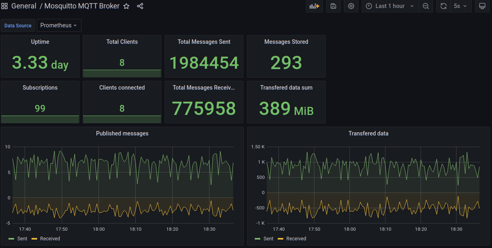

# Mosquitto-Exporter Mosquitto Prometheus Service Monitor

Mosquitto-Exporter exposes Mosquitto MQTT Broker Metrics as Prometheus Service Monitor.

[Return to Application List](../README.md)

* Kustomize based ArgoCD application deployment
* Deployed as a Deployment with configMapGenerator and secretGenerator

Review `mosquitto-exporter/kustomization.yaml`

* Set the initial image version

```yaml
images:
  - name: sapcc/mosquitto-exporter
    newTag: 0.8.0
```

* Set MQTT Username and password (not base64 encoded)

```yaml
# Don't base64 encode secret values here
secretGenerator:
- name: node-exporter-secret
  literals:
  - mqtt-user=<USERNAME_HERE>
  - mqtt-pass=<PASSWORD_HERE>

```

* Set namespace where Prometheus is located
* Set the Prometheus Auto-Discovery label used

```yaml
# Set namespace where Prometheus is located
# Set label Prometheus uses for ServiceMonitor auto-discovery
patches:
- patch: |-
    - op: replace
      path: /metadata/namespace
      value: monitoring
    - op: replace
      path: /metadata/labels/release
      value: kube-stack-prometheus
  target:
    kind: ServiceMonitor
```

---

Grafana Dashboard for Mosquitto MQTT: `11542`



[Return to Application List](../README.md)
