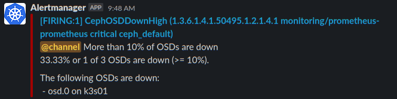
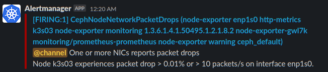
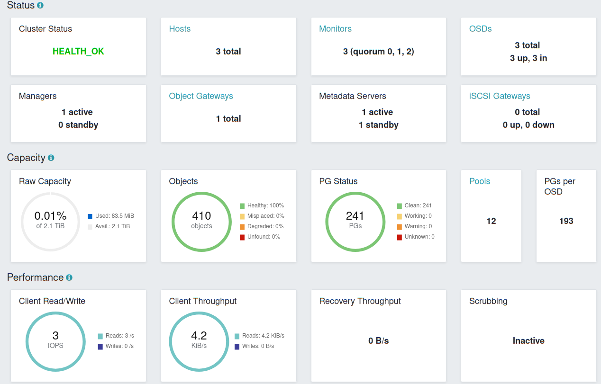
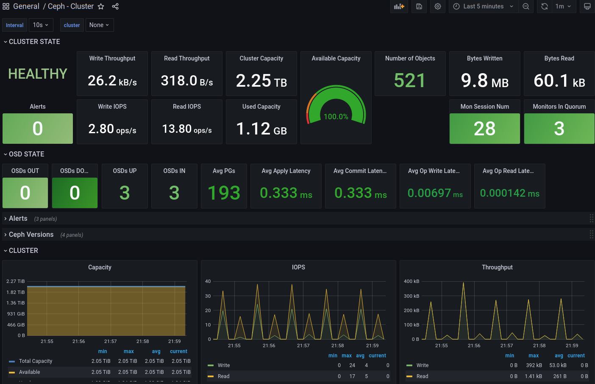

# Rook-Ceph - Rook orchestrates the Ceph storage solution

[Return to Application List](../)

* Specialized Kubernetes Operator to automate Ceph management
* Rook ensures that Ceph will run well on Kubernetes and simplify the deployment and management experience
  * Ceph still has a considerable learning curve
  * Spend the time to understand how this storage solution works
* ArgoCD based Helm application deployment

Rook-Ceph is storage managed within the Kubernetes cluster (much like Longhorn, but much more sophisticated). It does not require storage resources outside of the cluster. This is enterprise class software being scaled down for HomeLab use. Rook-Ceph default configuration values are not for small clusters.

* They assume your cluster has at least 5 nodes and each node has at least one storage device for Ceph to use.  It also defaults to lots of CPU and Memory resources (requests & limits).
* I've modified this configuration to worked for 3 nodes, each with at least one storage device.  If your nodes have less than 8GB of RAM available for Ceph's use pay close attention.  You might have edit or remove resource requests & limits to get everything to fit.
* This configuration does:
  * 3x replication for Ceph Block storage (iSCSI like, PVC are one per pod)
  * 3x replication for Ceph FileSystem storage (shared filesystem across multiple pods)
  * 2x replication for Ceph Object storage (like AWS S3 storage).  I don't use this, and scaled it down a bit to make room for the other storage types.
  * NFS based storage pools are disabled

Generally speaking, 3x replication means 2 storage devices can fail or 2 nodes be down without data loss.  The more nodes and devices you have the less likely 2 of them go down at the same time the less likely you will have data loss.

---

## Rook Operator Configuration

Review file `rook-ceph-argocd-helm/applications/rook-ceph-operator.yaml`

* Define the ArgoCD project to assign this application to
* ArgoCD uses `default` project by default

  ```yaml
  spec:
    project: default
  ```

* Unlike many Helm based applications, this one allows Helm to manage CRDs (Custom Resource Definitions), leave this at `true` if you change after deployment it will probably destroy your Ceph cluster. If you select `false` then you have to manage CRDs yourself.

  ```yaml
    ## Whether the helm chart should create and update the CRDs.
    crds:
      enabled: true
  ```

* Rook Operator does not use much memory or CPU unless it is applying configuration changes to the cluster

  ```yaml
    resources:
      limits:
        cpu: 500m
        memory: 512Mi
      requests:
        cpu: 120m
        memory: 150Mi
  ```

The rest of the settings will require you to review the Ceph project documentation to understand.  They are sane defaults for a small working cluster.  These additional features can be enabled, and scaled for larger deployments should you need it.

Prometheus monitoring has been enabled by default. If you are not using Prometheus, this can be disabled.

  ```yaml
      monitoring:
        # requires Prometheus to be pre-installed
        # enabling will also create RBAC rules to allow Operator to create ServiceMonitors
        enabled: true
  ```

---

## Cluster Configuration

Review file `rook-ceph-argocd-helm/applications/rook-ceph-cluster.yaml`

This file defines the Ceph storage cluster.  Changes to this file are monitored and implemented by ArgoCD and the Rook operator.

* Define the ArgoCD project to assign this application to
* ArgoCD uses `default` project by default

  ```yaml
  spec:
    project: default
  ```

Overrides to the default `ceph.conf` configuration file are easily defined here:

  ```yaml
    # Ability to override ceph.conf
    configOverride: |
      [global]
      mon_max_pg_per_osd = 250
      # Enable trim on SSD storage disabled by default
      bdev_enable_discard = true
      bdev_async_discard = true
  ```

* `mon_max_pg_per_osd` defines the maximum number of placement groups that can be stored on a single OSD (storage device). Ideally this number would be around 100 but this is not possible with a small cluster with only a handle of devices.   As your storage cluster grows, this number can be reduced.
* `bdev_enable_discard` and `bdev_async_discard` are enabled (`true`) to allow TRIM and FSTRIM operations to happen on SSD / NVMe storage devices.  This allows storage to be reclaimed as blocks are marked free.
  * Likely not needed if you use traditional spinning HDDs only
  * There are performance impacts to enabling this which may impact larger storage clusters.  For smaller clusters with few devices, reclaiming storage space is more important than raw performance.

[Ceph Toolbox](ceph-toolbox.md) is a POD you can attach to to run Ceph CLI commands to administer, configure, check status and troubleshoot your storage cluster.  You will need to learn Ceph CLI commands eventually. Especially when devices or nodes fail.  The toolbox resources have been reduced for smaller clusters.

  ```yaml
    # Installs a debugging toolbox deployment
    toolbox:
      enabled: true
      tolerations: []
      affinity: {}
      resources:
        limits:
          cpu: "100m"
          memory: "384Mi"
        requests:
          cpu: "50m"
          memory: "64Mi"
  ```

If you do NOT have Prometheus, this can be disabled.  The alerting rules will monitor storage devices and cluster status and provide alerts.

  ```yaml
    # monitoring requires Prometheus to be pre-installed
    monitoring:
      # enabling will also create RBAC rules to allow Operator to create ServiceMonitors
      enabled: true
      # whether to create the prometheus rules
      createPrometheusRules: true
  ```

### Examples of Prometheus Alerts to my Slack Channel





The `cephClusterSpec` values control the Ceph Cluster CRD configuration.  Some of these settings influence high-availability and redundancy of Monitors, Managers, Dashboard, Host Networking, etc.

* Cluster Monitor Daemons - One or more instances provides extremely reliable and durable storage of cluster membership, configuration, and state. Should have at least 3 each on a difference node.

  ```yaml
    cephClusterSpec:
    ...
      mon:
        # Set the number of mons to be started. Generally recommended to be 3.
        count: 3
        # The mons should be on unique nodes. For production, at least 3 nodes are recommended for this reason.
        # Mons should only be allowed on the same node for test environments where data loss is acceptable.
        allowMultiplePerNode: false
  ```

* Ceph Manager daemon runs alongside monitor daemons, to provide additional monitoring and interfaces to external monitoring and management systems. At least 1 is required, an additional can be added later.

  ```yaml
    mgr:
      # When higher availability of the mgr is needed, increase the count to 2.
      # In that case, one mgr will be active and one in standby. When Ceph updates which
      # mgr is active, Rook will update the mgr services to match the active mgr.
      count: 1
      allowMultiplePerNode: false
      modules:
        # Several modules should not need to be included in this list. The "dashboard" and "monitoring" modules
        # are already enabled by other settings in the cluster CR.
        - name: pg_autoscaler
          enabled: true
  ```

* Ceph Dashboard is a built-in web-based Ceph management and monitoring application through which you can inspect and administer various aspects and resources within the cluster.

  ```yaml
      # enable the ceph dashboard for viewing cluster status
      dashboard:
        enabled: true
        # serve the dashboard under a subpath (useful when you are accessing the dashboard via a reverse proxy)
        urlPrefix: /ceph-dashboard
        # serve the dashboard at the given port.
        # port: 8443
        # Serve the dashboard using SSL (if using ingress to expose the dashboard and `ssl: true` you need to set
        # the corresponding "backend protocol" annotation(s) for your ingress controller of choice)
        ssl: false
  ```

  * `urlPrefix` will make the dashboard listen for a path prefix like `https://k3s.example.com/ceph-dashboard`
  * `ssl` is `false` as the Ingress controller will provide SSL (HTTPS)

* Host Networking allows Ceph storage resources to be available outside of the Kubernetes cluster.  You desktop or laptop or other resources can mount Ceph volumes when enabled.

  ```yaml
      # Network configuration, see: https://github.com/rook/rook/blob/master/Documentation/CRDs/Cluster/ceph-cluster-crd.md#network-configuration-settings
      network:
        # enable host networking
        provider: host
  ```

* Crash Collector module collects information about daemon crashdumps and stores it in the Ceph cluster for later analysis.

  ```yaml
      # enable the crash collector for ceph daemon crash collection
      crashCollector:
        disable: false
        # Uncomment daysToRetain to prune ceph crash entries older than the
        # specified number of days.
        daysToRetain: 45
  ```

* Log Collector and log rotation.

  ```yaml
      # enable log collector, daemons will log on files and rotate
      logCollector:
        enabled: true
        periodicity: daily # one of: hourly, daily, weekly, monthly
        maxLogSize: 250M # SUFFIX may be 'M' or 'G'. Must be at least 1M.
  ```

---

Ceph Cluster resources have been tweaked from the defaults to support smaller clusters.

* Note that some processes such as  OSDs will not even start without at least a 2Gib resource limit.

---

Ceph Cluster Storage definitions are very flexible and can be defined in a combination of all nodes or devices specific to one node.

* I found it easier with a small cluster, to just list the names of devices Ceph is allowed to use.
* Any devices not listed here will be ignored.
* The device can be located on any node, I let Ceph look for it and determine which node it is on.
* Devices can be a complete device or just a partition of an existing device.
  * Fast devices like NVMe are fine using just a partition.  HDDs and SATA SSDs tend to be better using complete devices.
  * Fast devices like NVMe can be broken up into multiple OSDs but then each OSD needs its own daemon process which is CPU & RAM intensive for smaller clusters.  Just be aware that a single OSD process will not be able to saturate NVMe bandwidth. You probably would need 3 or more OSDs per NVMe device which requires a lot of CPU and RAM.
* To conserve RAM all storage devices are assigned just one OSD daemon, but you can change this.

  ```yaml
      storage: # cluster level storage configuration and selection
        useAllNodes: true
        useAllDevices: false
        config:
          osdsPerDevice: "1" # SSD / NVMe devices (HDD should use 1)
          storeType: bluestore
        devices:
          - name: "/dev/disk/by-id/nvme-Samsung_SSD_980_1TB_S64AN07316T-part5" #k3s01
          - name: "/dev/disk/by-id/nvme-Samsung_SSD_980_1TB_S64AN31593J-part5" #k3s02
          - name: "/dev/disk/by-id/nvme-Samsung_SSD_980_1TB_S64AN01060J-part5" #k3s03
  ```

* Ceph Dashboard Ingress will create the ingress route to access the dashboard:

  ```yaml
      ingress:
        dashboard:
          annotations:
            traefik.ingress.kubernetes.io/router.entrypoints: "websecure"
            traefik.ingress.kubernetes.io/router.middlewares: "traefik-x-forward-https-headers@kubernetescrd,traefik-compress@kubernetescrd"
          host:
            name: k3s.example.com
            path: "/ceph-dashboard/"
  ```

  * The annotations specify Traefik specific features to enable such as the `websecure` entrypoint (HTTPS port 443), forward https-headers, and compress the stream.
  * Adjust the `host` to match your ingress load balancer name.
  * Adjust `path` to match whatever you specified for the dashboard `urlPrefix` in the dashboard section.

Initial Ceph Dashboard:


---

### Storage Pools

* `cephBlockPools` is a pre-defined storage pool for block storage:

  ```yaml
      cephBlockPools:
        - name: ceph-blockpool
          # see https://github.com/rook/rook/blob/master/Documentation/CRDs/Block-Storage/ceph-block-pool-crd.md#spec for available configuration
          spec:
            failureDomain: host
            replicated:
              size: 3
            parameters:
              compression_mode: aggressive
          storageClass:
            enabled: true
            name: ceph-block
            isDefault: true
            reclaimPolicy: Retain
            allowVolumeExpansion: true
            mountOptions:
              - discard
  ```

  * The `failureDomain` of `hosts` indicates that this pool will only be replicated to OSDs on other hosts
  * The `replicated.size` of `3` indicates this must be replicated to 3 different hots to be considered healthy
  * `compression_mode` states to always try to compress data, without or without hints being given
  * The `storageClass` is `enabled`, named `ceph-block`
    * Will be a default storage class if one is not specified
    * Persistent Volumes will be retained when deleted
    * Volumes can be increased in size when needed
    * `mountOptions` of `discard` is for the filesystem to pass on information about deletes for disk space reclaiming

  ```shell
  $ kubectl get storageclass ceph-block

  NAME                   PROVISIONER                  RECLAIMPOLICY   VOLUMEBINDINGMODE   ALLOWVOLUMEEXPANSION   AGE
  ceph-block (default)   rook-ceph.rbd.csi.ceph.com   Retain          Immediate           true                   7d21h
  ```

* `cephFileSystems` is a pre-defined storage pool for CephFS storage (shared filesystem):

  ```yaml
      cephFileSystems:
        - name: ceph-filesystem
          # see https://github.com/rook/rook/blob/master/Documentation/CRDs/Shared-Filesystem/ceph-filesystem-crd.md#filesystem-settings for available configuration
          spec:
            metadataPool:
              failureDomain: host
              replicated:
                size: 3
            dataPools:
              # Optional and highly recommended, 'data0' by default, see https://github.com/rook/rook/blob/master/Documentation/CRDs/Shared-Filesystem/ceph-filesystem-crd.md#pools
              - name: data0
                failureDomain: host
                replicated:
                  size: 3
                parameters:
                  compression_mode: aggressive
  ```

  * The CephFS requires metadata pools besides data pools.
    * The `failureDomain` of `hosts` indicates that this pool will only be replicated to OSDs on other hosts
    * The `replicated.size` of `3` indicates this must be replicated to 3 different hots to be considered healthy
    * `compression_mode` states to always try to compress data, without or without hints being given

  * The metadata server properties can be defined, below worked will on my small cluster:

  ```yaml
      metadataServer:
        activeCount: 1
        activeStandby: true
        resources:
          limits:
            cpu: "250m"
            memory: "1Gi"
          requests:
            cpu: "100m"
            memory: "256Mi"
  ```

  * The `storageClass` is `enabled`, named `ceph-filesystem`:

  ```yaml
    storageClass:
      enabled: true
      isDefault: false
      name: ceph-filesystem
      reclaimPolicy: Retain
      allowVolumeExpansion: true
      mountOptions:
        - discard
  ```

  * Will NOT be a default storage class
  * Persistent Volumes will be retained when deleted
  * Volumes can be increased in size when needed
  * `mountOptions` of `discard` is for the filesystem to pass on information about deletes for disk space reclaiming

  ```shell
  $ kubectl get storageclass ceph-filesystem

  NAME              PROVISIONER                     RECLAIMPOLICY   VOLUMEBINDINGMODE   ALLOWVOLUMEEXPANSION   AGE
  ceph-filesystem   rook-ceph.cephfs.csi.ceph.com   Retain          Immediate           true                   7d21h
  ```

* Ceph Object Stores are Amazon S3 compatible. I do not use S3 storage much, so I reduced resources allocated to this storage type.  If Object Storage is important to you:
  * Be sure to bump `replicated.size` to `3`
  * Enable the storage class

Ceph Grafana Dashboard:

