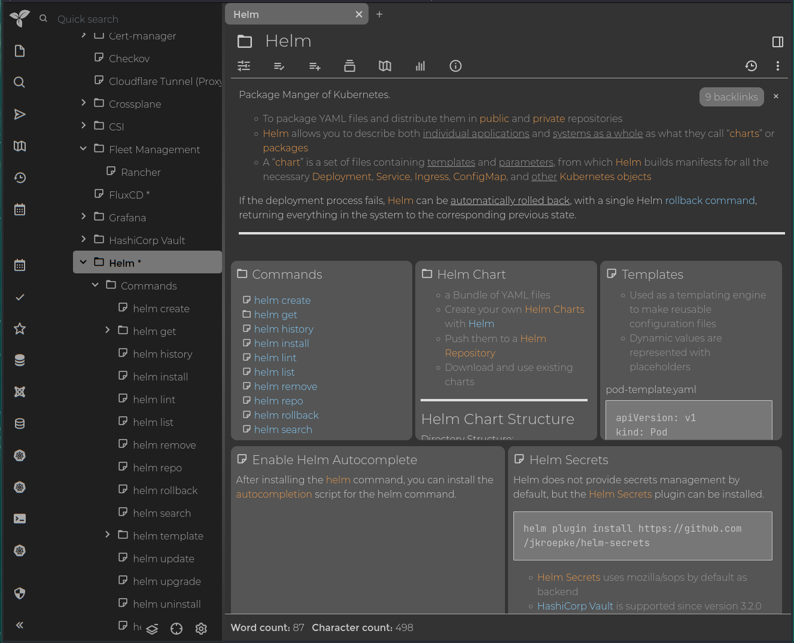

# Trilium Notes - hierarchical note taking application with focus on building large personal knowledge bases

[Return to Application List](../)

* Helm based ArgoCD application deployment
* Deployed as a Statefulset

Review file `trilium-notes-argocd-helm/applications/trilium-notes.yaml`

* Define the ArgoCD project to assign this application to
* ArgoCD uses `default` project by default

  ```yaml
  spec:
    project: default
  ```

* The `ingress` middleware reference points to the Traefik CRD without basic authentication as Trilium Notes provides its own authentication:

  ```yaml
    ingress:
      main:
        enabled: true
        annotations:
          traefik.ingress.kubernetes.io/router.entrypoints: "websecure"
          traefik.ingress.kubernetes.io/router.middlewares: "traefik-x-forward-https-headers@kubernetescrd,traefik-compress@kubernetescrd"
        hosts:
          - host: trilium.example.com
            paths:
              - path: /
                pathType: Prefix
  ```

## Data Migration

Upon first connection to Ingress, it will allow you connect to an existing instance (or start new if this is your first time using it).  I selected the option to connect to a server instance which I had running under docker.  It prompted for the URL of the server instance to connect to. It immediately connected and the two installations completed a data sync (4300+ notes sycn'd in under 2 minutes).

I then switched my laptop and desktop installations of Trilium Notes to point to the new Kubernetes server instance and performed a data sync to confirm that a page edit on my desktop would sync to the Kubernetes server instance and then the laptop would pickup the page edit on its next sync.

---

## Trilium Notes Server Web Interface

As viewed from web browser using server instance deployed on Kubernetes.



## Trilium Notes Desktop Interface

You can easily theme both types of interfaces.


