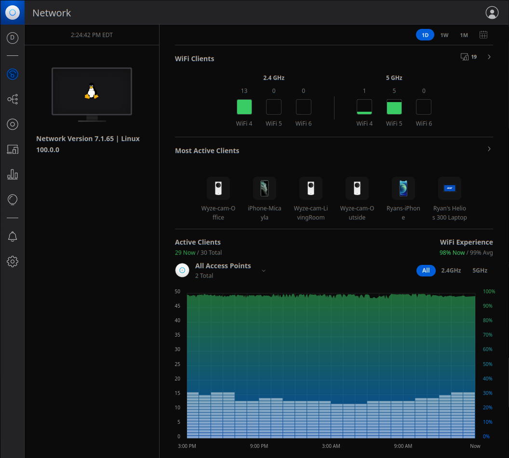

# Unifi Controller Wireless Network Management Software from Ubiquiti

* Be sure to export a backup from your existing installation.  You will be able to import that backup into this installation.

[Return to Application List](../)

* Kustomize based ArgoCD application deployment
* Deployed as a Statefulset with a 2Gi Longhorn Persistent Storage Volume for data

Review `unifi-controller/kustomization.yaml`

* Set the initial image version
* Service type is `LoadBalancer` and specific IP Address can be defined

```yaml
images:
  - name: linuxserver/unifi-controller
    newTag: 7.1.65

patches:
  # Set Service to LoadBalancer and Specify IP Address to use
  - patch: |-
      - op: add
        path: /spec/type
        value: LoadBalancer
      - op: add
        path: /spec/loadBalancerIP
        value: 192.168.10.242
    target:
      kind: Service
```

* Set Fully Qualified Domain Name for Traefik Ingress Route.

```yaml
  # Set IngressRoute Match Value for Traefik
  # Remember to use ` (backtick) not ' (single quote) around Host
  - patch: |-
      - op: replace
        path: /spec/routes/0/match
        value: Host(`unifi.example.com`)
    target:
      kind: IngressRoute
```

* Set Longhorn Persistent Volume Claim storage size
  * Storage needs to be large enough to hold Unifi Controller own internal database, backups and historical data

```yaml
  # Set Longhorn Persistent Volume Claim Size
  - patch: |-
      - op: replace
        path: /spec/resources/requests/storage
        value: 2Gi
    target:
      kind: PersistentVolumeClaim
```

Review `unifi-controller/applications/unifi-controller.yaml`

* Set `repoURL` source to the path of your dedicated ArgoCD repository

```yaml
  source:
    repoURL:  https://github.com/<USER_NAME>/<REPO_NAME>.git
    targetRevision: HEAD
    path: workloads/unifi-controller
```

---

Note the Unifi Controller application can take several minutes to become ready.  Getting a `Bad Gateway` message after installation or upgrade is normal.  Monitor the container logs to see when it is ready, or just try again in a few minutes.

---



[Return to Application List](../)
