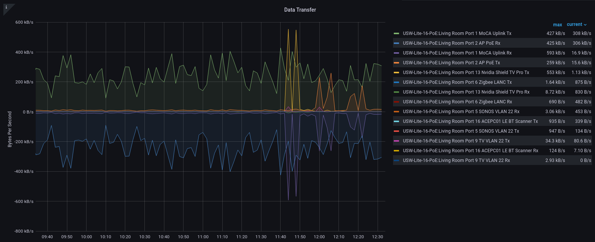
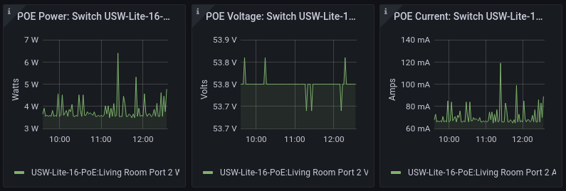

# Unpoller Exporter Prometheus Pod Monitor

Unpoller Exporter will exposes Unifi Controller Management Software metrics as Prometheus Pod Monitor.  Project Site:  [https://unpoller.com/](https://unpoller.com/)

NOTE: You will need to create a Read-Only admin account that is allowed to log into the Unifi Network Console. This account is used by Unpoller to extract metrics to expose to Prometheus.

[Return to Application List](../)

* Kustomize based ArgoCD application deployment
* Deployed as a Deployment with configMapGenerator and secretGenerator (or see instructions to create secrets manually)

Review `unpoller-exporter/kustomization.yaml`

* Set the initial image version

  ```yaml
  images:
    - name: golift/unifi-poller
      newTag: 2.1.3
  ```

* Review configMapGenerator file referenced in `./base/conf/up.conf`
  * This is only used to define how to reach Unifi Controller application
  * No changes to this file should be needed

  ```yaml
  generatorOptions:
    disableNameSuffixHash: true

  configMapGenerator:
  - name: unpoller-config-file
    files:
    - ./base/conf/up.conf
  ```

* Define the Read-Only ID and Password that Unpoller can log into Unifi Network Controller with:

  * OPTION 1 - You can uncomment and define the secrets within `unpoller-exporter/kustomization.yaml` however, if you plan to add this file to ArgoCD or a code repository such as git this is not recommended instead see other options below.

    ```yaml
    # Create a Read-Only Unifi Console Admin, enter credentials below
    # Don't base64 encode secret values here
    secretGenerator:
    - name: unpoller-secret
      literals:
      - unifi-user=<USERNAME_HERE>
      - unifi-pass=<PASSWORD_HERE>
    ```

  * OPTION 2 - You can create a secrets file directly and apply this to the cluster to prevent your secret from being committed to the repository:

    ```shell
    $ kubectl -n unifi create secret generic unpoller-secret \
      --from-literal=unifi-user=<USERNAME_HERE> \
      --from-literal=unifi-pass=<PASSWORD_HERE> \
      --dry-run=client -o yaml > unpoller-secret.yaml

      # No output expected
    ```

    Manually apply secret to cluster:

    ```shell
    $ kubectl create -f unpoller-secret.yaml 
    secret/unpoller-secret created
    ```

  * OPTION 3 - Convert secret created above into a Sealed Secret which is safe for code repository and ArgoCD:

    ```shell
    $ kubeseal --controller-namespace=sealed-secrets --format=yaml < unpoller-secret.yaml > unpoller-secret-sealed.yaml

    # No output expected
    ```

    This sealed secret can be added to your code repository the way you handle your other sealed secrets or applied directly.

* Set namespace where Prometheus is located
* Set the Prometheus Auto-Discovery label used

```yaml
# Set namespace where Prometheus is located
# Set label Prometheus uses for PodMonitor auto-discovery
patches:
- patch: |-
    - op: replace
      path: /metadata/namespace
      value: monitoring
    - op: replace
      path: /metadata/labels/release
      value: kube-prometheus-stack
  target:
    kind: PodMonitor
```

* Set namespace for Grafana dashboards where the sidecar is looking for matching labels

```yaml
- patch: |-
    - op: replace
      path: /metadata/namespace
      value: monitoring
  target:
    kind: ConfigMap
    name: unpollerdashboard-*
```

---

Once configured correctly, the unpoller container logs will resemble something like:

```log
2022/06/19 22:26:36 [INFO] Prometheus exported at http://0.0.0.0:9130/ - namespace: unifipoller
2022/06/19 22:26:54 [INFO] UniFi Measurements Exported. Site: 1, Client: 26, UAP: 2, USG/UDM: 0, USW: 4, DPI Site/Client: 0/0, Desc: 167, Metric: 1372, Err: 0, 0s: 349, Req/Total: 44.2ms / 50ms
2022/06/19 22:27:24 [INFO] UniFi Measurements Exported. Site: 1, Client: 26, UAP: 2, USG/UDM: 0, USW: 4, DPI Site/Client: 0/0, Desc: 167, Metric: 1372, Err: 0, 0s: 350, Req/Total: 41.8ms / 49.3ms
2022/06/19 22:27:54 [INFO] UniFi Measurements Exported. Site: 1, Client: 26, UAP: 2, USG/UDM: 0, USW: 4, DPI Site/Client: 0/0, Desc: 167, Metric: 1372, Err: 0, 0s: 371, Req/Total: 31.3ms / 40.9ms
2022/06/19 22:28:24 [INFO] UniFi Measurements Exported. Site: 1, Client: 27, UAP: 2, USG/UDM: 0, USW: 4, DPI Site/Client: 0/0, Desc: 167, Metric: 1392, Err: 0, 0s: 360, Req/Total: 33.5ms / 43.5ms
2022/06/19 22:28:54 [INFO] UniFi Measurements Exported. Site: 1, Client: 27, UAP: 2, USG/UDM: 0, USW: 4, DPI Site/Client: 0/0, Desc: 167, Metric: 1392, Err: 0, 0s: 358, Req/Total: 34.3ms / 41.6ms
```

---

Grafana Dashboard for Unifi Controller USW Insights - traffic per port / Unpoller: [11312](https://grafana.com/grafana/dashboards/11312)

This will be automatically installed as a configMap Dashboard for Grafana as part of the Unpoller Exporter deployment.



POE usage on a port:



Grafana Dashboard for Unifi Controller UAP Insights / Unpoller: [11314](https://grafana.com/grafana/dashboards/11314)

This will be automatically installed as a configMap Dashboard for Grafana as part of the Unpoller Exporter deployment.


Grafana Dashboard for Unifi Controller Client Insights: [11315](https://grafana.com/grafana/dashboards/11315)

This will be automatically installed as a configMap Dashboard for Grafana as part of the Unpoller Exporter deployment.


[Return to Application List](../)
