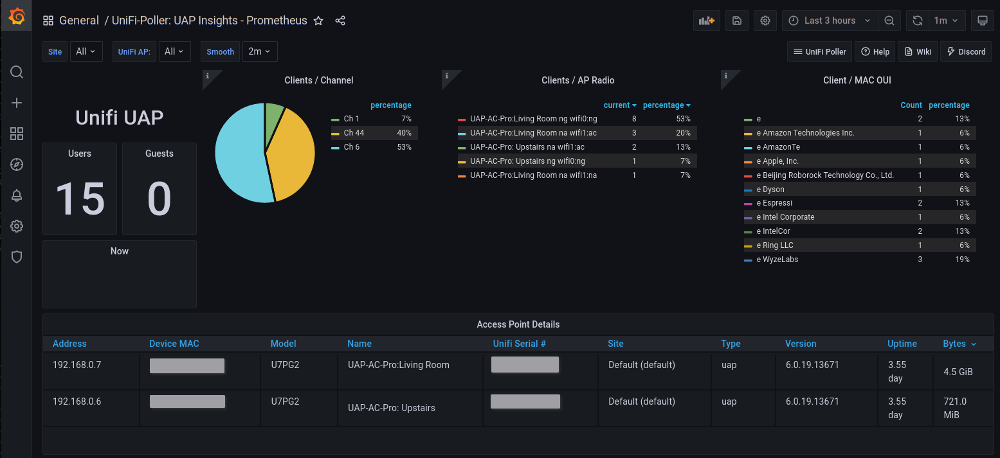
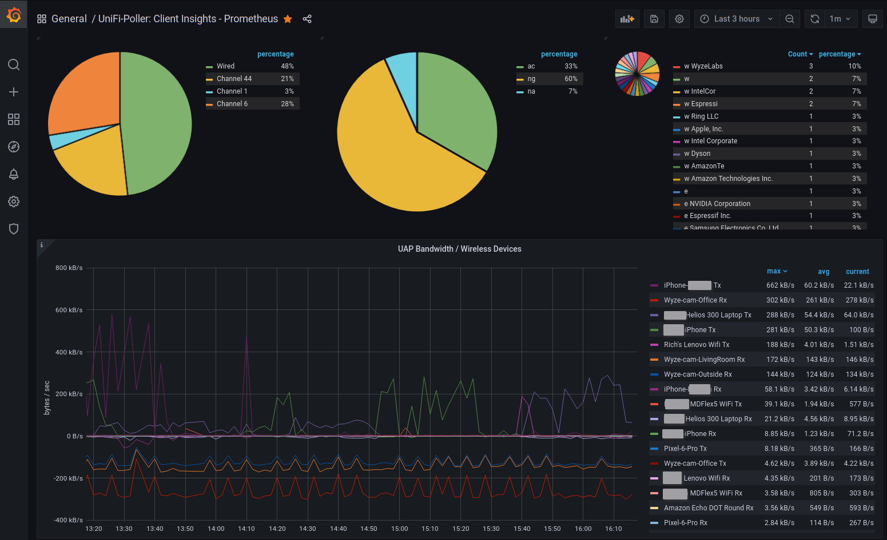

# Unpoller Exporter Prometheus Pod Monitor

Unpoller Exporter will exposes Unifi Controller Management Software metrics as Prometheus Pod Monitor.  Project Site:  [https://unpoller.com/](https://unpoller.com/)

NOTE: You will need to create a Read-Only admin account that is allowed to log into the Unifi Network Console. This account is used by Unpoller to extract metrics to expose to Prometheus.

[Return to Application List](../)

* Kustomize based ArgoCD application deployment
* Deployed as a Deployment with configMapGenerator and secretGenerator

Review `unpoller-exporter/kustomization.yaml`

* Set the initial image version

```yaml
images:
  - name: golift/unifi-poller
    newTag: 2.1.3
```

* Review configMapGenerator file referenced in `./base/conf/up.conf`
  * This is only used to define how to reach Unifi Controller application
  * No changed to this file should be needed

```yaml
configMapGenerator:
- name: unpoller-config-file
  files:
  - ./base/conf/up.conf
```

* Define the Read-Only ID and Password that Unpoller should log into Unifi Network Controller

```yaml
# Create a Read-Only Unifi Console Admin, enter credentials below
# Don't base64 encode secret values here
secretGenerator:
- name: unpoller-secret
  literals:
  - unifi-user=<USERNAME_HERE>
  - unifi-pass=<PASSWORD_HERE>
```

* Set namespace where Prometheus is located
* Set the Prometheus Auto-Discovery label used

```yaml
# Set namespace where Prometheus is located
# Set label Prometheus uses for PodMonitor auto-discovery
patches:
- patch: |-
    - op: replace
      path: /metadata/namespace
      value: monitoring
    - op: replace
      path: /metadata/labels/release
      value: kube-stack-prometheus
  target:
    kind: PodMonitor
```

---

Grafana Dashboard for Unifi Controller UAP Insights / Unpoller: [11314](https://grafana.com/grafana/dashboards/11314)



Grafana Dashboard for Unifi Controller Client Insights: [11315](https://grafana.com/grafana/dashboards/11315)



[Return to Application List](../)
