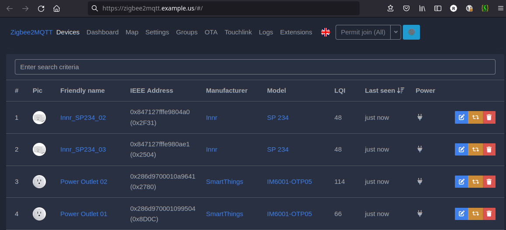
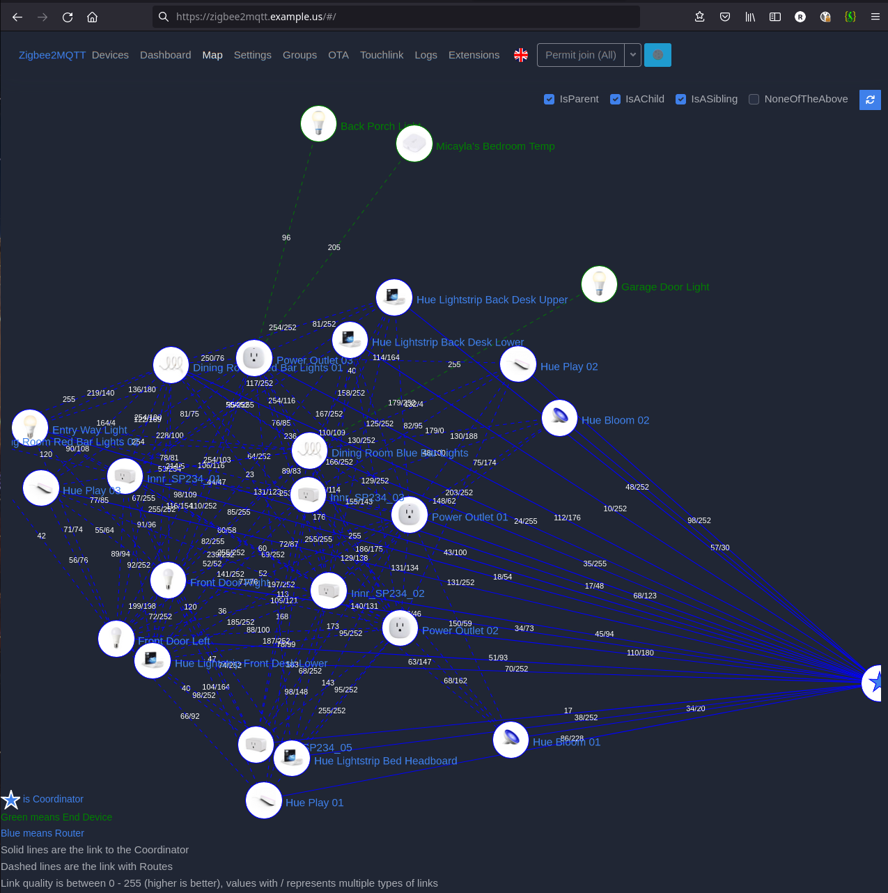

# Zigbee2MQTT - Zigbee to MQTT Bridge

[Return to Application List](../)

* Kustomize based ArgoCD application deployment
* Deployed as a Statefulset with a 100Mi Longhorn Persistent Storage Volume for data

Review file `zigbee2mqtt-argocd-helm/applications/zigbee2mqtt.yaml`

* Define the ArgoCD project to assign this application to
* ArgoCD uses `default` project by default

  ```yaml
  spec:
    project: default
  ```

* If using USB coordinator device and having an issue you might need to enable privileged `securityContext`
  * A network based coordinator does not need this enabled

  ```yaml
    # Configured for Network Coordinator not USB
    securityContext:
      privileged: false
  ```

* For Persistent Storage, not much is needed.  However the storage is somewhat write intensive which means it is not a good fit for Longhorn storage.  The storage class is set to Democratic CSI's iSCSI.  You may need to adjust this to fit your needs:

  ```yaml
    persistence:
      data:
        enabled: true
        mountPath: /data
        type: pvc
        accessMode: ReadWriteOnce
        size: 100Mi
        retain: true
        storageClass: freenas-iscsi-csi
        # existingClaim:
        # volumeName:
  ```

* Affinity by default is set to be scheduled on the same node as Mosquitto MQTT Broker via `podAffinity`
  * If using USB coordinator device, you **WILL** need to change this section to be based on `nodeAffinity` to always schedule on node with the USB device

  ```yaml
    # -- Affinity constraint rules to place the Pod with MQTT Broker
    affinity:
      podAffinity:
        requiredDuringSchedulingIgnoredDuringExecution:
          - labelSelector:
              matchExpressions:
                - key: app.kubernetes.io/name
                  operator: In
                  values:
                    - mosquitto
            topologyKey: "kubernetes.io/hostname"
  ```

---

NOTE: The configuration section will be written to disk ONLY ONCE as part of initilization of the pod / PVC storage.  To make configuration changes you will have to manually edit the configuration file. The `codeserver` graphical editor sidecar can be enabled for easy editing.

* Define Zigbee Coordinator, network coordinator shown:

  ```yaml
    config:
      ...

      # USB / Serial settings / Network Coordinator IP Address
      serial:
        port: tcp://192.168.2.8:6638
  ```

* Define your network key, channel and power for the coordinator:

  ```yaml
    config:
      ...

      advanced:
        network_key: GENERATE

        # (Note: use a ZLL channel: 11, 15, 20, or 25 to avoid Problems)
          # default: 11
          channel: 24
          transmit_power: 9
  ```

* Define URL name for Graphical Zigbee2MQTT interface to use

  ```yaml
    config:
      ...

      # Both of these need to be enabled for the webui
      frontend:
        port: 8080
        url: https://zigbee2mqtt.example.com

      experimental:
        new_api: true
      
  ```

* The `ingress` middleware reference points to the Traefik CRD for basic authentication needed to access web page

  ```yaml
    ingress:
      main:
        enabled: true
        annotations:
          traefik.ingress.kubernetes.io/router.entrypoints: "websecure"
          traefik.ingress.kubernetes.io/router.middlewares: "traefik-traefik-basic-auth@kubernetescrd"
        hosts:
          - host: zigbee2mqtt.example.com
            paths:
              - path: /
                pathType: Prefix
  ```

* Enable `codeserver` to enable the graphical vscode editor:

  ```yaml
    addons:
      codeserver:
        enabled: true
  ```

The `codeserver` is an editor you can use to maintain configuration files stored within the pod.


* The `ingress` middleware reference points to the Traefik CRD for basic authentication and middleware needed to access the `codeserver` page:

```yaml
        ingress:
          enabled: true
          annotations:
            traefik.ingress.kubernetes.io/router.entrypoints: "websecure"
            traefik.ingress.kubernetes.io/router.middlewares: "traefik-traefik-basic-auth@kubernetescrd,traefik-codeserver-stripprefix@kubernetescrd,traefik-compress@kubernetescrd"
          hosts:
            - host: zigbee2mqtt.example.com
              paths:
                - path: /codeserver
                  pathType: Prefix
```

---

Create secret file for the MQTT Broker Connection and apply this to the cluster to prevent your secret from being committed to the repository:

  Filename: `zigbee2mqtt-secret.yaml`

  ```yaml
  apiVersion: v1
  kind: Secret
  metadata:
    name: zigbee2mqtt-mqtt-auth-secret
    namespace: mosquitto
  stringData:
    secret.yaml: |
      mqtt-user: <USERNAME_HERE>
      mqtt-pass: <PASSWORD_HERE>
  ```

  OPTION 1 - Either manually apply secret to cluster:

  ```shell
  $ kubectl create -f zigbee2mqtt-secret.yaml

  secret/zigbee2mqtt-secret.yaml created
  ```

  OPTION 2 - Or convert secret created above into a Sealed Secret which is safe for code repository and ArgoCD:

  ```shell
  $ kubeseal --controller-namespace=sealed-secrets --format=yaml < zigbee2mqtt-secret.yaml > zigbee2mqtt-secret-sealed.yaml

  # No output expected
  ```

* This sealed secret `zigbee2mqtt-secret-sealed.yaml` can be added to your code repository the way you handle your other sealed secrets or applied directly.

---

Zigbee2MQTT Web Interface:



Zigbee2MQTT Device Map:



---
[Return to Application List](../)
