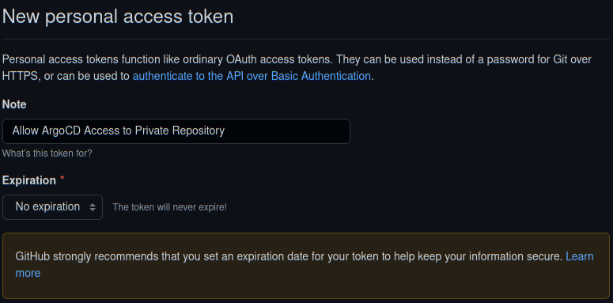
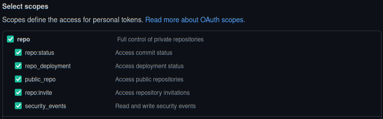
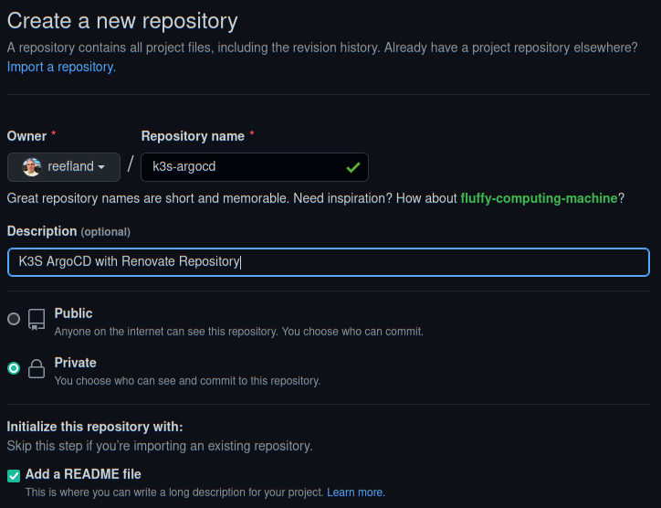
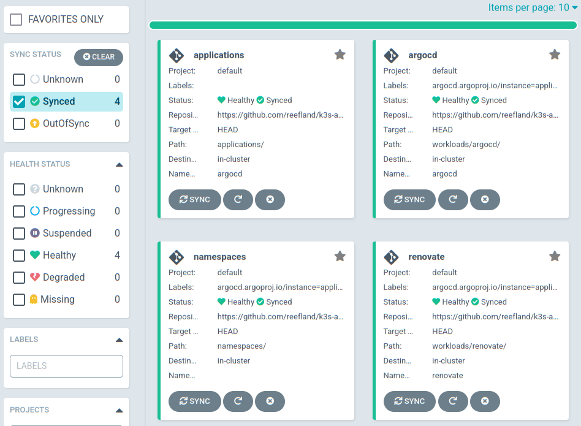

# ArgoCD Settings & Important Notes

[Back to README.md](../README.md)

## Important Notes

* ArgoCD will be used to deploy & monitor changes to deployed applications.
* ArgoCD requires a Git repository (GitHub) to store its configuration.
  * A Private repository is recommended and supported by default.
  * This should be a empty repository dedicated for ArgoCD's usage.

### Initial Empty Repository

When the repository is empty:

* The empty repository is cloned to establish a git directory structure.
* This Ansible process renders an initial set of all application manifests files to built the cluster services used by this Ansible install method.
* The rendered ArgoCD manifest and values files are used to install ArgoCD via Helm.
* The rendered manifest files are checked into the Git repository. It will no longer be empty.
* ArgoCD will now start to monitor the repository and deploy any application and configuration which are not yet deployed.

### Populated Repository

* The repository is cloned as-is.
* This ansible script will render new or missing (deleted) files into the repository.
  * Ansible will not update or overwrite existing files in the repository.
  * If you want Ansible to render a new version of an existing file, delete that file from the repository.
* Any updated files are checked into the repository.
* ArgoCD will monitor the repository and process whatever new applications or configuration changes that were added

---

## Create Personal Access Token

Github does not use ID & Password for API access.  A [Personal Access Token](https://docs.github.com/en/authentication/keeping-your-account-and-data-secure/creating-a-personal-access-token) needs to be created.

* NOTE: Personal Access Token is not scoped to a repository, it is scoped to the entire account.

Navigate: Profile > Settings > Developer Settings (bottom left) > Personal Access Tokens > click `[Generate new token]`.

* Enter a useful and descriptive note to remind you why this was created.



* Select an expiration date.  The more frequently it expires the more frequently you will need to update the ArgoCD secret to allow connectivity

### Set Personal Access Token Scope

ArgoCD documentation does not specify the minimum requirements for the Person Access Token.  I had to enabled these in my testing:



_NOTE: The `repo` (Full control of private repositories) is required which forces all the boxes below it to be enabled. Attempting to remove `public_repo` and updating the token seems to work (no error), but upon looking at the token scopes again it is re-enabled._

---

## Create GitHub Repository for ArgoCD

Create a new GitHub repository.  A private repository is recommended.

* NOTE: The repository cannot be completely empty or the clone will fail; enable the option to `Add a README file`.



---

## Review `vars/secrets/main.yml` for ArgoCD Secrets

You need to define which repository ArgoCD will use and how to connect to it.

```yaml
###[ ArgoCD Secrets: Repository Connections ]######################################################
ARGOCD_REPO_URL_SECRET: "https://github.com/<user-name>/<repo-name>"

# Github can use any non-empty value, its essentially ignored
ARGOCD_REPO_USERNAME_SECRET: "oauth"

# Github Personal Access Token
ARGOCD_REPO_PASSWORD_SECRET: "<token-value>"
```

* `ARGOCD_REPO_URL_SECRET` points to the dedicated ArgoCD repository to use. Do NOT include ".git" at the end of it.
* `ARGOCD_REPO_USERNAME_SECRET` typically is just any non-empty value and is not actually used in authentication.
* `ARGOCD_REPO_PASSWORD_SECRET` is the value of the Personal Access Token.

**Be sure to encrypt all the secrets above when completed:**

```shell
ansible-vault encrypt vars/secrets/main.yml
```

---

## Review `defaults/main.yml` for ArgoCD Settings

The ArgoCD Settings are in variable namespace `install.argocd`.

* Enable or disable installation of ArgoCD. Disabled will prevent the installation of all applications beyond the reduced K3s installation.

  ```yaml
  install:
    argocd:
      enabled: true
  ```

* Pin which version of ArgoCD to install.  This is the Helm Chart version, not the application version.
  * This is for initial installation only. Do not update this value to attempt to push an application upgrade.

  ```yaml
      # Select Release to install: https://artifacthub.io/packages/helm/argo/argo-cd
      install_version: "{{argocd_install_version|default('4.5.10')}}"
  ```

* Define the namespace to install ArgoCD into.

  ```yaml
      namespace: "argocd"
  ```

* Define Repository Connection Settings

  ```yaml
      repository:
        name: "k3s-argocd-renovate"
        url: "{{ ARGOCD_REPO_URL_SECRET }}"       # https://github.com/<user>/<repo-name>
        username: "{{ ARGOCD_REPO_USERNAME_SECRET }}"    # oath
        password: "{{ ARGOCD_REPO_PASSWORD_SECRET }}"    # Github Personal Access Token
  ```

  * The `name` is used within ArgoCD, it can be changed if you like.
  * The `ARGOCD_REPO_URL_SECRET`, `ARGOCD_REPO_USERNAME_SECRET`, `ARGOCD_REPO_PASSWORD_SECRET` values should be defined in `vars/secrets/main.yaml` file.
    * Be sure to to use `ansible-vault` to encrypt your secrets.

---

## ArgoCD Initial Dashboard

Once Traefik has been deployed the ArgoCD Dashboard URL path will resemble: `https://k3s.example.com/argocd/`.  

* If you need earlier access to the ArgoCD Dashboard via Port Forwarding, see section `Early Access to ArgoCD Dashboard` below.

The following shows the contents of the ArgoCD dashboard when only ArgoCD and Renovate are installed.



---

## Troubleshooting ArgoCD

### Early Access to ArgoCD Dashboard

The early initial installation will not have an ingress controller.  To get early access the ArgoCD dashboard to check connectivity to repository and status of deployments:

#### Create a Port Forward

Assuming K3s is not on your local machine, this will open a port accessible external to the cluster:

```shell
$ kubectl port-forward -n argocd svc/argocd-server 8080:80 --address='0.0.0.0'

Forwarding from 0.0.0.0:8080 -> 8080
```

#### Open Web Browser

Point your web browser to the cluster node IP or hostname using port 8080:

`http://k3shost.example.com:8080/argocd/`

You should now see the ArgoCD login page.  The default credentials if you did not change them:

* Username: `admin`
* Password: `password`

---

### Monitor ArgoCD Repository Logs

The ArgoCD repository server might provide additional troubleshooting information:

```shell
kubectl logs pod/argocd-repo-server-b884f4bc5-nsr8q -n argocd
```

* Adjust the pod name to match whatever your instance shows.

---

## ArgoCD Initial Cluster Full Deployment - Sync Waves

When all (or most) of the default applications in this Ansible playbook are added to the ArgoCD repository, upon ArgoCD first repository sync process it can be a chaotic race condition of deployments and service creation.  Usually Kubernetes deployment progressions can handle this by stalling a deployment until required items are available.  However after much testing, it seemed I had repeated issues with Cluster Load Balancers not giving out IP addresses and Let's Encrypt certificates not being fully created. To help with this ArgoCD Sync waves are implemented.

Sync waves are an integer number (negative or positive) assigned via Kubernetes annotations to application deployments and objects. The lower the number the earlier ArgoCD will process it. For the Initial Cluster Sync ArgoCD will:

* Scan every application being deployed looking for Sync Wave annotations.
* Arrange applications/objects to process via Sync Wave number (lowest to highest) to determine order of processing.
  * Applications without a defined Sync Wave number are assigned `0` (zero)
* Applications with the same Sync Wave number are installed at the same time.
* Once all applications with the same Sync Wave number are synced and healthy:
  * ArgoCD pauses for a few seconds for the cluster to catch up.
  * ArgoCD moves to the next highest Sync Wave number.
* This process progresses until all applications have been Synced.

### Sync Wave Values Assigned to Applications

The application / objects deployed via this Ansible process are assigned the following:

| Sync Wave Value | Description                 |
|     :----:      | :---                        |
| -5              | All namespaces              |
| -3              | ArgoCD Application          |
| -1              | Cert-manager                |
| -1              | Let's Encrypt Configuration |
| -1              | Renovate                    |
|  0              | Kube-vip API Load Balancer  |
|  0              | Kube-vip Cloud Provider Service Load Balancer |
|  1              | Traefik Ingress Controller Application        |
|  1              | Let's Encrypt Wildcard Certificate Generation |
|  3              | Traefik Configuration (IngressRoutes, Authentication Secrets, etc) |
|  5              | Longhorn Distributed Cluster Storage          |

[Back to README.md](../README.md)
