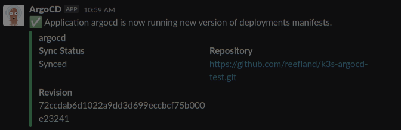
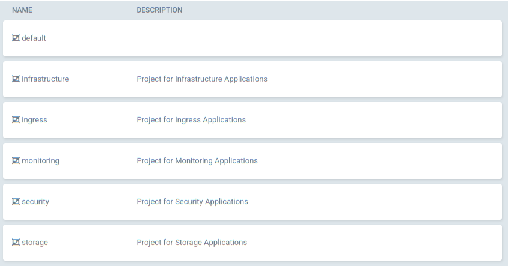

# ArgoCD Settings & Important Notes

[Back to README.md](../README.md)

## Important Notes

* ArgoCD will be used to deploy & monitor changes to deployed applications.
  * ArgoCD can send alerts and notifications to Slack, Email, Teams, etc.
* ArgoCD requires a Git repository (GitHub) to store its configuration.
  * A Private repository is recommended and supported by default.
  * This should be a empty repository dedicated for ArgoCD's usage.
* See ArgoCD Project [FAQ](https://github.com/argoproj/argo-cd/blob/master/docs/faq.md)

### Initial Empty Repository

When the repository is empty:

* The empty repository is cloned to establish a git directory structure.
* This Ansible process renders an initial set of all application manifests files to built the cluster services used by this Ansible install method.
* The rendered ArgoCD manifest and values files are used to install ArgoCD via Helm.
* The rendered manifest files are checked into the Git repository. It will no longer be empty.
* ArgoCD will now start to monitor the repository and deploy any application and configuration which are not yet deployed.

### Populated Repository

* The repository is cloned as-is.
* This ansible script will render new or missing (deleted) files into the repository.
  * Ansible will not update or overwrite existing files in the repository.
  * If you want Ansible to render a new version of an existing file, delete that file from the repository.
* Any updated files are checked into the repository.
* ArgoCD will monitor the repository and process whatever new applications or configuration changes that were added

---

## Create Personal Access Token

Github does not use ID & Password for API access.  A [Personal Access Token](https://docs.github.com/en/authentication/keeping-your-account-and-data-secure/creating-a-personal-access-token) needs to be created.

* NOTE: Personal Access Token is not scoped to a repository, it is scoped to the entire account.

Navigate: Profile > Settings > Developer Settings (bottom left) > Personal Access Tokens > click `[Generate new token]`.

* Enter a useful and descriptive note to remind you why this was created.


* Select an expiration date.  The more frequently it expires the more frequently you will need to update the ArgoCD secret to allow connectivity

### Set Personal Access Token Scope

ArgoCD documentation does not specify the minimum requirements for the Person Access Token.  I had to enabled these in my testing:


_NOTE: The `repo` (Full control of private repositories) is required which forces all the boxes below it to be enabled. Attempting to remove `public_repo` and updating the token seems to work (no error), but upon looking at the token scopes again it is re-enabled._

---

## Create GitHub Repository for ArgoCD

Create a new GitHub repository.  A private repository is recommended.

* NOTE: The repository cannot be completely empty or the clone will fail; enable the option to `Add a README file`.


---

## Review `vars/secrets/main.yml` for ArgoCD Secrets

You need to define which repository ArgoCD will use and how to connect to it.

```yaml
###[ ArgoCD Secrets: Repository Connections ]######################################################
# Github can use any non-empty value, its essentially ignored
ARGOCD_REPO_USERNAME_SECRET: "oauth"

# Github Personal Access Token
ARGOCD_REPO_PASSWORD_SECRET: "<token-value>"

# ArgoCD Slack Token for Notifications 
ARGOCD_NOTIFICATIONS_SLACK_TOKEN_SECRET: "xoxb-....."
```

* `ARGOCD_REPO_USERNAME_SECRET` typically is just any non-empty value and is not actually used in authentication.
* `ARGOCD_REPO_PASSWORD_SECRET` is the value of the Personal Access Token.
* `ARGOCD_NOTIFICATIONS_SLACK_TOKEN_SECRET` can be used to hold the value of the authentication token used for Slack Notifications.
  * Feel free to add additionals secrets for connecting to Microsoft Teams, or Gmail, etc. You can name the secrets as you wish.

**Be sure to encrypt all the secrets above when completed:**

```shell
ansible-vault encrypt vars/secrets/main.yml
```

---

## Review `defaults/main.yml` for ArgoCD Settings

The ArgoCD Settings are in variable namespace `install.argocd`.

* Enable or disable installation of ArgoCD. Disabled will prevent the installation of all applications beyond the reduced K3s installation.

  ```yaml
  install:
    argocd:
      enabled: true
  ```

* Pin which version of ArgoCD to install.  This is the Helm Chart version, not the application version.
  * This is for initial installation only. Do not update this value to attempt to push an application upgrade.

  ```yaml
      # Select Release to install: https://artifacthub.io/packages/helm/argo/argo-cd
      install_version: "{{argocd_install_version|default('4.5.10')}}"
  ```

* Define the namespace to install ArgoCD into:

  ```yaml
      namespace: "argocd"
  ```

* Define Repository Connection Settings:

  ```yaml
      repository:
        name: "k3s-argocd-renovate"
        url: "{{ argocd_repo_url }}"                     # https://github.com/<user>/<repo-name>
        username: "{{ ARGOCD_REPO_USERNAME_SECRET }}"    # oath
        password: "{{ ARGOCD_REPO_PASSWORD_SECRET }}"    # Github Personal Access Token
  ```

  * The `name` is used within ArgoCD when you view the repository connection, it can be changed if you like.
  * `argocd_repo_url` points to the dedicated ArgoCD repository to use.
    * Do NOT include ".git" at the end of it.
  * The `ARGOCD_REPO_USERNAME_SECRET` and `ARGOCD_REPO_PASSWORD_SECRET` values should be defined in `vars/secrets/main.yaml` file.
    * Be sure to to use `ansible-vault` to encrypt your secrets.

* Define ArgoCD Dashboard settings:

  ```yaml
    # Default Dashboard URL:  https://k3s.{{ansible_domain}}/argocd/
    dashboard:
      path: "/argocd"                         # URI Path for Ingress Route
      # $ARGO_PWD=password
      # htpasswd -nbBC 10 "" $ARGO_PWD | tr -d ':\n' | sed 's/$2y/$2a/'
      initial_password: "$2a$10$qsjuZNhoJR7UHv/v/CryaOe0wewDzzH.wP.j1YAVLqgBXWZImdQ/u"
  ```

  * The `path` is the URI part of the ArgoCD dashboard URL.
  * The `initial_password` is `password`.
    * If you have access to `htpasswd` utility you can set a different initial password.
    * You should change the password upon first login to the dashboard.

---

* Define ArgoCD Notification settings:

  * See ArgoCD Notifications Project [Documentation](https://argocd-notifications.readthedocs.io/en/stable/services/overview/) for details and ideas

  ```yaml
    # ArgoCD Notifications
    notifications:
      # Added to secret: argocd-notifications-secret
      # Reference slack tokens, email credentials, etc.
      # Define secrets in vars/secrets/main.yml
      secret_contents: |
        slack-token: "{{ARGOCD_NOTIFICATIONS_SLACK_TOKEN_SECRET|default('UNDEFINED_SLACK_TOKEN')}}"
  ```

  * The `secret_contents` is used to load secrets from the Ansible vault file into the ArgoCD notification controller secret.
    * A secret named `argocd-notifications-secret` will be created by this Ansible script and populated with values you specify.
      * If Sealed Secrets is enabled, then this will be encrypted and processed by the Sealed Secrets controller.
    * This secret can be used to hold all notification secrets for Gmail, MS Teams, Telegram, etc.
    * Should be one `key` and one `value` per line, the `key` can then be referenced in the ConfigMap (see below) by putting a dollar-sign (`$`) in-front of it such as `$slack-token`

  ```yaml
      # Reference secrets from above with "$<key-name> such as $slack-token"
      configmap_contents: |
        ## For more information: https://argocd-notifications.readthedocs.io/en/stable/subscriptions/
        subscriptions: 
          # Where to send notifications:
          - recipients:
              # Slack Channel:
              - slack:argocd 
            triggers:
              # What to send notifications about:
              - on-created
              - on-deleted
              - on-deployed
              - on-health-degraded
              - on-sync-failed
              - on-sync-running
              - on-sync-status-unknown
              - on-sync-succeeded
        notifiers:
          # How to send notifications:
          service.slack: |
                token: $slack-token
                username: ArgoCD
                icon: "https://cncf-branding.netlify.app/img/projects/argo/icon/color/argo-icon-color.png"
  ```

  * The `configmap_contents` is used to populate a portion of Notification Controller configMap.
    * A configMap named `argocd-notifications-cm` will be created by Helm / ArgoCD deployment based on the values defined in this section and the templates and triggers defined in the `values.yaml` installation file.
    * The `subscriptions` block will define the `recipients` (where notifications go) and `triggers` (conditions required to send notification)
      * Additional `recipients` can be added for other Slack channels
      * Additional `recipients` can be added for Gmail, Microsoft Teams, etc which would reference the respective `notifiers` entry.
    * The `notifiers` block defines how to send notifications.
      * The `service.slack` can be reused to send to multiple slack channels (defined in `recipients`)
        * Additional entries can be added to customize the `username` to Post as or the Icon to use with the `username`
      * Additional `notifiers` can be added to define how to connect to Gmail, Microsoft Teams, etc.

Example ArgoCD Slack Notification from Noritifcation Controller



---

## ArgoCD Initial Dashboard

Once Traefik has been deployed the ArgoCD Dashboard URL path will resemble: `https://k3s.example.com/argocd/`.  

* If you need earlier access to the ArgoCD Dashboard via Port Forwarding, see section `Early Access to ArgoCD Dashboard` below.

The following shows the contents of the ArgoCD dashboard when only ArgoCD and Renovate are installed.


---

### Update ArgoCD CLI Executable

While renovate will take care of upgrading ArgoCD application, there is nothing that takes care of keeping the `argocd` CLI utility updated.  To update the installed CLI to the version matched ArgoCD controller, you can just run the role with a single tag:

```shell
$ ansible-playbook -i k3s_test.yml k3s-argocd.yml --tags="update_argocd_cli"

...
TASK [k3s-argocd : Install ArgoCD CLI Executable]*********************************************
Saturday 09 July 2022  15:07:28 -0400 (0:00:00.061)       0:00:02.404 ********* 
changed: [testlinux.example.com]
```

---

## Troubleshooting ArgoCD

### Early Access to ArgoCD Dashboard

The early initial installation will not have an ingress controller.  It can take several minutes before Traefik is deployed, ingress route is created and Cert-manager generates the SSL certificate.  To get early access to the ArgoCD dashboard to check connectivity to repository and status of deployments:

#### Create a Port Forward

Assuming K3s is not on your local machine, this will open a port accessible external to the cluster:

```shell
$ kubectl port-forward -n argocd svc/argocd-server 8080:80 --address='0.0.0.0'

Forwarding from 0.0.0.0:8080 -> 8080
```

#### Open Web Browser

Point your web browser to the cluster node IP or hostname using port 8080:

`http://k3shost.example.com:8080/argocd/`

You should now see the ArgoCD login page.  The default credentials if you did not change them:

* Username: `admin`
* Password: `password`

---

### Login with ArgoCD CLI

This can be used to log into ArgoCD from a cluster node.

```shell
$ ARGOIP=$(kubectl get svc argocd-server -n argocd -o jsonpath='{.spec.clusterIP}')

$ argocd login --plaintext ${ARGOIP} --username admin --password password

'admin:login' logged in successfully
Context '10.43.101.179' updated
```

The default credentials if you did not change them:

* Username: `admin`
* Password: `password`

If ArgoCD Ingress is working, then you can use that for a simpler login method:

```shell
$ argocd login k3s.example.com --grpc-web-root-path /argocd

Username: admin
Password: 
'admin:login' logged in successfully
Context 'k3s.example.com/argocd' updated
```

---

### Monitor ArgoCD Repository Logs

The ArgoCD repository server might provide additional troubleshooting information:

```shell
kubectl logs pod/argocd-repo-server-b884f4bc5-nsr8q -n argocd
```

* Adjust the pod name to match whatever your instance shows.

---

### Monitor ArgoCD Notification Logs

The ArgoCD notifications controller might provide additional troubleshooting information while setting up additional notifications:

```shell
kubectl logs argocd-notifications-controller-6bdccc96b5-hk6dw -n argocd
```

* Adjust the pod name to match whatever your instance shows.

---

## ArgoCD Initial Cluster Full Deployment - Sync Waves

When all (or most) of the default applications in this Ansible playbook are added to the ArgoCD repository, upon ArgoCD first repository sync process it can be a chaotic race condition of deployments and service creation.  Usually Kubernetes deployment progressions can handle this by stalling a deployment until required items are available.  However after much testing, it seemed I had repeated issues with Cluster Load Balancers not giving out IP addresses and Let's Encrypt certificates not being fully created. To help with this ArgoCD Sync waves are implemented.

Sync waves are an integer number (negative or positive) assigned via Kubernetes annotations to application deployments and objects. The lower the number the earlier ArgoCD will process it. For the Initial Cluster Sync ArgoCD will:

* Scan every application being deployed looking for Sync Wave annotations.
* Arrange applications/objects to process via Sync Wave number (lowest to highest) to determine order of processing.
  * Applications without a defined Sync Wave number are assigned `0` (zero)
* Applications with the same Sync Wave number are installed at the same time.
* Once all applications with the same Sync Wave number are synced and healthy:
  * ArgoCD pauses for a few seconds for the cluster to catch up.
  * ArgoCD moves to the next highest Sync Wave number.
* This process progresses until all applications have been Synced.

### Sync Wave Values Assigned to Applications

The application / objects deployed via this Ansible process are assigned the following:

| Sync Wave Value | Description                 |
|     :----:      | :---                        |
| -5              | All namespaces              |
| -3              | ArgoCD Application          |
| -2              | Sealed-Secrets Controller   |
| -2              | Application Secrets         |
| -1              | Cert-manager                |
| -1              | Let's Encrypt Configuration |
| -1              | Renovate                    |
|  0              | Kube-vip API Load Balancer  |
|  0              | Kube-vip Cloud Provider Service Load Balancer |
|  1              | Traefik Ingress Controller Application        |
|  1              | Let's Encrypt Wildcard Certificate Generation |
|  3              | Traefik Configuration (IngressRoutes, Authentication Secrets, etc) |
|  5              | Longhorn Distributed Cluster Storage          |
|  7              | Longhorn Custom Config (snapshots & backups)  |

---

## ArgoCD Application Projects

ArgoCD allows applications to be grouped together into projects.  This is a better practice than leaving all applications within the `default` project.  The `default` project allows any application manifest to access any namespace, any source repository, can pretty much do anything. Individual projects can define limits on destination namespaces and source repositories that can be used for applications using the project. See [ArgoCD website](https://argo-cd.readthedocs.io/en/stable/operator-manual/declarative-setup/#projects) for more information on Projects.

* The project files are stored in the git repository under `/applications/projects/<project-name>-project.yaml`
* Can can easily create more projects and assign your own applications to projects

| Project Name   | Applications Assigned to Project | Description / Comments |
|     :---:      | :---                             | :---                   |
| infrastructure      | Kube-vip<br>Kube-vip Cloud Provider | Kubernetes infrastructure services such as Load Balancer providers. |
| ingress        | Traefik<br>Traefik config        | Traefik ingress rules, middlewares, basic authentication, certificates |
| monitoring     | Kube Stack Prometheus<br/>AlertManager<br/>Grafana<br/>Grafana Dashboards | Kubernetes Monitoring Applications such as Prometheus and it's supporting applications |
| security       | Sealed Secrets<br>App Secrets (secrets that are sealed)<br>Cert-manager<br>Let's Encrypt Certs | Applications used to provide secuity features such as secrets and certificates. |
| storage        | Longhorn <br/> Longhorn config (snapshot and backup schedules)<br/> democratic-csi (NFS and iSCSI)  | Kubernetes applications which provide storage services to the cluster such as NFS, iSCSI, block, etc.|

ArgoCD Projects can be reviewed within ArgoCD via Settings > Projects:



[Back to README.md](../README.md)
