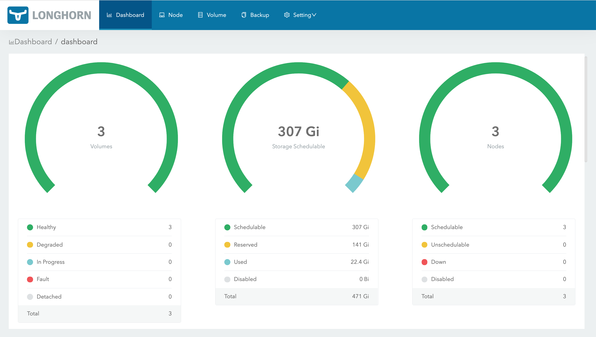

# Longhorn Distributed Storage Settings & Important Notes

[Back to README.md](../README.md)

## Important Notes

* Longhorn Distributed storage is intended to be the default storage class, once installed the "local-path" StorageClass "default" flag will be removed.
* A ZFS Zvol of your defined size will be created at `/var/lib/longhorn` this limits how much space Longhorn can consume.  A zvol can easily be made larger when needed.
* Longhorn volumes can be configured for scheduled snapshots and scheduled backups of data to a NFS location after installation using the Longhorn Web Dashboard (User Interface).

## Longhorn Infrastructure Diagram


* See [Longhorn Web Site](https://longhorn.io/) for details.

## Review `defaults/main.yml` for Longhorn Settings

The Longhorn Settings are in variable namespace `install.longhorn`.

* Enable or disable installation of Longhorn Distributed storage.  Setting will default to `true` but you can override this value per host to prevent a host(s) from allocating local storage to Longhorn.

  ```yml
  install:
    longhorn:
      enabled: "{{longhorn_enabled|default(true)}}"  # Install longhorn distributed cluster storage
  ```

* Pin which version of Longhorn to install. This value should be defined in the inventory file or group_vars file or can be updated directly here.

  ```yml
      # Select Release to use: https://github.com/longhorn/longhorn/releases 
      install_version: "{{longhorn_install_version|default('v1.2.4')}}"
  ```

* The name space Helm will use to install Longhorn:

  ```yml
      namespace: "longhorn-system"
  ```

---

### ZFS Zvol for Longhorn

* Define the ZFS pool name to use and volume name to create.

  * The `pool` can be defined per host or host group using variable `longhorn_zfs_pool` if this is not defined, it will default to `rpool` as shown below.

  ```yml
      zfs:                           # Combined "rpool/longhorn"
        pool: "{{longhorn_zfs_pool|default('rpool')}}"
        volume_name: "longhorn"
  ```

* Define some properties to be used with Zvol creation. The `volsize` specifies storage space dedicated to Longhorn usage.  You can select different compression if you like.

  ```yml
        zvol:
          options:
            volsize: "10G"
            compression: "lz4"        # "" (inherit), lz4, gzip-9, etc
            volblocksize: "16k"
  ```

### Longhorn Default Mountpoint

The ZFS Zvol will be formatted and mounted at the location specified below and Longhorn installation is set to look at this location.

```yml
zfs:
  zvol:
    mountpoint: "/var/lib/longhorn"
```

When completed, the ZFS zvol mount point will be added to the `/etc/fstab` file:

```text
/dev/zvol/rpool/longhorn /var/lib/longhorn xfs noatime,discard 0 0
```

---

### Change Default Storage Class

The intent of longhorn is to be used instead of "local-path" storage class. Once Longhorn is installed kubernetes "local-path" will no longer be available.

```yaml
   disable_local_path_as_default_storage_class: true
```

---

## Scheduled Volume Snapshots

Longhorn will automatically create snapshots for volumes at the recurring job scheduled time, as long as the volume is attached to a node.

* Recurring snapshot job only takes a new snapshot when the volume has new data in the volume head (the live data)

```yaml
    # Default Snapshots - Longhorn will internally create snapshots of each volume will using the
    # schedule parameters below. NOTE: This is unrelated to ZFS Snapshots.
    snapshots:
      cron_schedule: "03 6 * * *" # Daily at 6:03am
      retain_days: "7"            # Keep for 7 days
      concurrency: "2"            # number of jobs to run concurrently
```

---

## Scheduled Volume Backups

Longhorn will automatically create backups of volumes at the recurring job scheduled time, as long as the volume is attached to a node.

* Recurring backup job only takes a new backup when the volume has new data since the last backup

```yaml
    # Default Backups - Longhorn will take a snapshot and backup the snapshot to a remote NFS share
    backups:
      cron_schedule: "08 3 * * *" # Daily at 3:08am
      retain_days: "21"           # Keep for 14 days
      concurrency: "2"            # number of jobs to run concurrently
```

* The target destination to store the backups is defined by variable `longhorn_backup_target` located in the inventory file or host vars file
* It contains the full NFS URL location to place the backups, such as:

  `longhorn_backup_target: "nfs://192.168.10.102:/mnt/main/backups/longhorn`

---

### Longhorn Dashboard

* Settings for the Longhorn Web Dashboard. The `create_route` will create a Traefik Ingress route to expose the dashboard on the URI defined in `path`.

  ```yml
      # Longhorn Dashboard
      dashboard:
        create_route: true           # Create Ingress Route to make accessible 
        enable_https: true           # Require HTTPS to access dashboard
        enable_basic_auth: true      # Require Authentication to access dashboard

        # Fully Qualified Domain for ingress routes - Traefik Load Balancer address name
        # This is the DNS name you plan to point to the Traefik ingress Load Balancer IP address.
        ingress_name: '{{k3s_cluster_ingress_name|default("k3s.{{ansible_domain}}")}}'

        # Default Dashboard URL:  https://k3s.{{ansible_domain}}/longhorn/
        path: "/longhorn"            # URI Path for Ingress Route

        # Define secrets in vars/secrets/main.yml
        allowed_users: "{{LONGHORN_DASHBOARD_USERS_SECRET}}"
  ```

* The `ingress_name` should reference the DNS which points to the Traefik Load Balancer IP address used for all Traefik ingress routes. If a name is not provided it will default to hostname `k3s` and use the domain of the Kubernetes Linux host.
* The `allowed_users` maps to which users are allowed to access the Longhorn Dashboard (see more below).

The Longhorn Dashboard URL path will resemble: `https://k3s.example.com/longhorn/` (trailing slash is required.)



* By default basic authentication for the dashboard is enabled.  Individual users allowed to access the dashboard are defined in `var/secrets/main.yml` as follows:

```yaml
###[ Longhorn Dashboard Users ]####################################################################
# See Traefik Dashboard Users above for details on how to create dashboard users.

#LONGHORN_DASHBOARD_USERS_SECRET: |
#  dHJhZWZpa2FkbTokMnkkMTAkbHl3NWdYcXpvbFJCOUY4M0RHa2dMZW52YWJTcmpxUk9XbXNGUmZKa2ZQSlhBbzNDSmJHY08K

# NOTE: Kubernetes secrets do not span namespaces. This will be an isolated user list from Traefik
LONGHORN_DASHBOARD_USERS_SECRET: "{{TRAEFIK_DASHBOARD_USERS_SECRET}}"   # Same as Traefik Accounts
```

NOTE: by default, any users defined in the Traefik Dashboard allowed user list is allowed to log into the Longhorn dashboard.

* If you need to restrict access to the dashboard to different set of users or require different passwords, then update the file as needed.
* As stated in the comments this is not a shared Kubernetes secrets with Traefik. Once deployed a change in one will not be reflected in the other.  This is just to make initial setup easier.

---

### Test Claim

* Adjust if you want a Longhorn storage test claim created:

```yml
  test_claim:
    enabled: true               # true = attempt longhorn storage claim
    mode: "ReadWriteOnce"       # storage claim access mode
    size: "1Mi"                 # size of claim to request ("1Mi" is 1 Mebibytes)
    remove: true                # true = remove claim when test is completed (false leaves it alone)
```

* The test claim will be stored on the master node at `/home/kube/longhorn/longhorn-test-claim.yaml`.

---

### Show Storage Claim Provisioners and Claim Policy

```shell
$ kubectl get sc

NAME                 PROVISIONER            RECLAIMPOLICY   VOLUMEBINDINGMODE   ALLOWVOLUMEEXPANSION   AGE
longhorn (default)   driver.longhorn.io     Delete          Immediate           true                   4d3h

```

---

## Change Storage Claim Policy

For dynamically provisioned PersistentVolumes, the default reclaim policy is `Delete`. This means that a dynamically provisioned volume is automatically deleted when the corresponding PersistentVolumeClaim is deleted (Pod is deleted). This might be inappropriate if the volume contains precious data. You might want to switch to `Retain` policy. With the `Retain` policy, if the PersistentVolumeClaim is deleted (Pod deleted), the corresponding PersistentVolume will not be deleted --  it is moved to the `Released` phase, where all of its data can be manually recovered.

Storage Claim can be patched to change Claim Policy:

```shell
kubectl patch pv <your-pv-name> -p '{"spec":{"persistentVolumeReclaimPolicy":"Retain"}}'
```

---

## Increasing Zvol Size in the Future

You can easily check the current `volsize` using standard ZFS commands:

```shell
$ zfs get volsize rpool/longhorn

NAME           PROPERTY  VALUE    SOURCE
rpool/longhorn  volsize   10G      local
```

Determine how much space you have available before increasing the `volsize`:

```shell
$ zfs get available rpool/longhorn

NAME           PROPERTY   VALUE  SOURCE
rpool/longhorn  available  783G   -
```

You can increase the `volsize` manually in the future using standard ZFS commands such as:

```shell
$ sudo zfs set volsize=15G rpool/longhorn

$ zfs get volsize rpool/longhorn

NAME            PROPERTY  VALUE    SOURCE
rpool/longhorn  volsize   15G      local
```

Then expand the filesystem to use newly allocated space:

```shell
$ sudo xfs_growfs /var/lib/longhorn

meta-data=/dev/zd0               isize=512    agcount=4, agsize=655360 blks
         =                       sectsz=512   attr=2, projid32bit=1
         =                       crc=1        finobt=1, sparse=1, rmapbt=0
         =                       reflink=1
data     =                       bsize=4096   blocks=2621440, imaxpct=25
         =                       sunit=0      swidth=0 blks
naming   =version 2              bsize=4096   ascii-ci=0, ftype=1
log      =internal log           bsize=4096   blocks=2560, version=2
         =                       sectsz=512   sunit=0 blks, lazy-count=1
realtime =none                   extsz=4096   blocks=0, rtextents=0
data blocks changed from 2621440 to 3932160
```

Within a few seconds the new size should be reflected in the Longhorn dashboard.

[Back to README.md](../README.md)
