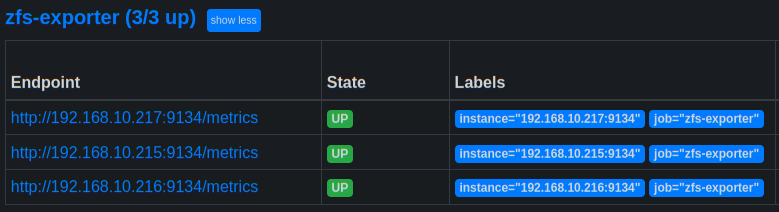

# Prometheus Exporters Settings & Important Notes

[Back to README.md](../README.md)

## Important Notes

* Prometheus Exporters are data collection agents deployed to nodes which are outside of Kubernetes to monitor aspects of the node itself.
  * The Exporters expose an HTTP endpoint which Prometheus scapes to collect metrics
* Prometheus `node-exporter` is deployed by default as part of the Prometheus Operator installation and is not part of this settings document (this is what provides RAM, CPU, Disk, Network metrics)

---

All additional Prometheus Exporter scape configurations are stored in a secret named `additional-scrape-configs` which can be reviewed to troubleshoot configuration.

```shell
$ kubectl get secrets -n monitoring additional-scrape-configs -o jsonpath='{.data}' | cut -d'"' -f 4 | base64 --decode

# ZFS Exporter Scrape Job
- job_name: "zfs-exporter"
  static_configs:
    - targets:
      - "192.168.10.215:9134"
      - "192.168.10.216:9134"
      - "192.168.10.217:9134"
```

---

## Review `defaults/main.yml` for Prometheus Exporters

Prometheus exporters are utilities that reside outside of Kubernetes that expose metrics that we wish to import into Prometheus.

* The individual Prometheus Exporter Settings are in variable namespace `install.prometheus_operator.exporters`.

`ZFS Exporter` - is used as a replacement to the broken ZFS metrics collector ([see GitHub Issue](https://github.com/prometheus/node_exporter/issues/2068)) built into `node_exporter` (installed already with Prometheus). The `zfs_exporter` is deployed as a systemd service onto each Kubernetes node.

* Enable or disable installation of ZFS Exporter.  Setting will default to `true` but you can override this value per host for nodes not using ZFS.

  ```yml
  exporters:
    # Install ZFS Exporter for ZFS Monitoring
    zfs_exporter:
      enabled: "{{zfs_exporter_enabled|default(true)}}" 
  ```

* Pin which version of ZFS Exporter to install. This value should be defined in the inventory file or group_vars file or can be updated directly here.

  ```yml
      # Select Release to use: https://github.com/pdf/zfs_exporter/releases
      install_version: "{{zfs_exporter_install_version|default('v2.2.5')}}"
  ```

### Check Status of ZFS Exporter Systemd Service

When deployed, you can easily check the status of the ZFS Exporter:

```shell
$ systemctl status zfs-exporter

● zfs-exporter.service - Prometheus zfs-exporter
     Loaded: loaded (/lib/systemd/system/zfs-exporter.service; disabled; vendor preset: enabled)
     Active: active (running) since Mon 2022-08-01 22:00:11 EDT; 10min ago
   Main PID: 186088 (zfs_exporter)
      Tasks: 5 (limit: 9402)
     Memory: 2.7M
        CPU: 10ms
     CGroup: /system.slice/zfs-exporter.service
             └─186088 /usr/local/bin/zfs_exporter --web.listen-address=:9134 --exclude=^rpool/containerd/

Aug 01 22:00:11 testlinux systemd[1]: Started Prometheus zfs-exporter.
Aug 01 22:00:11 testlinux zfs_exporter[186088]: ts=2022-08-02T02:00:11.711Z caller=log.go:168 level=info msg="Starting zfs_exporter" version="(versi>
Aug 01 22:00:11 testlinux zfs_exporter[186088]: ts=2022-08-02T02:00:11.711Z caller=log.go:168 level=info msg="Build context" context="(go=go1.17.6, >
Aug 01 22:00:11 testlinux zfs_exporter[186088]: ts=2022-08-02T02:00:11.711Z caller=log.go:168 level=info msg="Enabling pools" pools=(all)
Aug 01 22:00:11 testlinux zfs_exporter[186088]: ts=2022-08-02T02:00:11.711Z caller=log.go:168 level=info msg="Enabling collectors" collectors="datas>
Aug 01 22:00:11 testlinux zfs_exporter[186088]: ts=2022-08-02T02:00:11.711Z caller=log.go:168 level=info msg="Listening on address" address=:9134

```

### Test ZFS Exporter Metrics Publishing URL

When deployed, you can easily test if ZFS Exporter is publishing metrics:

```shell
$ curl -s http://localhost:9134/metrics | head

# HELP go_gc_duration_seconds A summary of the pause duration of garbage collection cycles.
# TYPE go_gc_duration_seconds summary
go_gc_duration_seconds{quantile="0"} 0
go_gc_duration_seconds{quantile="0.25"} 0
go_gc_duration_seconds{quantile="0.5"} 0
go_gc_duration_seconds{quantile="0.75"} 0
go_gc_duration_seconds{quantile="1"} 0
go_gc_duration_seconds_sum 0
go_gc_duration_seconds_count 0
# HELP go_goroutines Number of goroutines that currently exist.
```

### Confirm Prometheus is able to Detect and Scrape Endpoint

Prometheus status on endpoint scraping can be checked within Prometheus Web GUI from `Status` > `Targets`:



[Back to README.md](../README.md)
