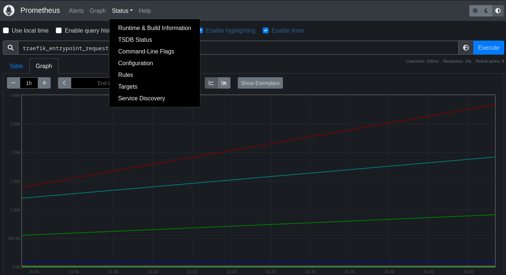
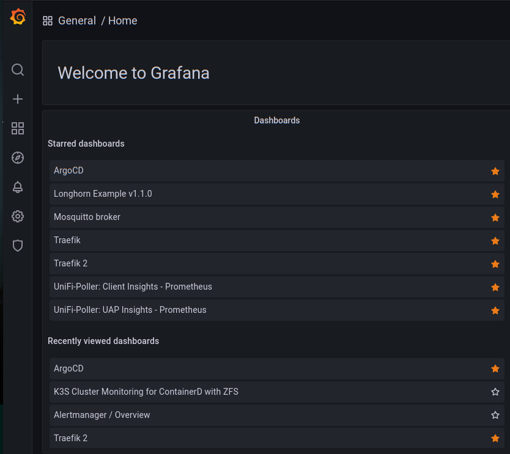
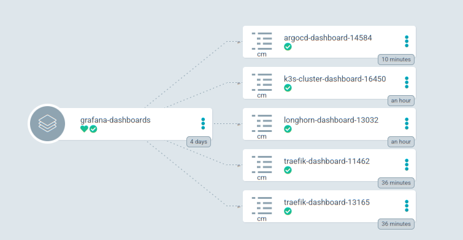
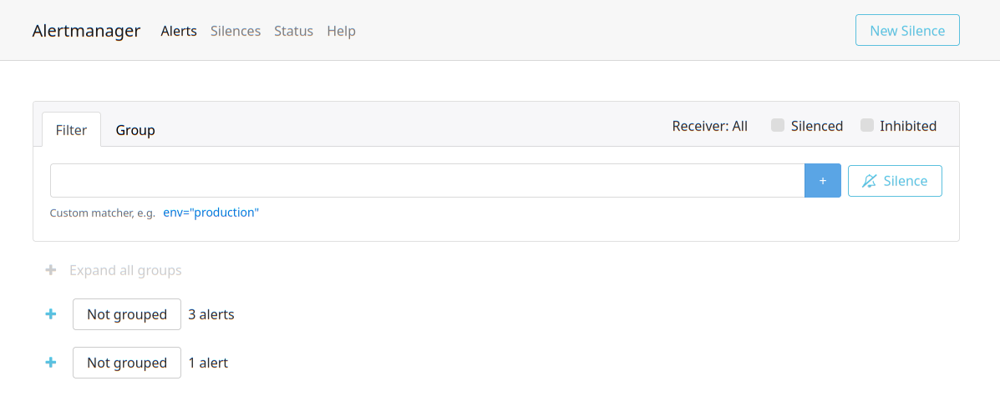
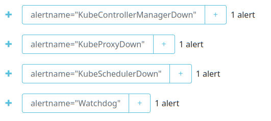
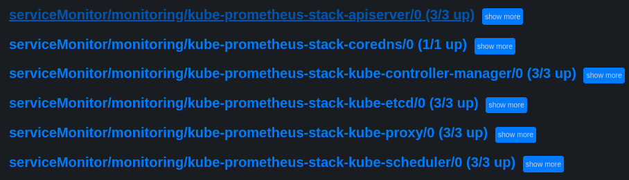
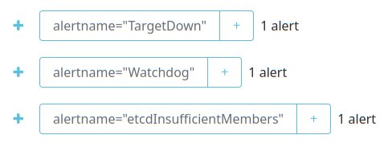
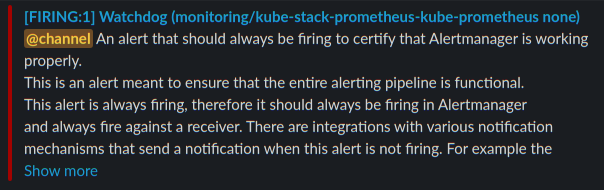
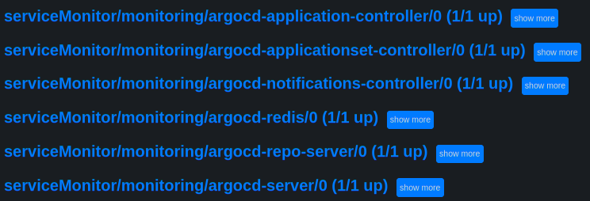

# Prometheus Operator Settings & Important Notes

[Back to README.md](../README.md)

## Important Notes

* Prometheus will use persistent storage. By default it is configured to use the [democratic CSI TrueNAS iSCSI](democratic-csi-settings.md) persistent storage.
* You can easily change this to a different storage class.
* To prevent Traefik metrics from being exposed on the LoadBalancer IP address, an internal ClusterIP service is created for the service monitor to reach Traefik metrics.

## Review `defaults/main.yml` for Prometheus Operator Settings

The Prometheus Operator Settings are in variable namespace `install.prometheus_operator`.

* Define the version of Kube Prometheus Stack to install. Available releases to use:  [https://github.com/prometheus-community/helm-charts/releases](https://github.com/prometheus-community/helm-charts/releases)

  ```yml
  prometheus_operator:
    install_version: "41.7.4"
  ```

* The Kubernetes Custom Resource Definitions (CRD) for Kube Prometheus Stack are maintained by the [Prometheus Operator](https://github.com/prometheus-operator/prometheus-operator) Project and is assigned a different version number than the Kube Prometheus Stack Helm Chart.  These two versions need to be instep with each other.  Luckily renovate will monitor and upgrade both as they become available.  This page should state the version of the CRD to use: [https://github.com/prometheus-community/helm-charts/tree/main/charts/kube-prometheus-stack](https://github.com/prometheus-community/helm-charts/tree/main/charts/kube-prometheus-stack#upgrading-chart)

  ```yml
    crd_version: "v0.60.1"
  ```

* The namespace Helm will use to install Kube Prometheus Stack:

  ```yml
    namespace: "monitoring"          # Add resources to this namespace
  ```

* Define ArgoCD Project to associate Prometheus with:

  ```yaml
    argocd_project: "monitoring"     # ArgoCD Project to associate this with
  ```

---

## Review `defaults/main.yml` for Prometheus Settings

Prometheus Specific Settings are in variable namespace `install.prometheus_operator.prometheus`.

* Define how long data should be retained.  The longer the duration and more nodes you have the larger the database needs to be.

  ```yml
    prometheus:
      retention: "21d"                 # How long to retain data
  ```

* Define the type of Persistent Volume Storage Claim to use and its size.  The `class_name` can be `freenas-iscsi-csi`, `freenas-nfs-csi`, or `longhorn` to use the provided storage classes.

  ```yml
      storage_claim:                  # Define where and how data is stored
        access_mode: "ReadWriteOnce"
        class_name: "freenas-iscsi-csi"
        claim_size: 50Gi
  ```

* Settings for the Prometheus Web Interface. The `create_route` will create a Traefik Ingress route to expose the web interface on the URI defined in `path`.

  ```yml
      # Prometheus Web Interface
      dashboard:
        create_route: true           # Create Ingress Route to make accessible 
        enable_basic_auth: true      # Require Authentication to access dashboard

        # Fully Qualified Domain for ingress routes - Traefik Load Balancer address name
        # This is the DNS name you plan to point to the Traefik ingress Load Balancer IP address.
        ingress_name: '{{k3s_cluster_ingress_name|default("k3s.{{ansible_domain}}")}}'

        # Default Dashboard URL:  https://k3s.{{ansible_domain}}/prometheus/
        path: "/prometheus"       # URI Path for Ingress Route
  ```

* The `ingress_name` should reference the DNS which points to the Traefik Load Balancer IP address used for all Traefik ingress routes.

The Prometheus Web Interface URL path will resemble: `https://k3s.example.com/prometheus/`



* By default basic authentication for the Prometheus Web Interface is enabled
* Any users defined in the Traefik Dashboard allowed user list is allowed to log into the Prometheus Web Interface

### Review `defaults/main.yml` for Prometheus Exporters

Prometheus exporters are utilities that reside outside of Kubernetes that expose metrics that we wish to import into Prometheus.

* Review [Prometheus Exporter Settings](prometheus-exporters-settings.md) for more details.

---

## Review `defaults/main.yml` for Grafana Settings

* Define the type of Persistent Volume Storage Claim to use and its size.  The `class_name` can be `freenas-iscsi-csi`, `freenas-nfs-csi`, or `longhorn` to use the provided storage classes.

  ```yml
    grafana:
      storage_claim:                  # Define where and how data is stored
        access_mode: "ReadWriteOnce"
        class_name: "freenas-iscsi-csi"
        claim_size: 5Gi
  ```

* Settings for Grafana Sidecar for dynamically loading dashboards as configMaps. Here you can define the Kubernetes `label` you want to use, optionally a specific value the label must contain and which namespaces to search for Dashboard configMaps.  Storing Dashboards in configMaps allows them to be retained in Git and version controlled.  However, you can import dashboards within Grafana or build your own.

```yml
      # Labels for Grafana Sidecar to use to locate configMap based dashboards
      sidecar:
        label: "grafana_dashboard" # Label Key
        label_value: null         # Ignore value, just find label key
        search_namespaces: "ALL"  # Limit Searched to name spaces
```

* Settings for the Grafana Dashboard. The `create_route` will create a Traefik Ingress route to expose the Grafana Dashboard on the URI defined in `path`.

  ```yml
      # Grafana Dashboard
      dashboard:
        create_route: true           # Create Ingress Route to make accessible 
        enable_basic_auth: false     # Require Authentication to access dashboard

        # Fully Qualified Domain for ingress routes - Traefik Load Balancer address name
        # This is the DNS name you plan to point to the Traefik ingress Load Balancer IP address.
        ingress_name: '{{k3s_cluster_ingress_name|default("k3s.{{ansible_domain}}")}}'

        # Default Dashboard URL:  https://k3s.{{ansible_domain}}/grafana/
        path: "/grafana"          # URI Path for Ingress Route

        # See vars/secret/main.yml for default Grafana Admin & Password values
  ```

* The `ingress_name` should reference the DNS which points to the Traefik Load Balancer IP address used for all Traefik ingress routes.

### Review `vars/secrets/main.yml` for Grafana Default Admin Settings

The default Admin Account and Password can be defined:

```yml
# The values below set the default Admin User and Password to access Grafana's built in Login Page
GRAFANA_DASHBOARD_ADMIN_USER: "admin"
GRAFANA_DASHBOARD_ADMIN_PASSWORD: "prom-operator"
```

To extract the current ID & Password for Grafana Dashboard from the secrets:

```shell
$ kubectl get secret --namespace monitoring kube-prometheus-stack-grafana -o jsonpath='{.data.admin-user}' | base64 -d ;echo
admin

$ kubectl get secret --namespace monitoring kube-prometheus-stack-grafana -o jsonpath='{.data.admin-password}' | base64 -d; echo
prom-operator
```

* Above shows the default may be ID: `admin` and Password: `prom-operator`.

The Grafana Dashboard URL path will resemble: `https://k3s.example.com/grafana/`



Several Grafana Dashboards will be loaded to be managed by ArgoCD:



You can add your own confipMap based dashboards to the ArgoCD git repository `/workloads/grafana-dashboards`

To Search for Dashboards to add to Grafana: [https://grafana.com/grafana/dashboards/](https://grafana.com/grafana/dashboards/)

---

## Review `defaults/main.yml` for Alertmanager Settings

Alertmanager specific settings are in variable namespace `install.prometheus_operator.alertmanager`.

* Define the type of Persistent Volume Storage Claim to use and its size.  The `class_name` can be `freenas-iscsi-csi`, `freenas-nfs-csi`, or `longhorn` to use the provided storage classes.

  ```yml
    alertmanager:
      storage_claim:                  # Define where and how data is stored
        access_mode: "ReadWriteOnce"
        class_name: "freenas-iscsi-csi"
        claim_size: 3Gi
  ```

* Settings for the Alertmanager Web Interface. The `create_route` will create a Traefik Ingress route to expose the web interface on the URI defined in `path`.

  ```yml
      # Alertmanager Web Interface
      dashboard:
        create_route: true           # Create Ingress Route to make accessible 
        enable_basic_auth: true      # Require Authentication to access dashboard

        # Fully Qualified Domain for ingress routes - Traefik Load Balancer address name
        # This is the DNS name you plan to point to the Traefik ingress Load Balancer IP address.
        ingress_name: '{{k3s_cluster_ingress_name|default("k3s.{{ansible_domain}}")}}'

        # Default Dashboard URL:  https://k3s.{{ansible_domain}}/alertmanager/
        path: "/alertmanager"     # URI Path for Ingress Route
  ```

* The `ingress_name` should reference the DNS which points to the Traefik Load Balancer IP address used for all Traefik ingress routes.

The Alertmanager Web Interface URL path will resemble: `https://k3s.example.com/alertmanager/`



* By default basic authentication for the Alertmanager Web Interface is enabled
* Any users defined in the Traefik Dashboard allowed user list is allowed to log into the Alertmanager Web Interface

---

## K3s and Prometheus / Alertmanager Expected Issues

### K3s Services Down

K3s has been designed for low resource consumption, as such the etcd (not used by default; but enabled by default with this Ansible script), Kube Control Manager, Kube Scheduler, Kube Proxy are not deployed as pods but included in the k3s binary.  This means standard `Kube Prometheus Stack` is unable to obtain any metrics from these services.  

* You will typically have down alerts such as the following:

  

### Resolution

To resolve these issues, the following are performed by this Ansible script:

* If the file `/etc/rancher/k3s/config.yaml` does not exist (it does not by default) on each  master then it will be created with the content below to enable these resources to expose Prometheus metrics.

  ```yaml
  etcd-expose-metrics: true
  kube-controller-manager-arg:
  - bind-address=0.0.0.0
  kube-proxy-arg:
  - metrics-bind-address=0.0.0.0
  kube-scheduler-arg:
  - bind-address=0.0.0.0
  ```

  * IMPORTANT: If the file already exists, it is not modified. You will have to manually add the entries above.
  * NOTE: K3s needs to be restarted for the above parameters to be enabled.

* The Kube Prometheus Stack Helm Chart values stored in ArgoCD in the Git repository `applications/prometheus-op.yaml` will adjust `kubeApiServer`, `kubeControllerManager`, `kubeScheduler`, `kubeProxy`, `kubeEtcd` entries to use IP & Port information instead of pods.
  * It will attempt to add all detected node IPs who are members of the Kubernetes Control-Plane Role.
  * You will need to adjust these manually once deployed if these values need to change.
* Once the installation is completed all of these services should be active targets in Prometheus:

  

### etcd Metrics Unavailable

When etcd metrics are used in an environment with Let's Encrypt Staging certificated the collection of metrics against etcd may be impacted.  The following may ne observed in AlertManager:



Resolution

* This message can be ignored if you intent to use Let's Encrypt staging certificates
* Once Let's Encrypt Certificates are upgraded from staging to production these messages should go away.

---

## Review `defaults/main.yml` for Alertmanager Routes and Receivers Settings

Alertmanager has the ability to send notifications to many services.  Note that `kube-prometheus-operator` and or `prommetheus-operator` Project may lag behind in supporting all the notifications that Alertmanager itself supports.

Reference [https://prometheus.io/docs/alerting/latest/configuration/](https://prometheus.io/docs/alerting/latest/configuration/) for most of this configuration.

* Configuration below is just a minium to get a `default-receiver` defined.

```yaml
# Configuration Values for Alertmanager Notifications
config_values: |
  config:
    global:
      resolve_timeout: 5m
    route:
      receiver: default-receiver
      group_wait: 30s
      group_interval: 5m
      repeat_interval: 4h
      group_by: [cluster, alertname]
      # All alerts that do not match the following child routes
      # will remain at the root node and be dispatched to 'default-receiver'.
      #routes:
      #  - matchers:
      #    - service=~"foo1|foo2|baz"
      #  receiver: database-team
      routes:
```

The `receivers:` sections defines which configuration to use for the `default-receiver`:

```yaml
    receivers:
    - name: 'default-receiver'
      # https://prometheus.io/docs/alerting/latest/configuration/#slack_config
      slack_configs:
        - api_url: "{{vault_slack_config_api_url}}"
          send_resolved: true
          channel: 'monitoring'
          text: "{{ range .Alerts }}<!channel> {{ .Annotations.summary }}\n{{ .Annotations.description }}\n{{ end }}"
```

* NOTE: The Slack API URL variable `vault_slack_config_api_url` is an ansible secret in `vars/secret/main.yml`

If the configuration is good then within seconds you should at least get the `watchdog` alert. The Slack example sent me this:



---

### Troubleshooting Alertmanager Configuration

* Review the current configuration as displayed in the **Alertmanager Web Interface** `Status > Config` page.  It should include your configuration and related global defaults. The configuration should be available within seconds of a valid configuration update.  If it does not then there is likely a parsing issue with the configuration. The Alertmanager Web Interface URL path will resemble: `https://k3s.example.com/alertmanager/`

* Review the Ansible rendered ArgoCD files in the Git hub repository `/applications/prometheus-op.yaml` carefully review the file for any indentation issues.

* Review Kube Operator Pod log files for any error messages related to parsing (unmarshal). Determine which pod is the Kube Operator:

  ```shell
  $ kubectl get pods -l "app=kube-prometheus-stack-operator" -A

    NAMESPACE    NAME                                                  READY   STATUS    RESTARTS   AGE
    monitoring   kube-stack-prometheus-kube-operator-d88d65894-h56nf   1/1     Running   0          7h8m

  ```

  * Watch logs much like tail command in Linux:

  ```shell
  $ kubectl logs -f pods/kube-stack-prometheus-kube-operator-d88d65894-h56nf -n monitoring

    level=info ts=2022-04-09T23:11:44.993226584Z caller=operator.go:741 component=alertmanageroperator key=monitoring/kube-stack-prometheus-kube-alertmanager msg="sync alertmanager"
  ```
  
  * Message above indicated the configuration was sync'd without issue.

* Parsing / unmarshal error examples:

  ```error
  level=error ts=2022-04-09T16:06:45.789583554Z caller=klog.go:116 component=k8s_client_runtime func=ErrorDepth msg="Sync \"monitoring/kube-stack-prometheus-kube-alertmanager\" failed: provision alertmanager configuration: base config from Secret could not be parsed: yaml: unmarshal errors:\n  line 5: field telegram_configs not found in type config.plain"
  ```

  * This error was due to Prometheus Operator CDR not yet supporting the Telegram receiver which Alertmanager did support.

  ```error
  level=error ts=2022-04-09T18:54:07.691337429Z caller=klog.go:116 component=k8s_client_runtime func=ErrorDepth msg="Sync \"monitoring/kube-stack-prometheus-kube-alertmanager\" failed: provision alertmanager configuration: base config from Secret could not be parsed: yaml: unmarshal errors:\n  line 5: field slack_config not found in type config.plain"
  ```

  * This error was due to `slack_config` missing an `s` as in `slack_configs`.

There should not be any reason to alter the configuration secret(s) themseleves, however if you need to review them:

```shell
# Current configuration:

$ kubectl -n monitoring get secret alertmanager-kube-prometheus-stack-alertmanager-config -o jsonpath='{.data}' | cut -d'"' -f 4 | base64 --decode

# Configuration from possible parse / templating / rendering issue:
$ kubectl -n monitoring get secret alertmanager-kube-prometheus-stack-alertmanager-generated -o jsonpath='{.data}' | cut -d'"' -f 4 | base64 --decode
```

---

## Enable ArgoCD serviceMonitors

As ArgoCD is installed so early in the ansible process and Prometheus stack is optional the ArgoCD serviceMonitors for Prometheus are not enabled by default.  However placeholders for them are included in the `/workloads/argocd/values.yaml` file.

The placeholders look like the following:

```yaml
    ## Application controller metrics configuration
#   metrics:
#     enabled: true
#     serviceMonitor:
#       enabled: true
#       namespace: "monitoring"
```

You need to uncomment each of them (there will be several of these) and then commit the change to ArgoCD git repository.  ArgoCD will then create all the service monitors.

You can use the Prometheus UI to view the active targets and you should see the ArgoCD serviceMonitors listed:



---

## Uninstall Kube Prometheus Stack

Should you need to remove Prometheus Operator:

* Delete the following files from ArgoCD repository:

```text
/applications/prometheus-op-monitors.yaml
/applications/prometheus-op.yaml
/applications/prometheus-op-crds.yaml
/applications/grafana-dashboards.yaml 
/workloads/grafana-dashboards/*
/workloads/prometheus-op-monitors/*
/namespaces/monitoring.yaml
/secrets/prometheus-alertmanager-config_secret-sealed.yaml
/secrets/prometheus-auth_secret-sealed.yaml
/secrets/prometheus-grafana-admin_secret-sealed.yaml
```

Once changes are committed to the repository, upon ArgoCD's next sync cycle all removed assets will be undeployed from the cluster.

**WARNING:** Persistent Volumes should be retained, but will be unusable without manual cleanup of the previous claim references.

[Back to README.md](../README.md)
