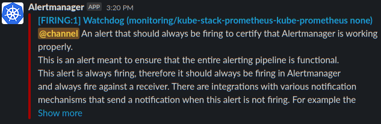

# Prometheus Operator Settings & Important Notes

[Back to README.md](../README.md)

## Important Notes

* Prometheus will use persistent storage. By default it is configured to use the democratic CSI TrueNAS iSCSI persistent storage.  This can be configured to use Longhorn persistent storage.
* To prevent Traefik metrics from being exposed on the LoadBalancer IP address, an internal ClusterIP service is created for the service monitor to reach Traefik metrics.

## Review `defaults/main.yml` for Prometheus Operator Settings

The Prometheus Operator Settings are in variable namespace `install.prometheus_operator`.

* Enable or disable installation of Longhorn Distributed storage:

  ```yml
    prometheus_operator:
      install_this: true              # Install Prometheus Operator
  ```

* The name space and release name Helm will use to install Longhorn:

  ```yml
      namespace: "monitoring"
      release: "kube-stack-prometheus"
  ```

* Define the version of Kube Promethus Stack to install. Available releases to use:  [https://github.com/prometheus-community/helm-charts/releases](https://github.com/prometheus-community/helm-charts/releases)

  ```yml
      install_version: "34.7.1"
  ```

---

## Review `defaults/main.yml` for Prometheus Settings

Prometheus Specific Settings are in variable namespace `install.prometheus_operator.prometheus`.

* Define how long data should be retained.

  ```yml
      prometheus:
        retention: "14d"                 # How long to retain data
  ```

* Define the type of Persistent Volume Storage Claim to use and its size.  The `class_name` can be `freenas-iscsi-csi`, `freenas-nfs-csi`, or `longhorn` to use the provided storage classes.

  ```yml
        storage_claim:                  # Define where and how data is stored
          access_mode: "ReadWriteOnce"
          class_name: "freenas-iscsi-csi"
          claim_size: 20Gi
  ```

* Settings for the Prometheus Web Interface. The `create_route` will create a Traefik Ingress route to expose the web interface on the URI defined in `path`.

  ```yml
        # Prometheus Web Interface
        dashboard:
          create_route: true           # Create Ingress Route to make accessible 
          enable_basic_auth: true      # Require Authentication to access dashboard

          # Default Dashboard URL:  https://k3s.{{ansible_domain}}/prometheus/
          hostname: "k3s.{{ansible_domain}}"    # Domain for ingress route
          path: "/prometheus"          # URI Path for Ingress Route

          # Encoded users and passwords for basic authentication
          allowed_users: "{{prometheus_operator.prometheus.dashboard_users}}"
  ```

* The `hostname` should reference the DNS which points to the Traefik Load Balancer IP address used for all Traefik ingress routes.
* The `allowed_users` maps to which users are allowed to access the Prometheus Web Interface.

The Prometheus Web Interface URL path will resemble: `https://k3s.example.com/prometheus/`


* By default basic authentication for the Prometheus Web Interface is enabled.  Individual users allowed to access the dashboard are defined in `var/secrets/prometheus_dashboard_secrets.yml` as follows:

```yaml
# Define encoded Prometheus Operator users allowed to use the Prometheus Web Interface (if enabled)
# Multiple users can be listed below, one per line (indented by 2 spaces)
# Created with "htpasswd" utility and then base64 encode that output such as:
# $ htpasswd -nb [user] [password] | base64

# Example of unique users from other dashboards:
# PROMETHEUS_DASHBOARD_USERS: |
#  dHJhZWZpa2FkbTokMnkkMTAkbHl3NWdYcXpvbFJCOUY4M0RHa2dMZW52YWJTcmpxUk9XbXNGUmZKa2ZQSlhBbzNDSmJHY08K

# Use same users currently defined by Traefik dashboard:
# NOTE: They do not share a common K8s secret. This will place the same information in two different
#       secrets.
PROMETHEUS_DASHBOARD_USERS: "{{TRAEFIK_DASHBOARD_USERS}}"
```

NOTE: by default, any users defined in the Traefik Dashboard allowed user list is allowed to log into the Prometheus Web Interface.

* If you need to restrict access to the Prometheus Web Interface to different set of users or require different passwords, then update the file as needed.
* As stated in the comments this is not a shared Kubernetes secrets with Traefik. Once deployed a change in one will not be reflected in the other.  This is just to make initial setup easier.

---

## Review `defaults/main.yml` for Grafana Settings

* Define the type of Persistent Volume Storage Claim to use and its size.  The `class_name` can be `freenas-iscsi-csi`, `freenas-nfs-csi`, or `longhorn` to use the provided storage classes.

  ```yml
        storage_claim:                  # Define where and how data is stored
          access_mode: "ReadWriteOnce"
          class_name: "freenas-iscsi-csi"
          claim_size: 5Gi
  ```

* Settings for the Grafana Dashboard. The `create_route` will create a Traefik Ingress route to expose the Grafana Dashboard on the URI defined in `path`.

  ```yml
        # Grafana Dashboard
        dashboard:
          create_route: true           # Create Ingress Route to make accessible 
          enable_basic_auth: false     # Require Authentication to access dashboard

          # Default Dashboard URL:  https://k3s.{{ansible_domain}}/prometheus/
          hostname: "k3s.{{ansible_domain}}"    # Domain for ingress route
          path: "/prometheus"          # URI Path for Ingress Route

  ```

* The `hostname` should reference the DNS which points to the Traefik Load Balancer IP address used for all Traefik ingress routes.
* The `enable_basic_auth` is set to false as Grafana already requires its own authentication by default.

To extract the default ID & Password for Grafana Dashboard from the secrets:

```shell
$ kubectl get secret --namespace monitoring kube-stack-prometheus-grafana -o jsonpath='{.data.admin-user}' | base64 -d ;echo
admin

$ kubectl get secret --namespace monitoring kube-stack-prometheus-grafana -o jsonpath='{.data.admin-password}' | base64 -d; echo
prom-operator
```

* Above shows the default may be ID: `admin` and Password: `prom-operator`.

The Grafana Dashboard URL path will resemble: `https://k3s.example.com/grafana/`


To Search for Dashboards to add to Grafana: [https://grafana.com/grafana/dashboards/](https://grafana.com/grafana/dashboards/)

---

## Review `defaults/main.yml` for Alertmanager Settings

Alertmanager Specific Settings are in variable namespace `install.prometheus_operator.alertmanager`.

* Define the type of Persistent Volume Storage Claim to use and its size.  The `class_name` can be `freenas-iscsi-csi`, `freenas-nfs-csi`, or `longhorn` to use the provided storage classes.

  ```yml
        storage_claim:                  # Define where and how data is stored
          access_mode: "ReadWriteOnce"
          class_name: "freenas-iscsi-csi"
          claim_size: 3Gi
  ```

* Settings for the Alertmanager Web Interface. The `create_route` will create a Traefik Ingress route to expose the web interface on the URI defined in `path`.

  ```yml
        # Alertmanager Web Interface
        dashboard:
          create_route: true           # Create Ingress Route to make accessible 
          enable_basic_auth: true      # Require Authentication to access dashboard

          # Default Dashboard URL:  https://k3s.{{ansible_domain}}/prometheus/
          hostname: "k3s.{{ansible_domain}}"    # Domain for ingress route
          path: "/alertmanager"        # URI Path for Ingress Route

          # Encoded users and passwords for basic authentication
          allowed_users: "{{prometheus_operator.alertmanager.dashboard_users}}"
  ```

* The `hostname` should reference the DNS which points to the Traefik Load Balancer IP address used for all Traefik ingress routes.
* The `allowed_users` maps to which users are allowed to access the Alertmanager Web Interface.

The Alertmanager Web Interface URL path will resemble: `https://k3s.example.com/alertmanager/`


* By default basic authentication for the Alertmanager Web Interface is enabled.  Individual users allowed to access the dashboard are defined in `var/secrets/alertmanager_dashboard_secrets.yml` as follows:

```yaml
# Define encoded Alertmanager users allowed to use the Alertmanager Web Interface (if enabled)
# Multiple users can be listed below, one per line (indented by 2 spaces)
# Created with "htpasswd" utility and then base64 encode that output such as:
# $ htpasswd -nb [user] [password] | base64

# Example of unique users from other dashboards:
# ALERTMANAGER_DASHBOARD_USERS: |
#  dHJhZWZpa2FkbTokMnkkMTAkbHl3NWdYcXpvbFJCOUY4M0RHa2dMZW52YWJTcmpxUk9XbXNGUmZKa2ZQSlhBbzNDSmJHY08K

# Use same users currently defined by Traefik dashboard:
# NOTE: They do not share a common K8s secret. This will place the same information in two different
#       secrets.
ALERTMANAGER_DASHBOARD_USERS: "{{TRAEFIK_DASHBOARD_USERS}}"
```

NOTE: by default, any users defined in the Traefik Dashboard allowed user list is allowed to log into the Alertmanager Web Interface.

* If you need to restrict access to the Alertmanager Web Interface to different set of users or require different passwords, then update the file as needed.
* As stated in the comments this is not a shared Kubernetes secrets with Traefik. Once deployed a change in one will not be reflected in the other.  This is just to make initial setup easier.

---

## K3s and Prometheus / Alertmanager Expected Issues

K3s has been designed for low resource consumption, as such the etcd (not used by default; but enabled by default with this Ansible script), Kube Control Manager, Kube Scheduler, Kube Proxy are not deployed as pods but included in the k3s binary.  This means standard `Kube Prometheus Stack` is unable to obtain any metrics from these services.  

* You will typically have down alerts such as the following:

  

To resolve these issues, the following are performed by this Ansible script:

* If the file `/etc/rancher/k3s/config.yaml` does not exist (it does not by default) on the master then it will be created with the content below to enable these resources to expose Prometheus metrics.

  ```yaml
  etcd-expose-metrics: true
  kube-controller-manager-arg:
  - bind-address=0.0.0.0
  kube-proxy-arg:
  - metrics-bind-address=0.0.0.0
  kube-scheduler-arg:
  - bind-address=0.0.0.0
  ```

  * IMPORTANT: If the file already exists, it is not modified. You will have to manually add the entries above.
  * NOTE: K3s needs to be restarted for the above parameters to be enabled.

* The Kube Prometheus Operator Helm Chart values file on the master node, non-root user home directory `~/prometheus-op/chart_values.yaml` will adjust `kubeApiServer`, `kubeControllerManager`, `kubeScheduler`, `kubeProxy`, `kubeEtcd` entries to use IP & Port information instead of pods.  It will attempt to add all detected node IPs who are members of the Kubernetes Control-Plane Role.
* One the installation is completed all of these services should be active targets in Prometheus:

  

---

## Review `defaults/main.yml` for Alertmanager Routes and Receivers Settings

Alertmanager has the ability to send notifications to many services.  Note that `kube-prometheus-operator` and or `prommetheus-operator` Project may lag behind in supporting all the notifications that Alertmanager itself supports.

Reference [https://prometheus.io/docs/alerting/latest/configuration/](https://prometheus.io/docs/alerting/latest/configuration/) for most of this configuration.

* Configuration below is just a minium to get a `default-receiver` defined.

```yaml
# Configuration Values for Helm for Alert Configurations
helm_config_values: |
  config:
    global:
      resolve_timeout: 5m
    route:
      receiver: default-receiver
      group_wait: 30s
      group_interval: 5m
      repeat_interval: 4h
      group_by: [cluster, alertname]
      # All alerts that do not match the following child routes
      # will remain at the root node and be dispatched to 'default-receiver'.
      #routes:
      #  - matchers:
      #    - service=~"foo1|foo2|baz"
      #  receiver: database-team
      routes:
```

The `receivers:` sections defined which configuration to use for the `default-receiver`:

```yaml
    receivers:
    - name: 'default-receiver'
      # https://prometheus.io/docs/alerting/latest/configuration/#slack_config
      slack_configs:
        - api_url: "{{vault_slack_config_api_url}}"
          send_resolved: true
          channel: 'monitoring'
          text: "{{ range .Alerts }}<!channel> {{ .Annotations.summary }}\n{{ .Annotations.description }}\n{{ end }}"
```

* NOTE: The Slack API URL `{{vault_slack_config_api_url}}` is an ansible secret you should store in a vault file.

If the configuration is good then within seconds you should at least get the `watchdog` alert. The Slack example sent me this:



---

### Troubleshooting Alertmanager Configuration

* Review the current configuration as displayed in the **Alertmanager Web Interface** `Status > Config` page.  It should include your configuration and related global defaults. The configuration should be available within seconds of a valid configuration update.  If it does not then there is likely a parsing issue with the configuration. The Alertmanager Web Interface URL path will resemble: `https://k3s.example.com/alertmanager/`

* Review the Ansible rendered file on the Kubernetes non-root user account home directory `~/prometheus-op/chart_values.yaml` carefully review the file for any indentation issues.

* Review Kube Operator Pod log files for any error messages related to parsing (unmarshal). Determine which pod is the Kube Operator:

  ```shell
  $ kubectl get pods -l "app=kube-prometheus-stack-operator" -A

    NAMESPACE    NAME                                                  READY   STATUS    RESTARTS   AGE
    monitoring   kube-stack-prometheus-kube-operator-d88d65894-h56nf   1/1     Running   0          7h8m

  ```

  * Watch logs much like tail command in Linux:

  ```shell
  $ kubectl logs -f pods/kube-stack-prometheus-kube-operator-d88d65894-h56nf -n monitoring

    level=info ts=2022-04-09T23:11:44.993226584Z caller=operator.go:741 component=alertmanageroperator key=monitoring/kube-stack-prometheus-kube-alertmanager msg="sync alertmanager"
  ```
  
  * Message above indicated the configuration was sync'd without issue.

* Parsing / unmarshal error examples:

  ```error
  level=error ts=2022-04-09T16:06:45.789583554Z caller=klog.go:116 component=k8s_client_runtime func=ErrorDepth msg="Sync \"monitoring/kube-stack-prometheus-kube-alertmanager\" failed: provision alertmanager configuration: base config from Secret could not be parsed: yaml: unmarshal errors:\n  line 5: field telegram_configs not found in type config.plain"
  ```

  * This error was due to Prometheus Operator CDR not yet supporting the Telegram receiver which Alertmanager did support.

  ```error
  level=error ts=2022-04-09T18:54:07.691337429Z caller=klog.go:116 component=k8s_client_runtime func=ErrorDepth msg="Sync \"monitoring/kube-stack-prometheus-kube-alertmanager\" failed: provision alertmanager configuration: base config from Secret could not be parsed: yaml: unmarshal errors:\n  line 5: field slack_config not found in type config.plain"
  ```

  * This error was due to `slack_config` missing an `s` as in `slack_configs`.

There should not be any reason to alter the configuration secret(s) themseleves, however if you need to review them:

```shell
# Current configuration:

$ kubectl -n monitoring get secret alertmanager-kube-stack-prometheus-kube-alertmanager -o jsonpath='{.data}' | cut -d'"' -f 4 | base64 --decode

# Configuration from possible parse / templating / rendering issue:
$ kubectl -n monitoring get secret alertmanager-kube-stack-prometheus-kube-alertmanager-generated -o jsonpath='{.data}' | cut -d'"' -f 4 | base64 --decode
```

---

## Uninstall Prometheus Operator

Should you need to remove Prometheus Operator:

```shell
$ helm uninstall kube-stack-prometheus -n monitoring
release "kube-stack-prometheus" uninstalled
```

**WARNING:** Upon deleting the namespace all associated Persistent Volume Claims will be deleted.

```shell
$ kubectl delete namespace monitoring
namespace "monitoring" deleted
```

[Back to README.md](../README.md)
