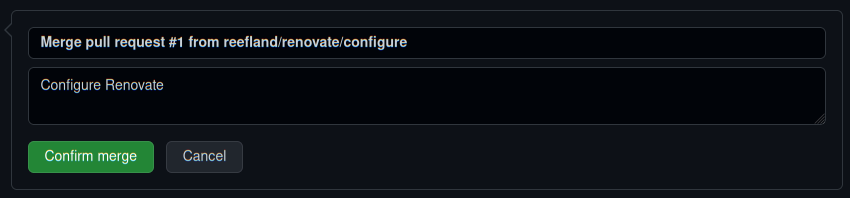

# Renovate Workflow Example

[Back to README.md](../README.md)

Once **ArgoCD** & **Renovate** applications are deployed, the first job Renovate will perform is to open a "Welcome to Renovate" Pull Request in the ArgoCD repository. This is an introduction to how the Pull Request and code merge work and it is fairly simple.

* Renovate is a Kubernetes Job that runs on a cronjob like schedule. By default renovate is executed at 1am every night.  You can wait for this, or run it manually as show in [Manually Run Renovate Job](renovate-settings.md).

---

## Initial Pull Request

Your introduction to Renovate begins with PR (Pull Request) #1, which can be found under the `Pull request` tab of your ArgoCD repository:

* Click `Configure Renovate` link to review the PR which was generated.

---

## Review Configure Renovate PR #1

Upon clicking the link you will be presented with something like below which shows some package updates already detected.

* As stated in the "What to Expect", it plans on opening 4 more PR (Pull Requests) for each of the package updates it detected.

_NOTE: The additional PR (Pull Requests) are not being processed now, they will be generated the next time Renovate is scheduled to run.  For now the remainder of this PR is accepting the configuration of Renovate._

---

## Merge Request Notification

Scrolling down a little more in the Configure Renovate PR #1 shows the message below.

This repository has nothing defined to process the Pull Request, so it will require the human interaction for now.

* Click the button `[ Merge pull request ]`.

---

## Confirm Merge Request

The merge request changed into a merge confirmation.  The defaults are fine, but you can also add more details to the merge description.

* Click the button `[ Confirm merge ]`.

---

## Merge Cleanup

Within a few seconds the code merge has completed.

* You can can safely click button `[ Delete branch ]` as it is no longer needed.

---

See [Example of 4 Application Upgrade PR requests from above](renovate-workflow-multi.md) opened by Renovate.

[Back to README.md](../README.md)
