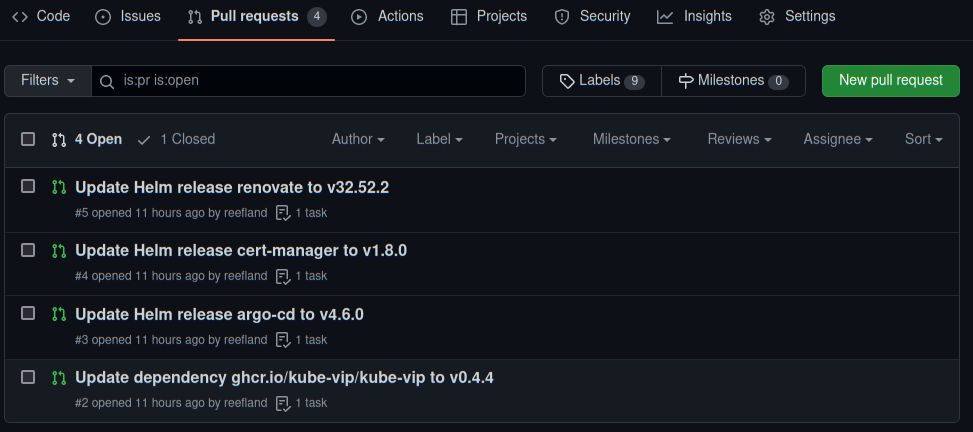
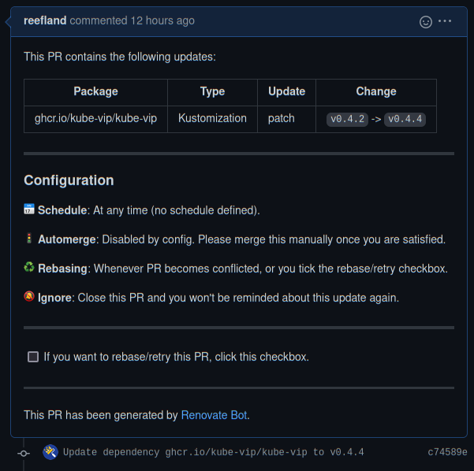
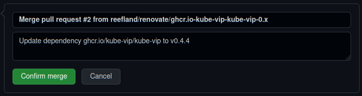
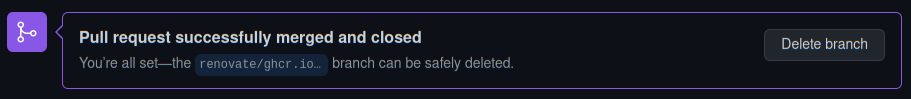
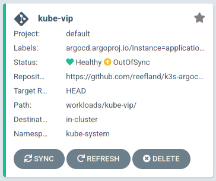
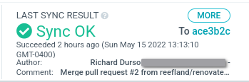

# Renovate Application Upgrade PR Examples

[Back to README.md](../README.md)

Renovate will open PR (Pull Request) for each application upgrade it detects.  You should review release notes of applications being upgraded for any breaking changes before accepting changes.

NOTE: Application CRDs (Custom Resource Definitions) are not upgraded. These usually require your manual action to process.  The details of what needs to be done should be detailed the application documentation.

## Typical Bulk PR Requests Opened

Below shows the result of a typical Renovate job result.  Multiple PR (Pull Requests) have been opened, one for each application upgrade detected.

The order you process these should not matter.

---

## Renovate Application PR Example

I selected PR #2 at the bottom of the list for Kube-vip.

* The `Package` shows the docker image name, the `Type` shows this is a [Kustomization](https://kustomize.io/) based deployment, the `Update` says its a simple patch, and `Change` shows the version tag of the docker image will be updated.

---

## Merge Request Notification

Scrolling down a little more in the Pull Request shows the message below.

This repository has nothing defined to process the Pull Request, so it will require the human interaction for now.

* Click the button `[ Merge pull request ]`.

---

## Confirm Merge Request

The merge request changed into a merge confirmation.  The defaults are fine, but you can also add more details to the merge description.

* Click the button `[ Confirm merge ]`.

---

## Merge Cleanup

Within a few seconds the code merge has completed.

* You can can safely click button `[ Delete branch ]` as it is no longer needed.

---

### ArgoCD Update Deployment

Within a few minutes ArgoCD will perform its routine scanning of the repository and detect the application is no longer in sync with what is deployed in Kubernetes.

* If the application is configured for self healing, it will automatically deploy the changes made by Renovate.  Otherwise it will be remain in "OutOfSync" waiting for you to manually process Sync changes.

Once the sync has been processed, the sync message will reflect that PR has been applied.

* Sync comment shows that pull request #2 as applied, everything is Synced and application is healthy.

---

The upgrade has completed.  The process starts over with Renovate monitoring the project for an update release, and then this cycle will restart itself again.

[Back to README.md](../README.md)
