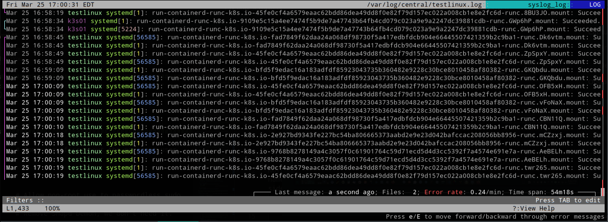

# Centralized Cluster System Logging

[Back to README.md](../README.md)

## Important Notes

* `rsyslog` will be configured so that all cluster members will send system logs to a centralized cluster member.
* The central logging server is specified by variable `rsyslog_server: "testlinux01.example.com"` which has the Fully Qualified Domain Name (FQDN) of the central logging server.
* When Ansible detects it is being run host matching the name in `rsyslog_server:` it will configure it to be the central logging host
  * All other hosts will be configured as logging clients.

NOTE: Don't change which member is the centralized logging server name once deployed.  It can create logging loops and other weird side effects.

## Review `defaults/main.yml` for Centralized Logging Settings

The Containerd Settings are in variable namespace `install.os.central_logging`.

* If the variable `rsyslog_server` is defined then this centralized logging feature will be enabled automatically.
  * This should be defined in the group vars for the inventory or `group_vars` variable file.

### Define Centralized Logging Directory

The directory where all system logs will be stored on the centralized logging server:

```yaml
install:
  os:
    central_logging:
      log_path: "/var/log/central"            # Directory on central server to hold logs 
```

A utility called `lnav` can be used to watch centralized system logs in real-time:

```yaml
sudo lnav /var/log/central
```

Screen shot of [lnav](https://lnav.org/):


[Back to README.md](../README.md)
