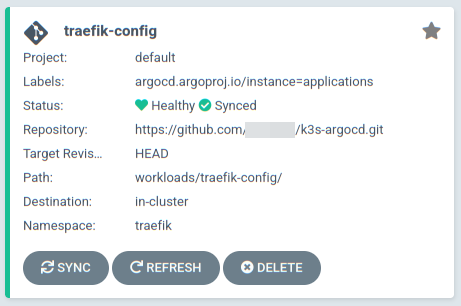
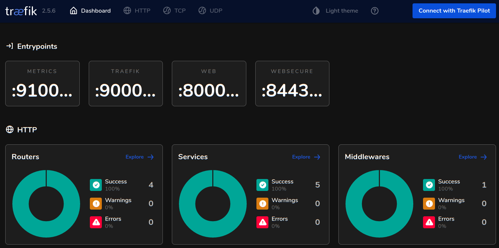

# Traefik Settings & Important Notes

[Back to README.md](../README.md)

## Important Notes

* **Traefik's Dashboard** is exposed by IngressRoute to URI `/dashboard/`, this can be disabled if needed.
* Access to the dashboard can be restricted to defined users via basic authentication.
* Once everything is deployed, the Traefik Dashboard IngressRoute, Let's Encrypt certificates and IngressRoutes for all other dashboards accessed via Traefik can be inspected in the ArgoCD Dashboard in application `Traefik-config`.



---

## Review `vars/secrets/main.yml` for Traefik Authenticated Users

### Dashboard Authentication

If you plan on using the Traefik dashboard and wish to require authentication. Then define the users who can access in file `vars/secrets/main.yml`:

```yaml
# Define encoded Traefik users allowed to use the Traefik Dashboard (if enabled)
# Multiple users can be listed below, one per line (indented by 2 spaces)
# Created with "htpasswd" utility and then base64 encode that output such as:
# $ htpasswd -nb [user] [password] | base64
TRAEFIK_DASHBOARD_USERS: |
  dHJhZWZpa2FkbTokMnkkMTAkbHl3NWdYcXpvbFJCOUY4M0RHa2dMZW52YWJTcmpxUk9XbXNGUmZKa2ZQSlhBbzNDSmJHY08K
```

**Be sure to encrypt all the secrets above when completed:**

```shell
ansible-vault encrypt vars/secrets/main.yml
```

---

## Review `default/main.yml` for Traefik Settings

The Traefik Settings are in variable namespace `install.traefik`.

### Review Traefik Dashboard Settings

* Enable or disable installation of Traefik. Disabled will prevent the installation prevent usage of IngressRoutes to application dashboards

  ```yaml
  install:
    traefik:
      enabled: true
  ```

* Pin which version of Traefik to install.  This value should be defined in the inventory file or group_vars file or can be updated directly here.

  ```yml
    ###[ Traefik Installation Settings ]#############################################################
    install:
      traefik:

        # Select release to use: https://github.com/traefik/traefik-helm-chart/tags
        install_version: "{{traefik_install_version|default('v10.19.4')}}"

        namespace: "traefik"                      # Add resources to this namespace
  ```

* Define if Traefik dashboard will be used and how it will be accessed.

  ```yaml
        # Traefik Dashboard
        dashboard:
          create_route: true                      # Create Ingress Router to make accessible 
          enable_https: true                      # Require HTTPS to access dashboard
          enable_basic_auth: true                 # Require Authentication to access dashboard
  ```

  * The `create_route` will create a Traefik Ingress route to expose the dashboard on the URI defined in `path` (see below)
    * Set `create_route` to `false` to prevent the route from being created.  
  * The `enable_https` will require HTTPS protocol for accessing the dashboard.  This will use a Let's Encrypt generated certificate that is managed by Cert-manager.
  * By default basic authentication for the dashboard is enabled.  

---

## Define the Fully Qualified Domain Name (FQDN) for Traefik Dashboard

Traefik and other dashboards are accessed via this DNS name.  

* The DNS name is specified in `k3s_cluster_ingress_name` variable and the IP address of this DNS name is specified in `traefik_lb_ip` variable as stated in [Inventory Variables for IP & Load Balancers](../README.md)

  ```yaml
          # Fully Qualified Domain for ingress routes - Traefik Load Balancer address name
          # This is the DNS name you plan to point to the Traefik ingress Load Balancer IP address.
          ingress_name: '{{k3s_cluster_ingress_name|default("k3s.{{ansible_domain}}")}}'
          
          # Default Dashboard URL:  https://k3s.{{ansible_domain}}/dashboard/
          path: "/dashboard"                      # PathPrefix for dashboard

          # Encoded users and passwords for basic authentication stored in k3s_traefik_api_secrets.yml
          allowed_users: "{{TRAEFIK_DASHBOARD_USERS}}"    
  ```

* The `ingress_name` should reference the DNS name which points to the Traefik Load Balancer IP address used for all Traefik ingress routes. If a name is not provided it will default to hostname `k3s` and use the domain of the Kubernetes Linux host.
* The `"{{TRAEFIK_DASHBOARD_USERS}}"` specifies the individual users allowed to access the dashboard.
  * This variable is defined in `vars/secrets/main.yml`.

The Traefik Dashboard URL path will resemble: `https://k3s.example.com/dashboard/`



[Back to README.md](../README.md)
