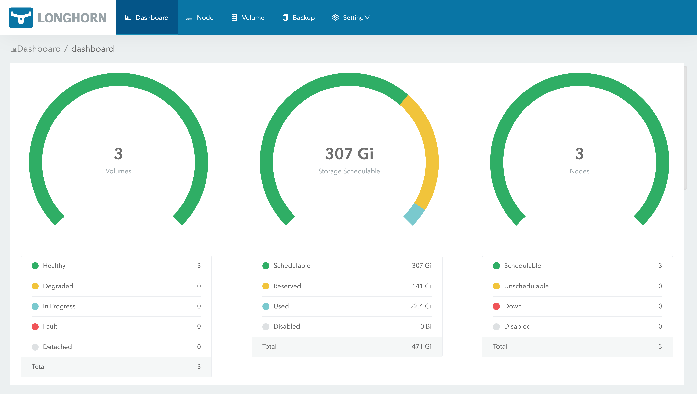

# Longhorn Distributed Storage Settings & Important Notes

## Important Notes

* Longhorn Distributed storage is intended to be the default storage class, once installed the "local-path" StorageClass "default" flag will be removed.
* By default a ZFS Zvol of a defined size will be created at `/var/lib/longhorn` this limits how much space Longhorn can consume.  A zvol can easily be made larger when needed.

## Longhorn Infrastructure Diagram


* See [Longhorn Web Site](https://longhorn.io/) for details.

## Review `defaults/main.yml` for Longhorn Settings

The Longhorn Settings are in variable namespace `install.longhorn`.

* Enable or disable installation of Longhorn Distributed storage:

```yml
  longhorn:
    install_this: true              # Install longhorn distributed cluster storage
```

* The name space and release name Helm will use to install Longhorn:

```yml
    namespace: "longhorn-system"
    release: "longhorn"
```

### ZFS Zvol for Longhorn

* Define the ZFS pool name to use and volume name to create.

```yml
    zfs:                           # Combined "rpool/longhorn"
      pool: "rpool"
      volume_name: "longhorn"              
```

* Define some properties to be used with Zvol creation. The `volsize` specifies storage space dedicated to Longhorn usage.  You can select different compression if you like.

```yml
      zvol:
        options:
          volsize: "10G"
          compression: "lz4"        # "" (inherit), lz4, gzip-9, etc
          volblocksize: "16k"
```

### Increasing Zvol Size in the Future

You can increase the `volsize` manually in the future using standard ZFS commands such as:

```shell
$ sudo zfs set volsize=15G rpool/longhorn

$ zfs get volsize rpool/longhorn

NAME            PROPERTY  VALUE    SOURCE
rpool/longhorn  volsize   15G      local
```

Then expand the filesystem to use newly allocated space:

```shell
$ sudo xfs_growfs /var/lib/longhorn

meta-data=/dev/zd0               isize=512    agcount=4, agsize=655360 blks
         =                       sectsz=512   attr=2, projid32bit=1
         =                       crc=1        finobt=1, sparse=1, rmapbt=0
         =                       reflink=1
data     =                       bsize=4096   blocks=2621440, imaxpct=25
         =                       sunit=0      swidth=0 blks
naming   =version 2              bsize=4096   ascii-ci=0, ftype=1
log      =internal log           bsize=4096   blocks=2560, version=2
         =                       sectsz=512   sunit=0 blks, lazy-count=1
realtime =none                   extsz=4096   blocks=0, rtextents=0
data blocks changed from 2621440 to 3932160
```

Within a few seconds the new size should be reflected in the Longhorn dashboard.

### Longhorn Default Mountpoint

The ZFS Zvol will be formatted and mounted at the location specified below and Longhorn installation is set to look at this location.

```yml
zfs:
  zvol:
    mountpoint: "/var/lib/longhorn"
```

### Change Default Storage Class

The intent of longhorn is to be used instead of "local-path" storage class. Once Longhorn is installed "local-path" will be disabled as the default storage class.

```yaml
   disable_local_path_as_default_storage_class: true
```

### Longhorn Dashboard

* Settings for the Longhorn Web Dashboard:

```yml
    # Longhorn Dashboard
    dashboard:
      create_route: true           # Create Ingress Route to make accessible 
      enable_basic_auth: true      # Require Authentication to access dashboard
      path: "/longhorn"            # URI Path for Ingress Route
```



* Disable "local-path" as the default storage class once Longhorn is installed:

```yml
    # The intent of longhorn is to be used instead of "local-path" storage class
    # once Longhorn is installed "local-path" will be disabled as the default storage class
    disable_local_path_as_default_storage_class: true
```

[Back to README.md](../README.md)
