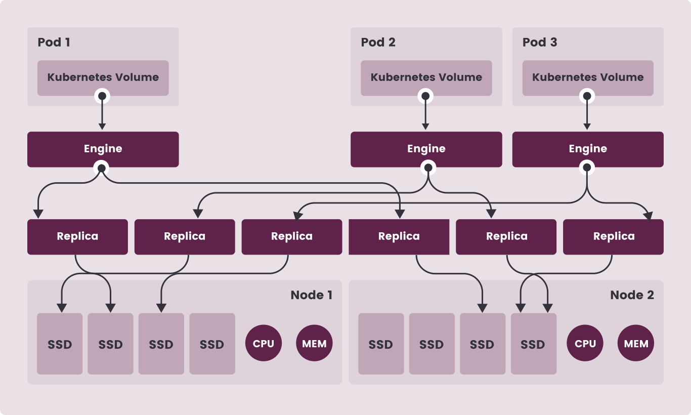

# Longhorn Distributed Storage Settings & Important Notes

## Important Notes

* Longhorn Distributed storage is intended to be the default storage class, once installed the "local-path" StorageClass "default" flag will be removed.

## Longhorn Infrastructure Diagram



* See [Longhorn Web Site](https://longhorn.io/) for details.

## Review `defaults/main.yml` for Longhorn Settings

The Longhorn Settings are in variable namespace `install.longhorn`.

* Enable or disable installation of Longhorn Distributed storage:

```yml
  longhorn:
    install_this: true              # Install longhorn distributed cluster storage
```

* The name space and release name Helm will use to install Longhorn:

```yml
    namespace: "longhorn-system"
    release: "longhorn"
```

* Define default location to allocate to Distributed Storage.  All available space at this location can be "Scheduled" for use.

```yml
    # Default location to store distributed cluster storage
    # You should make this a ZFS dataset mount location to use a dedicated dataset
    storage_dataset: "/var/lib/longhorn"
```

* Settings for the Longhorn Web Dashboard:

```yml
    # Longhorn Dashboard
    dashboard:
      create_route: true           # Create Ingress Route to make accessible 
      enable_basic_auth: true      # Require Authentication to access dashboard
      path: "/longhorn"            # URI Path for Ingress Route
```


* Disable "local-path" as the default storage class once Longhorn is installed:

```yml
    # The intent of longhorn is to be used instead of "local-path" storage class
    # once Longhorn is installed "local-path" will be disabled as the default storage class
    disable_local_path_as_default_storage_class: true
```

[Back to README.md](../README.md)
