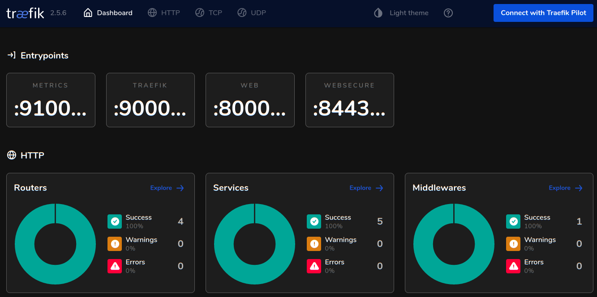

# Traefik Settings & Important Notes

## Important Notes

* **Traefik's Letsencrypt** is configured for **Staging** certificates, but you can default it to **Prod** or use provided CLI parameter to force **Prod** certificates only when needed `--extra-vars '{le_staging:false}'`
* **Traefik's Dashboard** is exposed by IngressRoute to URI `/dashboard/`, this can be disabled if needed.
* Access to the dashboard can be restricted to defined users via basic authentication.

## Review `vars/secrets/k3s_traefik_api_secrets.yml` for Traefik Let's Encrypt Settings


### Let's Encrypt Configuration

The file `vars/k3s_traefik_api_secrets.yml` needs to be configured to provide **four** variables:

#### Configure CloudFlare DNS Challenge

* `CF_DNS_API_TOKEN` - CloudFlare API token value
* `CF_AUTH_EMAIL` - CloudFlare Email address associated with the API token
* `LE_AUTH_EMAIL` - Letsencrypt Email Address for expiration Notifications
* `LE_DOMAINS` - List of domain names for Wildcard Certificates

```yml
# Cloudflare API token used by Traefik
# Requires Zone / Zone / Read
# Requires Zone / DNS / Edit Permissions
CF_DNS_API_TOKEN: abs123 ... 456xyz

# Email address associated to DNS API key
CF_AUTH_EMAIL: you@domain.com

# Email address associated to Let's Encrypt
LE_AUTH_EMAIL: you@domain.com

# List of Domains to Create Certificates
LE_DOMAINS:
  - "example.com"
  - "*.example.com"
```

### Staging or Production Certificates

By default staging certificates are generated and controlled by (`vars/k3s.yml`):

```yaml
k3s:
  traefik:
    # Generate Staging Certificates
    staging: true
```

Don't change this value. Once staging certificates are verified to be working, the playbook can be run to switch to production certificates:

```shell
ansible-playbook -i inventory kubernetes.yml --tags="config_traefik_dns_certs" --extra-vars '{le_staging:false}' 
```

* _See below for using a test deployment with certificates._

## Review ``vars/secrets/k3s_traefik_api_secrets.yml`` for Traefik Authenticated Users


### Dashboard Authentication

If you plan on using the Traefik dashboard and wish to require authentication. Then define the users who can access in file `vars/k3s_traefik_api_secrets.yml`:

```yaml
# Define encoded Traefik users allowed to use the Traefik Dashboard (if enabled)
# Multiple users can be listed below, one per line (indented by 2 spaces)
# Created with "htpasswd" utility and then base64 encode that output such as:
# $ htpasswd -nb [user] [password] | base64
TRAEFIK_DASHBOARD_USERS: |
  dHJhZWZpa2FkbTokMnkkMTAkbHl3NWdYcXpvbFJCOUY4M0RHa2dMZW52YWJTcmpxUk9XbXNGUmZKa2ZQSlhBbzNDSmJHY08K
```

**Be sure to encrypt all the secrets above when completed:**

```shell
ansible-vault encrypt vars/k3s_traefik_api_secrets.yml
```

## Review `default/main.yml` for Traefik Settings

The Traefik Settings are in variable namespace `install.traefik`.

By default a Ingress Route will be created to allow the Dashboard to be accessible on URI `/dashboard/` (the trailing slash is REQUIRED).  



Set `create_route` to `false` to prevent the route from being created.  If you need to apply a change do the dashboard then run the playbook with tag `--tags="config_traefik_dashboard"` to apply changes.

```yml
  ###[ Traefik Installation Settings ]#############################################################
  traefik:
    ...

    # Traefik Dashboard
    dashboard:
    create_route: true                      # Create Ingress Router to make accessible 
    enable_https: true                      # Require HTTPS to access dashboard
    enable_basic_auth: true                 # Require Authentication to access dashboard
```

* The ID & Password's which are allowed access to the dashboard are defined in the file `vars/k3s_traefik_api_secrets.yml` as discussed above.

---

## Example App Deployment with Certificates

To test generated certificates, a deployment using `whoami` is provided

### Install Test Application

```shell
sudo su - kube
cd ~/traefik

# Deploy apps & create ingress rules
kubectl apply -f traefik_test_apps.yaml

```

### Confirm Application Installation

```shell
# Confirm pods are running:
kubectl get pods -n default

  NAME                      READY   STATUS    RESTARTS      AGE
  whoami-5b69cdcd49-2gfts   1/1     Running   2 (23m ago)   6h9m
  whoami-5b69cdcd49-bg5j4   1/1     Running   2 (23m ago)   6h9m
```

### Test Certificates

```shell
# Simple test without certificates (notice URI of "/notls")
curl http://$(hostname -f):80/notls

Hostname: whoami-5b69cdcd49-2gfts
IP: 127.0.0.1
IP: ::1
IP: 10.42.0.37
IP: fe80::c43:7ff:fe31:3b61
RemoteAddr: 10.42.0.34:52596
GET /notls HTTP/1.1
Host: testlinux.example.com
User-Agent: curl/7.68.0
Accept: */*
Accept-Encoding: gzip
X-Forwarded-For: 10.42.0.36
X-Forwarded-Host: testlinux.example.com
X-Forwarded-Port: 80
X-Forwarded-Proto: http
X-Forwarded-Server: traefik-6bb96f9bd8-72cj8
X-Real-Ip: 10.42.0.36

# This will work ONLY with a production cert, it will FAIL with a staging cert:
curl https://$(hostname -f):/tls

# This will work with EITHER staging OR production cert:
curl -k https://$(hostname -f):/tls
```

### Show Certificate Information

```shell
kubectl describe certificates wildcard-cert -n kube-system

Spec:
  Dns Names:
    example.com
    *.example.com
  Issuer Ref:
    Kind:       ClusterIssuer
    Name:       letsencrypt-prod
  Secret Name:  wildcard-secret
Status:
  Conditions:
    Last Transition Time:  2022-02-24T18:09:47Z
    Message:               Certificate is up to date and has not expired
    Observed Generation:   1
    Reason:                Ready
    Status:                True
    Type:                  Ready
  Not After:               2022-05-25T17:09:46Z
  Not Before:              2022-02-24T17:09:47Z
  Renewal Time:            2022-04-25T17:09:46Z
```

### Uninstall & Cleanup Test Application

```shell
# To delete the "whoami" deployment and ingress rules:
kubectl delete -f traefik_test_apps.yaml

deployment.apps "whoami" deleted
service "whoami" deleted
ingressroute.traefik.containo.us "simpleingressroute" deleted
ingressroute.traefik.containo.us "ingressroutetls" deleted
```

[Back to README.md](../README.md)
